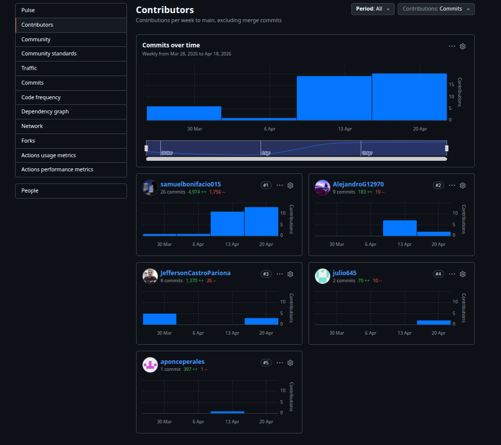
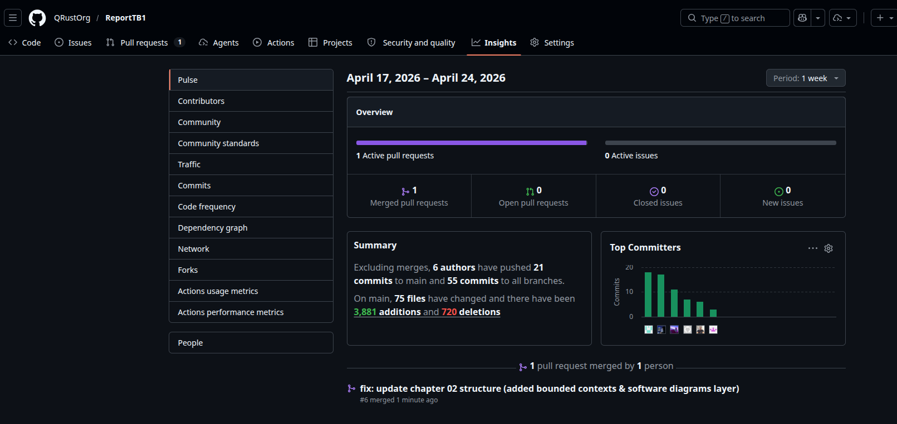

 

 

**Universidad Peruana de Ciencias Aplicadas**

 

**Carrera:** Ingeniería de Software  

 

**Curso:** Aplicaciones para Dispositivos Móviles 

**Ciclo:** 202610   

 

**Sección:** 3667  

 

**Profesor:** Eduardo Martin Reyes Rodriguez 

 

**INFORME DE TRABAJO FINAL**

 

**Startup:** QRust  

 

**Producto:** Klippr  

---

**Relación de Integrantes**

 

| Apellidos y Nombres               | Código      |
| --------------------------------- | ----------- |
| Bonifacio Jaramillo, Samuel Jesus | U202317269  |
| Castro Pariona, Jefferson Ernesto | U201822823  |
| Guillen Galindo, Julio Adolfo     | U20241A352  |
| Galindo Montero, Alejandro Manuel | U202321264  |
| Ponce Perales Alberto Alejandro   | U2023206804 |

  

**Julio - 2026**

 

# Registro de Versiones del Informe

 

<table>
  <thead>
    <tr>
      <th>Versión</th>
      <th>Fecha</th>
      <th>Autores</th>
      <th>Descripción de modificación</th>
    </tr>
  </thead>
  <tbody>
    <tr>
      <td>1.0</td>
      <td>17 de abril</td>
      <td>QRust</td>
      <td>Desarrollo de los capitulos I,II & Anexos</td>
    </tr>
    <tr>
      <td>2.0</td>
      <td>11 de mayo</td>
      <td>QRust</td>
      <td>Despliegue de Landing Page, avance de Backend y desarrollo de capítulos III & IV</td>
    </tr>
    <tr>
      <td>3.0</td>
      <td>15 de mayo</td>
      <td>QRust</td>
      <td>Validaciones y tests sobre la Landing Page, avance de Backend y desarrollo de capítulos III & IV</td>
    </tr>
    <tr>
      <td>4.0</td>
      <td>19 de junio</td>
      <td>QRust</td>
      <td>Creación/Finalización de la aplicación Kotlin (Klippr Customer)</td>
    </tr>
    <tr>
      <td>5.0</td>
      <td>1 de julio</td>
      <td>QRust</td>
      <td>Despliegue de aplicación para consumidores, validación de funcionalidades para negocios</td>
    </tr>
    <tr>
      <td></td>
      <td></td>
      <td></td>
      <td></td>
    </tr>
  </tbody>
</table>

# Project Report Collaboration Insights

Analiza cómo la colaboración y la gestión de tareas influyeron en los resultados del proyecto, destacando fortalezas y áreas de mejora para optimizar futuras estrategias.

URL del Repositorio del Informe: https://github.com/QRustOrg/ReportTB1  
URL del Repositorio de Landing Page: https://github.com/QRustOrg/LandingPage  
URL del Repositorio del Frontend (Consumidores): https://github.com/QRustOrg/Klippr-Customer  
URL del Repositorio del Frontend (Negocios): https://github.com/QRustOrg/Klippr-Business  
URL del Repositorio del Backend: https://github.com/QRustOrg/Klippr-Backend   

### Reporte de Colaboración Entrega AV1

En esta entrega se redactó el informe abarcando la **definición inicial del producto, el modelado UX y hasta la sección de Tactical Level Domain-Driven Design de la Arquitectura de Software**. Las tareas más relevantes fueron el desarrollo del **Event Storming**, los diseños de **historias de usuario, perfiles de usuario** y el modelado de experiencia. Además, se definieron el **Diagrama de Componentes, Diagrama de Clases y Diagrama de Base de Datos** para cada **Bounded Context** identificado mediante el **Event Storming**.

Para evidenciar nuestros avances y demostrar que todos los miembros del equipo participaron en la redacción del informe, se presentan a continuación las capturas obtenidas de los analíticos de colaboración en el repositorio de GitHub del Informe:

**Contributors**

*En el analítico de Contributors se evidencian las contribuciones que hizo cada integrante del equipo para la redacción del informe durante el periodo de esta primera entrega. Se puede observar la cantidad de commits que realizó cada integrante, así como la cantidad de adiciones y eliminaciones que se realizaron en el repositorio.

**Pulse**

En el analítico de Pulse se evidencian los commits que realizó cada integrante del equipo durante el periodo definido para esta primera entrega.

### Reporte de Colaboración Entrega TP

En esta entrega se evidencian las contribuciones realizadas por cada integrante del equipo para el desarrollo de la **Landing Page** y el **Backend**. A continuación se presentan las capturas obtenidas de los analíticos de colaboración en GitHub (Insights) correspondientes a cada repositorio durante este periodo.

**Landing Page Contributors**

**Backend Contributors**

---

### Reporte de Colaboración Entrega AV2:

 

<table>
  <thead>
    <tr>
      <th> Integrantes</th>
      <th> Tarea Asignada</th>
    </tr>
  </thead>
  <tbody>
    <tr>
      <th> Bonifacio Jaramillo, Samuel Jesus</th>
      <th> Diseño de arquitectura y Bounded Contexts, diagramas de base de datos, Event Storming y estructuración general (Capítulos I y II).</th>
    </tr>
    <tr>
      <th> Castro Pariona, Jefferson Ernesto</th>
      <th> Definición de perfiles de la startup, análisis competitivo e inicialización del documento (Capítulo 1).</th>
    </tr>
    <tr>
      <th> Guillen Galindo, Julio Adolfo</th>
      <th> Redacción de estrategias de marketing, análisis comparativo y estructuración de la visión del producto.</th>
    </tr>
    <tr>
      <th> Ponce Perales, Alberto Alejandro</th>
      <th> Elaboración de User Stories, Technical Stories, Landing Stories, Spike Stories y criterios de aceptación (Capítulo 2).</th>
    </tr>
    <tr>
      <th> Galindo Montero, Alejandro Manuel</th>
      <th> Elaboración del Lean UX Canvas, User Personas, User Task Matrix, Empathy Mapping y User Journey (Capítulos 1 y 2).</th>
    </tr>
  </tbody>
</table>

 

**TP**

Para el desarrollo del informe perteneciente a la entrega del TB1, se dividió la implementación de secciones de la siguiente forma para cada integrante del equipo:

 

 

<table>
  <thead>
    <tr>
      <th> Integrantes</th>
      <th> Tarea Asignada</th>
    </tr>
  </thead>
  <tbody>
    <tr>
      <th> Bonifacio Jaramillo, Samuel Jesus</th>
      <th> Despliegue de Landing Page & Backend, diseño de US (Mockups y Wireframes) y estructuración general (Capítulos III & IV)</th>
    </tr>
    <tr>
      <th> Castro Pariona, Jefferson Ernesto</th>
      <th> Colaboracion diseño de la landing page, diseño de historias de usuario en Figma, elaboracion del Evidences for Sprint 1 de BC Iam y Profile</th>
    </tr>
    <tr>
      <th> Guillen Galindo, Julio Adolfo</th>
      <th> Creación de los Bounded Contexts de Community y Setting para el Backend, además de la documentación de estos procesos.</th>
    </tr>
    <tr>
      <th> Ponce Perales, Alberto Alejandro</th>
      <th> Colaboracion de diseño de la landing page ademas de historias de usuario en Figma, encargado de las validation interviews.</th>
    </tr>
    <tr>
      <th> Galindo Montero, Alejandro Manuel</th>
      <th> Creación del Bounded Context de Analytics para el Backend, además del desarrollo de las secciones Social Proof y Comparison para la Landing Page.</th>
    </tr>
  </tbody>
</table>

 

**AV2**

Para el desarrollo del informe perteneciente a la entrega del TB2, se dividió la implementación de secciones de la siguiente forma para cada integrante del equipo:

 

<table>
  <thead>
    <tr>
      <th> Integrantes</th>
      <th> Tarea Asignada</th>
    </tr>
  </thead>
  <tbody>
    <tr>
      <th> Bonifacio Jaramillo, Samuel Jesus</th>
      <th> Actualizar la documentación de los Bounded Contexts de Promotion y Redemption, así como elaborar las evidencias funcionales correspondientes a los endpoints implementados.</th>
    </tr>
    <tr>
      <th> Castro Pariona, Jefferson Ernesto</th>
      <th> Corregir observaciones evidencias del Sprint 2.</th>
    </tr>
    <tr>
      <th> Guillen Galindo, Julio Adolfo</th>
      <th> Actualizar la documentación técnica de los procesos implementados.</th>
    </tr>
    <tr>
      <th> Ponce Perales, Alberto Alejandro</th>
      <th> Actualizar el Bounded Context de Favorites.</th>
    </tr>
    <tr>
      <th> Galindo Montero, Alejandro Manuel</th>
      <th> Desarrollo de las secciones Community y guardar en Promotions.</th>
    </tr>
  </tbody>
</table>

 

**TF**

Para el desarrollo del informe perteneciente a la entrega del TF, se dividió la implementación de secciones de la siguiente forma para cada integrante del equipo:

  
 <table>
  <thead> 
  <tr>
   <th> Integrantes</th> <th> Tarea Asignada</th> </tr> </thead> <tbody> <tr> <th> Bonifacio Jaramillo, Samuel Jesus</th> <th> Integración final de los Bounded Contexts IAM, Profile, Promotion y Redemption; validación de endpoints desplegados y consolidación de evidencias técnicas del Backend para la entrega TF.</th> </tr> <tr> <th> Castro Pariona, Jefferson Ernesto</th> <th> Corrección y cierre de observaciones del informe; actualización de evidencias funcionales de IAM y Profile; y apoyo en el control de calidad documental para la versión final.</th> </tr> <tr> <th> Guillen Galindo, Julio Adolfo</th> <th> Ajuste final de los Bounded Contexts Community y Setting; documentación de flujos implementados; y verificación del despliegue y funcionamiento en entorno productivo.</th> </tr> <tr> <th> Ponce Perales, Alberto Alejandro</th> <th> Consolidación del Bounded Context Favorites; ejecución y registro de pruebas funcionales; y cierre de evidencias de validación de funcionalidades para consumidores.</th> </tr> <tr> <th> Galindo Montero, Alejandro Manuel</th> <th> Implementación y documentación final de funcionalidades de Community y Promotions en aplicaciones cliente; además de apoyo en evidencias de ejecución y presentación del producto.
   </th>
  </tr> 
  </tbody>
  </table> 
  

# Contenido

1. [Capítulo I: Presentación](#capítulo-i-presentación) 
   1.1. [Startup Profile](#11-startup-profile) 
   1.1.1. [Descripción de la Startup](#111-descripción-de-la-startup) 
   1.1.2. [Perfiles de integrantes del equipo](#112-perfiles-de-integrantes-del-equipo) 
   1.2. [Solution Profile](#12-solution-profile) 
   1.2.1. [Antecedentes y problemática](#121-antecedentes-y-problemática) 
   1.2.2. [Lean UX Process](#122-lean-ux-process) 
   1.2.2.1. [Lean UX Problem Statements](#1221-lean-ux-problem-statements) 
   1.2.2.2. [Lean UX Assumptions](#1222-lean-ux-assumptions) 
   1.2.2.3. [Lean UX Hypothesis Statements](#1223-lean-ux-hypothesis-statements) 
   1.2.2.4. [Lean UX Canvas](#1224-lean-ux-canvas) 
   1.3. [Segmentos objetivo](#13-segmentos-objetivo) 
2. [Capítulo II: Requirements Development and Software Solution Design](#capítulo-ii-requirements-development-and-software-solution-design) 
   2.1. [Competidores](#21-competidores) 
   2.1.1. [Análisis competitivo](#211-análisis-competitivo) 
   2.1.2. [Estrategias y tácticas frente a competidores](#212-estrategias-y-tácticas-frente-a-competidores) 
   2.2. [Entrevistas](#22-entrevistas) 
   2.2.1. [Diseño de entrevistas](#221-diseño-de-entrevistas) 
   2.2.2. [Registro de entrevistas](#222-registro-de-entrevistas) 
   2.2.3. [Análisis de entrevistas](#223-análisis-de-entrevistas) 
   2.3. [Needfinding](#23-needfinding) 
   2.3.1. [User Personas](#231-user-personas) 
   2.3.2. [User Task Matrix](#232-user-task-matrix) 
   2.3.3. [User Journey Mapping](#233-user-journey-mapping) 
   2.3.4. [Empathy Mapping](#234-empathy-mapping) 
   2.3.5. [Big Picture EventStorming](#235-big-picture-eventstorming) 
   2.3.6. [Ubiquitous Language](#236-ubiquitous-language) 
   2.4. [Requirements specification](#24-requirements-specification) 
   2.4.1. [User Stories](#241-user-stories) 
   2.4.2. [Impact Mapping](#242-impact-mapping) 
   2.4.3. [Product Backlog](#243-product-backlog) 
   2.5. [Strategic-Level Domain-Driven Design](#25-strategic-level-domain-driven-design) 
   2.5.1. [EventStorming](#251-eventstorming) 
   2.5.1.1. [Candidate Context Discovery](#2511-candidate-context-discovery) 
   2.5.1.2. [Domain Message Flows Modeling](#2512-domain-message-flows-modeling) 
   2.5.1.3. [Bounded Context Canvases](#2513-bounded-context-canvases) 
   2.5.2. [Context Mapping](#252-context-mapping) 
   2.5.3. [Software Architecture](#253-software-architecture) 
   2.5.3.1. [Software Architecture Context Level Diagrams](#2531-software-architecture-context-level-diagrams) 
   2.5.3.2. [Software Architecture Container Level Diagrams](#2532-software-architecture-container-level-diagrams) 
   2.5.3.3. [Software Architecture Deployment Diagrams](#2533-software-architecture-deployment-diagrams) 
   2.6. [Tactical-Level Domain-Driven Design](#26-tactical-level-domain-driven-design) 
   2.6.x. [Bounded Context: &lt;Bounded Context Name&gt;](#26x-bounded-context-bounded-context-name) 
   2.6.x.1. [Domain Layer](#26x1-domain-layer) 
   2.6.x.2. [Interface Layer](#26x2-interface-layer) 
   2.6.x.3. [Application Layer](#26x3-application-layer) 
   2.6.x.4. [Infrastructure Layer](#26x4-infrastructure-layer) 
   2.6.x.5. [Bounded Context Software Architecture Component Level Diagrams](#26x5-bounded-context-software-architecture-component-level-diagrams) 
   2.6.x.6. [Bounded Context Software Architecture Code Level Diagrams](#26x6-bounded-context-software-architecture-code-level-diagrams) 
   2.6.x.6.1. [Bounded Context Domain Layer Class Diagrams](#26x61-bounded-context-domain-layer-class-diagrams) 
   2.6.x.6.2. [Bounded Context Database Design Diagram](#26x62-bounded-context-database-design-diagram) 
3. [Capítulo III: Solution UI/UX Design](#capítulo-iii-solution-uiux-design) 
   3.1. [Product design](#31-product-design) 
   3.1.1. [Style Guidelines](#311-style-guidelines) 
   3.1.1.1. [General Style Guidelines](#3111-general-style-guidelines) 
   3.1.2. [Information Architecture](#312-information-architecture) 
   3.1.2.1. [Organization Systems](#3121-organization-systems) 
   3.1.2.2. [Labelling Systems](#3122-labelling-systems) 
   3.1.2.3. [SEO Tags and Meta Tags](#3123-seo-tags-and-meta-tags) 
   3.1.2.4. [Searching Systems](#3124-searching-systems) 
   3.1.2.5. [Navigation Systems](#3125-navigation-systems) 
   3.1.3. [Landing Page UI Design](#313-landing-page-ui-design) 
   3.1.3.1. [Landing Page Wireframe](#3131-landing-page-wireframe) 
   3.1.3.2. [Landing Page Mock-up](#3132-landing-page-mock-up) 
   3.1.4. [Mobile Applications UX/UI Design](#314-mobile-applications-uxui-design) 
   3.1.4.1. [Mobile Applications Wireframes](#3141-mobile-applications-wireframes) 
   3.1.4.2. [Mobile Applications Wireflow Diagrams](#3142-mobile-applications-wireflow-diagrams) 
   3.1.4.3. [Mobile Applications Mock-ups](#3143-mobile-applications-mock-ups) 
   3.1.4.4. [Mobile Applications User Flow Diagrams](#3144-mobile-applications-user-flow-diagrams) 
   3.1.4.5. [Mobile Applications Prototyping](#3145-mobile-applications-prototyping) 
4. [Capítulo IV: Product Implementation & Validation](#capítulo-iv-product-implementation--validation) 
   4.1. [Software Configuration Management](#41-software-configuration-management) 
   4.1.1. [Software Development Environment Configuration](#411-software-development-environment-configuration) 
   4.1.2. [Source Code Management](#412-source-code-management) 
   4.1.3. [Source Code Style Guide & Conventions](#413-source-code-style-guide--conventions) 
   4.1.4. [Software Deployment Configuration](#414-software-deployment-configuration) 
   4.2. [Landing Page & Mobile Application Implementation](#42-landing-page--mobile-application-implementation) 
   4.2.1. [Sprint n](#421-sprint-1) 
   4.2.1.1. [Sprint Planning 1](#4211-sprint-planning-1) 
   4.2.1.2. [Sprint Backlog 1](#4212-sprint-backlog-1) 
   4.2.1.3. [Development Evidence for Sprint Review](#4213-development-evidence-for-sprint-review) 
   4.2.1.4. [Testing Suite Evidence for Sprint Review](#4214-testing-suite-evidence-for-sprint-review) 
   4.2.1.5. [Execution Evidence for Sprint Review](#4215-execution-evidence-for-sprint-review) 
   4.2.1.6. [Services Documentation Evidence for Sprint Review](#4216-services-documentation-evidence-for-sprint-review) 
   4.2.1.7. [Software Deployment Evidence for Sprint Review](#4217-software-deployment-evidence-for-sprint-review) 
   4.2.1.8. [Team Collaboration Insights during Sprint](#4218-team-collaboration-insights-during-sprint) 
   4.2.2. [Sprint 2](#421-sprint-2) 
   4.2.2.1. [Sprint Planning 2](#4211-sprint-planning-2) 
   4.2.2.2. [Sprint Backlog 2](#4212-sprint-backlog-2) 
   4.2.2.3. [Development Evidence for Sprint Review](#4213-development-evidence-for-sprint-review) 
   4.2.2.4. [Testing Suite Evidence for Sprint Review](#4214-testing-suite-evidence-for-sprint-review) 
   4.2.2.5. [Execution Evidence for Sprint Review](#4215-execution-evidence-for-sprint-review) 
   4.2.2.6. [Services Documentation Evidence for Sprint Review](#4216-services-documentation-evidence-for-sprint-review) 
   4.2.2.7. [Software Deployment Evidence for Sprint Review](#4217-software-deployment-evidence-for-sprint-review) 
   4.2.2.8. [Team Collaboration Insights during Sprint](#4218-team-collaboration-insights-during-sprint) 
   4.3. [Validation Interviews](#43-validation-interviews) 
   4.3.1. [Diseño de Entrevistas](#431-diseño-de-entrevistas) 
   4.3.2. [Registro de Entrevistas](#432-registro-de-entrevistas) 
   4.3.3. [Evaluaciones según heurísticas](#433-evaluaciones-según-heurísticas) 

5. [Conclusiones](#conclusiones) 
   5.1. [Conclusiones y recomendaciones](#51-conclusiones-y-recomendaciones) 

6. [Video App Validation](#video-app-validation) 

7. [Video About the product](#video-about-the-product) 

8. [Video About-the-team](#video-about-the-team) 

9. [Bibliografía](#bibliografía) 

10. [Anexos](#anexos) 

 

# Student Outcome

<table>
  <thead>
    <tr>
      <th>Criterio específico</th>
      <th>Acciones realizadas</th>
      <th>Conclusión general</th>
    </tr>
  </thead>
  <tbody>
    <tr>
      <td>
        <b>
          7.c1. Actualiza conceptos y conocimientos necesarios para su desarrollo profesional y en especial para su proyecto en soluciones de ingeniería de software
        </b>
      </td>
      <td>
        <b>AV1:</b> 
        <b>Bonifacio Jaramillo, Samuel Jesus:</b>  Al desarrollar el Tactical-Level Domain-Driven Design del Bounded Context IAM, el desarrollo del Bounded Context Profile, el Keynote y las Ideas de User Stories, aprendí más acerca de los conceptos de arquitectura de software y metodologías ágiles, actualizando mis conocimientos en patrones de diseño y gestión de identidades para aplicarlos en soluciones reales.  
        <b>Castro Pariona, Jefferson Ernesto</b>  Al realizar la redacción de los Capítulos I y II del informe, participar en la evaluación del Product Backlog y elaborar los diagramas de Bounded Context utilizando el C4 model, actualicé significativamente mis conocimientos en arquitectura de software, modelado de contextos de negocio y herramientas de visualización arquitectónica. Esta experiencia me permitió comprender la importancia de una sólida estructura arquitectónica en la definición de soluciones de ingeniería de software. 
        <b>Guillen Galindo, Julio Adolfo</b> En el desarrollo del Capítulo II, participé en la estructuración de requisitos, análisis competitivo y estrategias de marketing para la solución. Esto me permitió actualizar mis conocimientos en metodologías ágiles, técnicas de recopilación de requisitos y estrategias empresariales aplicadas al desarrollo de software, consolidando una visión integral del desarrollo de productos tecnológicos. 
        <b>Ponce Perales, Alberto Alejandro</b> Al desarrollar la especificación de requisitos incluyendo User Stories, Technical Stories y criterios de aceptación, actualicé mis conocimientos en técnicas de especificación de requisitos y metodologías ágiles. Esta experiencia me permitió comprender mejor cómo traducir necesidades del usuario en requisitos técnicos claros y verificables. 
        <b>Alejandro Manuel Galindo Montero</b> Al desarrollar el Capítulo II con la elaboración de diagramas de Bounded Context utilizando el C4 model, actualicé mis conocimientos en arquitectura de software y modelado de contextos. Además, participé activamente en la etapa de needfinding y en la construcción de Bounded Contexts, incluyendo el diseño de sus diagramas de dominio, modelos de base de datos y documentación en Clean Architecture, permitiéndome consolidar una comprensión integral de la arquitectura de software moderna. 
        <b>TB1:</b> 
        <b>Bonifacio Jaramillo, Samuel Jesus</b> Durante la ejecución del Sprint 1, actualicé mis conocimientos en desarrollo Backend con C# y ASP.NET Core mediante la implementación de los Bounded Contexts de Promotion y Redemption. Además, adquirí experiencia en el despliegue de aplicaciones web utilizando plataformas cloud como Railway y Vercel, consolidando mi comprensión de Clean Architecture y la integración de APIs. 
        <b>Castro Pariona, Jefferson Ernesto</b> Colaboracion diseño de la landing page, diseño de historias de usuario en Figma, elaboracion del Evidences for Sprint 1 de BC Iam y Profile. 
        <b>Guillen Galindo, Julio Adolfo</b> Durante el Sprint 1, actualicé mis conocimientos en el desarrollo Backend con C# y .NET mediante la creación de los Bounded Contexts de Community y Setting. Además, fortalecí mis habilidades en la documentación técnica de procesos, consolidando mi comprensión sobre Clean Architecture e interacciones sociales dentro de la plataforma. 
        <b>Ponce Perales, Alberto Alejandro</b>  Durante este Sprint 1, desarrolle y fortaleci mis conocimientos en C# y .NET, mediante el desarrollo del bounded context de Favorites, ademas colabore en el diseño de landing page, historias de usuario, por ultimo responsable de las validation interviews. 
        <b>Alejandro Manuel Galindo Montero</b> Durante el Sprint 1, actualicé mis conocimientos tanto en el desarrollo de interfaces web como en el Backend. En la Landing Page, desarrollé las secciones de Social Proof y Comparison. En el Backend, implementé el Bounded Context de Analytics en C#, consolidando mis habilidades en Clean Architecture y el desarrollo de componentes modernos. 
        <b>AV2:</b> 
        <b>Bonifacio Jaramillo, Samuel Jesus</b>  Dcumente y actualize los Bounded Contexts de Promotion y Redemption, elaborar las evidencias funcionales de los endpoints y participar en la validación de los flujos de canje de promociones, actualicé mis conocimientos en desarrollo de APIs REST, documentación con Swagger y pruebas funcionales. Esta experiencia me permitió comprender mejor la importancia de la trazabilidad y documentación en proyectos de software reales. 
        <b>Castro Pariona, Jefferson Ernesto</b> 
        <b>Guillen Galindo, Julio Adolfo</b>  Al desarrollar y documentar los Bounded Contexts asignados, así como participar en el despliegue y validación del backend en Railway, actualicé mis conocimientos en arquitecturas backend, servicios REST y plataformas cloud. Esta experiencia me permitió comprender con mayor profundidad el ciclo completo de desarrollo y puesta en producción de una aplicación. 
        <b>Ponce Perales, Alberto Alejandro</b>  Al implementar y validar el Bounded Context de Favorites, elaborar evidencias funcionales y participar en la revisión de funcionalidades de la aplicación, actualicé mis conocimientos en desarrollo backend con C#, pruebas funcionales y documentación de software. 
        <b>Alejandro Manuel Galindo Montero</b> 
        <b>TB2:</b> 
        <b>Bonifacio Jaramillo, Samuel Jesus</b> Reconocí que el aprendizaje permanente es indispensable al enfrentar el reto de un despliegue 100% funcional y documentado, ya que las herramientas de CI/CD y las prácticas de documentación evolucionan constantemente y exigen actualización continua para asegurar releases de calidad.  
        <b>Castro Pariona, Jefferson Ernesto</b> Al revisar y mejorar artefactos previamente presentados, comprendí que la mejora continua y el aprendizaje constante son parte esencial del ciclo de vida del software, incluso en etapas finales de un proyecto.  
        <b>Guillen Galindo, Julio Adolfo</b> Reconocí que mantenerme actualizado en plataformas de distribución móvil y estándares de documentación es clave para asegurar que un producto cumpla con todas las funcionalidades comprometidas en el product backlog.  
        <b>Ponce Perales, Alberto Alejandro</b> Comprendí que el aprendizaje permanente no se limita al desarrollo técnico, sino también a la capacidad de comunicar y validar el producto ante terceros, lo cual exige actualizar habilidades de presentación y evaluación de usabilidad  
        <b>Alejandro Manuel Galindo Montero</b> Reconocí que la elaboración del Capítulo IV y la validación final del Sprint 3 requieren una actualización constante en metodologías de evaluación de resultados, reforzando mi compromiso con el aprendizaje continuo como profesional de ingeniería de software.  
      </td>
      <td>
      <b>AV1:</b> 
      Los estudiantes lograron actualizar exitosamente sus conocimientos profesionales mediante la aplicación de metodologías de Domain-Driven Design, análisis competitivo y arquitectura de software. El manejo de responsabilidades asignadas permitió que cada miembro brinde su aporte en cada área específica mientras contribuía al desarrollo del proyecto, demostrando la capacidad de adquirir y aplicar nuevos conocimientos de manera efectiva en un contexto real de desarrollo de software.  
      <b>TB1:</b> El equipo logró actualizar exitosamente sus conocimientos técnicos a través del desarrollo del Backend y la Landing Page en el Sprint 1. Mediante la implementación práctica de Bounded Contexts, el diseño de la interfaz de usuario interactiva y la configuración de entornos de despliegue en la nube, cada miembro consolidó habilidades clave para la ingeniería de software moderna en un entorno real de trabajo ágil.   
      <b>AV2:</b> 
      Durante el Sprint 2, el equipo logró actualizar sus conocimientos profesionales mediante actividades concretas relacionadas con la implementación, documentación y validación de la solución. El despliegue completo del backend en Railway, la documentación de los endpoints mediante Swagger/OpenAPI, la elaboración de evidencias funcionales y la actualización de los artefactos del informe permitieron consolidar habilidades técnicas y de gestión aplicadas a un entorno real de desarrollo de software.   
      <B>TB2:</b> Durante el TB2 (Release Review), el equipo consolidó sus conocimientos profesionales mediante el despliegue final del 100% del backend, la Landing Page y la aplicación en Firebase App Distribution, así como la documentación completa y la corrección de artefactos previos, demostrando la capacidad de cerrar un ciclo de desarrollo de software real con calidad profesional.  
      </td>
    </tr>
    <tr>
      <td>
        <b>
          7.c2. Reconoce la necesidad del aprendizaje permanente para el desempeño profesional y el desarrollo de proyectos en soluciones de tecnologías de ingeniería de software
        </b>
      </td>
      <td>
        <b>AV1:</b> 
        <b>Bonifacio Jaramillo, Samuel Jesus</b> Al asumir el desarrollo de los Capítulos I y II del informe, incluyendo el diseño de User Stories, el análisis competitivo, el Lean UX Process y la arquitectura de software orientada a Domain-Driven Design, reconocí que las tecnologías y metodologías aplicadas en ingeniería de software evolucionan constantemente. Esta experiencia me motivó a profundizar en nuevos conceptos como EventStorming y Bounded Contexts, reforzando mi compromiso con el aprendizaje continuo como pilar fundamental para el desarrollo profesional y la entrega de soluciones de calidad. 
        <b>Castro Pariona, Jefferson Ernesto</b> Durante el desarrollo del Capítulo I y II, así como en la evaluación del Product Backlog y elaboración de diagramas de Bounded Context con C4 model, reconocí la necesidad del aprendizaje permanente en metodologías de modelado arquitectónico y técnicas de validación de requisitos. La actualización continua de conocimientos en herramientas como C4 model y Domain-Driven Design es fundamental para diseñar soluciones de software robustas y escalables que se adapten a los cambios del mercado tecnológico. 
        <b>Guillen Galindo, Julio Adolfo</b> En la redacción del Capítulo II, reconocí la importancia del aprendizaje permanente en estrategias de marketing, análisis competitivo y técnicas de especificación de requisitos. El contexto dinámico de la ingeniería de software requiere una actualización constante de habilidades para comprender tanto aspectos técnicos como empresariales, lo que es esencial para desarrollar soluciones competitivas y alineadas con las necesidades del mercado. 
        <b>Ponce Perales, Alberto Alejandro</b> En la elaboración de User Stories, Technical Stories y criterios de aceptación, reconocí que el aprendizaje permanente es fundamental para mantenerme actualizado en metodologías ágiles y técnicas de especificación de requisitos. La capacidad de adaptarse a nuevas herramientas y procesos es clave para el desempeño profesional en ingeniería de software y para garantizar la entrega de soluciones de calidad. 
        <b>Alejandro Manuel Galindo Montero</b> Al desarrollar el Capítulo II incluyendo la elaboración de diagramas de Bounded Context con C4 model y participar en el needfinding, reconocí la importancia del aprendizaje permanente para el desempeño profesional. La participación en la construcción de Bounded Contexts y el desarrollo de diagramas de dominio, modelos de base de datos y documentación en Clean Architecture me permitió identificar la necesidad de reforzar continuamente conocimientos en arquitectura de software y comprender que la actualización constante es clave para diseñar soluciones tecnológicas sólidas. 
        <b>TB1:</b> 
        <b>Bonifacio Jaramillo, Samuel Jesus</b> A partir del desarrollo de los módulos transaccionales del backend y el despliegue de nuestra infraestructura, reconocí la necesidad del aprendizaje continuo frente a la rápida evolución de servicios en la nube como Vercel y Railway. Afrontar los desafíos técnicos en la creación de los Endpoints de promociones y canjes me enseñó que la actualización constante es esencial para diseñar arquitecturas de software robustas. 
        <b>Castro Pariona, Jefferson Ernesto</b> Reuniones periodicas para definir el alcance de la landing page, diseño de historias de usuario en Figma, elaboracion del Evidences for Sprint 1 de BC Iam y Profile 
        <b>Guillen Galindo, Julio Adolfo</b> Al desarrollar los Bounded Contexts de Community y Setting, reconocí que el aprendizaje permanente es clave para implementar arquitecturas limpias y sistemas de interacción escalables. La necesidad de documentar estos procesos técnicos me demostró que mantenerse actualizado en estándares de desarrollo es esencial para asegurar la calidad y mantenibilidad del software en un entorno profesional. 
        <b>Ponce Perales, Alberto Alejandro</b>  Del desarrollo del backend obtuve los desafíos técnicos en la creación de los Endpoints de este módulo me enseñó que la actualización constante es esencial para diseñar arquitecturas de software robustas. .Asimismo, complementé este proceso técnico asumiendo el diseño y la estructuración de las historias de usuario directamente en Figma. Por último, lideré de manera integral la fase de validation interviews, siendo completamente responsable de ejecutar la evaluación por heurísticas para garantizar la usabilidad y calidad de la solución antes de su implementación. 
        <b>Alejandro Manuel Galindo Montero</b> Al participar en el desarrollo del Bounded Context de Analytics y de secciones clave en la Landing Page, reconocí la importancia del aprendizaje continuo para integrar diferentes tecnologías. Adaptarme a los requerimientos de análisis de datos en el backend y al diseño de interfaces de usuario atractivas me enseñó que la constante actualización es fundamental para mi desempeño como desarrollador de software. 
        <b>AV2:</b> 
        <b>Bonifacio Jaramillo, Samuel Jesus</b>  Al documentar los servicios desarrollados y validar los flujos de negocio implementados, reconocí que el aprendizaje permanente es fundamental para adaptarse a nuevas herramientas y metodologías utilizadas en el desarrollo moderno de APIs y arquitecturas distribuidas. 
        <b>Castro Pariona, Jefferson Ernesto</b> 
        <b>Guillen Galindo, Julio Adolfo</b>  Reconocí que las tecnologías cloud y las arquitecturas modernas evolucionan constantemente, por lo que es necesario actualizar continuamente los conocimientos para mantenerse competitivo en la industria. 
        <b>Ponce Perales, Alberto Alejandro</b>  Comprendi nuevas herramientas, patrones de diseño y buenas prácticas que permitan desarrollar software escalable y mantenible. 
        <b>Alejandro Manuel Galindo Montero</b> Reconocí que la elaboración del Capítulo y la validación final del Sprint equieren una actualización constante en metodologías de evaluación de resultados, reforzando mi compromiso con el aprendizaje continuo como profesional de ingeniería de software.  
        <b>TB2:</b> 
        <b>Bonifacio Jaramillo, Samuel Jesus</b> Reconocí que el aprendizaje permanente es indispensable al enfrentar el reto de un despliegue 100% funcional y documentado, ya que las herramientas de CI/CD y las prácticas de documentación evolucionan constantemente y exigen actualización continua para asegurar releases de calidad.  
        <b>Castro Pariona, Jefferson Ernesto</b> Al revisar y mejorar artefactos previamente presentados, comprendí que la mejora continua y el aprendizaje constante son parte esencial del ciclo de vida del software, incluso en etapas finales de un proyecto.  
        <b>Guillen Galindo, Julio Adolfo</b> Reconocí que mantenerme actualizado en plataformas de distribución móvil y estándares de documentación es clave para asegurar que un producto cumpla con todas las funcionalidades comprometidas en el product backlog.  
        <b>Ponce Perales, Alberto Alejandro</b> Comprendí que el aprendizaje permanente no se limita al desarrollo técnico, sino también a la capacidad de comunicar y validar el producto ante terceros, lo cual exige actualizar habilidades de presentación y evaluación de usabilidad.  
        <b>Alejandro Manuel Galindo Montero</b> Reconocí que la elaboración del Capítulo IV y la validación final del Sprint 3 requieren una actualización constante en metodologías de evaluación de resultados, reforzando mi compromiso con el aprendizaje continuo como profesional de ingeniería de software.  
      </td>
      <td>
      <b>AV1:</b> 
      El equipo reconoció exitosamente la necesidad del aprendizaje permanente a través de la aplicación práctica de metodologías emergentes como Domain-Driven Design, C4 model y Clean Architecture. Cada integrante identificó áreas de crecimiento profesional y comprendió que la actualización continua de conocimientos es esencial para adaptarse a la evolución constante de las tecnologías de ingeniería de software y mantener la competitividad en el desarrollo de soluciones innovadoras.  
      <b>TB1:</b> El equipo reconoció de manera efectiva la importancia del aprendizaje permanente al enfrentar diversos desafíos técnicos durante el primer Sprint, como el despliegue en plataformas cloud y la integración de arquitecturas limpias. Esta etapa evidenció que la investigación constante y la adopción proactiva de nuevas herramientas son fundamentales para desarrollar soluciones competitivas y escalables.  
      <b>AV2:</b> 
      El equipo reconoció la importancia del aprendizaje permanente al enfrentar nuevos retos técnicos y organizativos, como la corrección de artefactos previos, la preparación de evidencias para el Sprint Review, la documentación del backend desplegado y la elaboración de los videos de validación y presentación del producto. Estas actividades demostraron que mantenerse actualizado es necesario para responder adecuadamente a las exigencias del proyecto y mejorar continuamente la calidad de la solución desarrollada.   
      <B>TB2:</b>  El equipo reconoció que el aprendizaje permanente es un pilar transversal a lo largo de todo el proyecto, evidenciado en la etapa final del Release Review mediante la actualización de conocimientos en despliegue en producción, documentación técnica, distribución de aplicaciones móviles y comunicación audiovisual del producto, reforzando su preparación para el desempeño profesional en ingeniería de software.   
      </td>
    </tr>
  </tbody>
</table>
