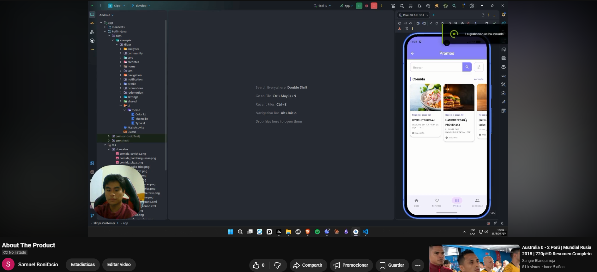
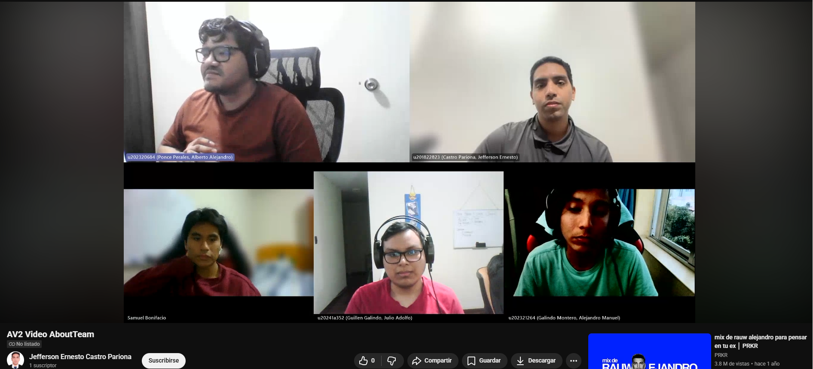

# Conclusiones

- El desarrollo del Sprint 3 consolidó la madurez funcional del producto al incorporar el despliegue de la aplicación móvil en Firebase App Distribution, permitiendo validar la entrega de una versión instalable y compartible para pruebas internas y revisión del avance del MVP.

- La integración del trabajo realizado en el Sprint 2, especialmente en los Bounded Contexts del backend y su despliegue en Railway, permitió contar con una base técnica estable para soportar los flujos principales de autenticación, favoritos, promociones, canjes y perfil de usuario.

- Las entrevistas de validación realizadas en esta etapa confirmaron que la propuesta de valor de Klippr resulta comprensible tanto para usuarios finales como para negocios afiliados, destacando como elementos más valorados el canje seguro mediante QR único y la posibilidad de gestionar campañas con mayor control.

- Los resultados obtenidos también evidenciaron oportunidades de mejora concretas en la experiencia de usuario, como la claridad de algunos flujos, la necesidad de reforzar el contenido orientado a negocios y la corrección de elementos de navegación que generaban confusión durante la exploración del prototipo.

- A nivel de colaboración y gestión, el equipo mantuvo una organización efectiva del trabajo durante los Sprints 2 y 3, lo que permitió avanzar en paralelo con el backend, la aplicación móvil y la documentación del informe, asegurando consistencia entre implementación, validación y presentación de evidencias.

- En conjunto, los avances del Sprint 2 y Sprint 3 demuestran que Klippr ha evolucionado desde una base arquitectónica y de backend sólida hacia una solución más cercana a un MVP validable, con componentes desplegados, prototipos funcionales y retroalimentación real de usuarios que orienta las siguientes iteraciones.

# Video App Validation

Link: https://youtu.be/GtMGwwJoRAQ

# Video About The Product

Link: https://youtu.be/W2HLC4PCJRQ

# Video About The Team

Link: https://youtu.be/MyfhH-qDnhU

# Bibliografía

Evans, E. (2003). _Domain-driven design: Tackling complexity in the heart of software_. Addison-Wesley Professional.

Gothelf, J., & Seiden, J. (2021). _Lean UX: Designing great products with agile teams_ (3rd ed.). O'Reilly Media.

Richardson, C. (2018). _Microservices patterns: With examples in Java_. Manning Publications.

Brandolini, A. (2021). _Introducing EventStorming: An act of deliberate collective sensemaking_. Leanpub. https://leanpub.com/introducing_eventstorming

Ries, E. (2011). _The lean startup: How today's entrepreneurs use continuous innovation to create radically successful businesses_. Crown Business.

Beck, K., Beedle, M., van Bennekum, A., Cockburn, A., Cunningham, W., Fowler, M., Grenning, J., Highsmith, J., Hunt, A., Jeffries, R., Kern, J., Marick, B., Martin, R. C., Mellor, S., Schwaber, K., Sutherland, J., & Thomas, D. (2001). _Manifesto for agile software development_. Agile Alliance. https://agilemanifesto.org/

OWASP Foundation. (2021). _OWASP top ten_. https://owasp.org/www-project-top-ten/

International Organization for Standardization. (2011). _ISO/IEC 25010:2011 — Systems and software engineering — Systems and software quality requirements and evaluation (SQuaRE) — System and software quality models_. https://www.iso.org/standard/35733.html

QR Code.com. (s.f.). _What is a QR code?_ Denso Wave. https://www.qrcode.com/en/about/

Rappi. (2025). _Rappi: Pide lo que quieras_. https://www.rappi.com.pe

PedidosYa. (2025). _PedidosYa Perú_. https://www.pedidosya.com.pe

Cuponatic. (2025). _Cuponatic: Ofertas, cupones y descuentos_. https://www.cuponatic.com

Miro. (2025). _Miro: The visual workspace for innovation_. https://miro.com

Google. (2025). _Firebase documentation_. https://firebase.google.com/docs

Atlassian. (2025). _Jira software: Project and issue tracking_. https://www.atlassian.com/software/jira

Visa. (2023). _The future of digital payments in Latin America_. Visa Inc. https://www.visa.com.pe

Instituto Nacional de Estadística e Informática. (2024). _Estadísticas de tecnologías de información y comunicación en los hogares_. INEI. https://www.inei.gob.pe

# Anexos

<h2>Repositorios de la Organización</h2>

<table>
  <thead>
    <tr>
      <th>Repositorio</th>
      <th>URL</th>
    </tr>
  </thead>
  <tbody>
    <tr>
      <td>Report</td>
      <td>https://github.com/QRustOrg/ReportAV2</td>
    </tr>
    <tr>
      <td>Landing Page</td>
      <td>https://github.com/QRustOrg/Landing-Page</td>
    </tr>
    <tr>
      <td>Backend</td>
      <td>https://github.com/QRustOrg/Klippr-Backend</td>
    </tr>
    <tr>
      <td>Mobile App (Customer)</td>
      <td>https://github.com/QRustOrg/Klippr-Customer</td>
    </tr>
    <tr>
      <td>Mobile App (Business)</td>
      <td>https://github.com/QRustOrg/Klippr-Business</td>
    </tr>
  </tbody>

</table>
