# Capítulo II: Requirements Elicitation & Analysis

## 2.1. Competidores.
### 2.1.1. Análisis competitivo.
<table>
    <tr>
      <th colspan="6">Competitive Analysis Landscape — Plataformas de ofertas, cupones y descuentos</th>
    </tr>
    <tr>
      <td colspan="1">¿Por qué llevar a cabo el análisis?</td>
      <td colspan="5">Permite ubicar a <strong>Klippr</strong> frente a modelos de descuentos masivos, marketplaces y agregadores, identificar brechas (fraude, prueba social, trazabilidad por campaña) y definir tácticas de diferenciación coherentes con el MVP.</td>
    </tr>
    <tr>
      <td colspan="2"></td>
      <td align="center"> <strong>Klippr</strong> <em>(nuestra startup)</em></td>
      <td align="center"> <strong>Rappi</strong> <em>(delivery + promos)</em></td>
      <td align="center"> <strong>PedidosYa</strong> <em>(delivery + descuentos)</em></td>
      <td align="center"> <strong>Cuponatic</strong> <em>(cupones y ofertas digitales)</em></td>
    </tr>
    <tr>
      <td rowspan="2">Perfil</td>
      <td>Overview</td>
      <td>Plataforma móvil de cupones y descuentos con QR único por usuario/oferta, comunidad integrada (reseñas, ratings) y panel de autogestión para PYMEs.</td>
      <td>App de delivery y servicios con secciones de promociones, clubes y campañas según ciudad y marca.</td>
      <td>Plataforma de pedidos en línea donde restaurantes y retail publican descuentos ligados a compras por la app.</td>
      <td>Sitio/app orientada a cupones y promociones con enfoque editorial y descuentos por categoría.</td>
    </tr>
    <tr>
      <td>Ventaja competitiva ¿Qué valor ofrece a los clientes?</td>
      <td>QR único e irrepetible por canje, bloqueo post-canje anti-fraude, prueba social integrada al flujo y analítica en tiempo real para el comercio.</td>
      <td>Alcance regional, hábito de uso recurrente y bundling con otros servicios (envío, pagos, etc.).</td>
      <td>Conveniencia inmediata: descuentos dentro del flujo de compra de comida y retail express.</td>
      <td>Curación de ofertas y búsqueda por categoría; foco en “encontrar cupones” rápidamente.</td>
    </tr>
    <tr>
      <td rowspan="2">Perfil de Marketing</td>
      <td>Mercado Objetivo</td>
      <td>Consumidores que buscan descuentos verificados y PYMEs que necesitan control anti-fraude y métricas de campaña.</td>
      <td>Usuarios urbanos que ya consumen delivery y activan promociones por push o secciones de beneficios.</td>
      <td>Clientes de delivery y quick-commerce en distritos con cobertura de reparto.</td>
      <td>Usuarios price-sensitive que comparan cupones antes de comprar online o en retail asociado.</td>
    </tr>
    <tr>
      <td>Estrategias de Marketing</td>
      <td>Alianzas con cámaras de comercio, contenido educativo sobre el flujo "publicar–QR–canjear–reseñar" y referidos entre comercios.</td>
      <td>Notificaciones, banners in-app, alianzas con marcas y mecánicas de fidelización.</td>
      <td>Promociones flash, combos, cupones first-order y programas por restaurante.</td>
      <td>Tráfico web, redes sociales y newsletters con ofertas destacadas del día.</td>
    </tr>
    <tr>
      <td rowspan="3">Perfil de Producto</td>
      <td>Productos y Servicios</td>
      <td>App móvil con creación de campañas, generación de QR único por usuario, canje con validación en tiempo real, comunidad de reseñas y dashboard para el comercio.</td>
      <td>Descuentos y beneficios dentro de un ecosistema amplio (no exclusivamente “cuponera”).</td>
      <td>Descuentos asociados a pedidos; foco en canales digitales de restaurantes/tiendas adheridas.</td>
      <td>Catálogo de cupones/códigos; experiencia centrada en descubrimiento y compra del beneficio.</td>
    </tr>
    <tr>
      <td>Precios y Costos</td>
      <td>Modelo freemium para PYMEs (plan básico gratuito) con suscripción por analítica avanzada y comisión opcional.</td>
      <td>Descuentos financiados por marcas/plataforma; costos ligados a suscripción o dinámica de marketplace.</td>
      <td>Promos como palanca de adquisición; estructura de comisiones al comercio.</td>
      <td>Ofertas con precios promocionales; mix de modelos por afiliación y publicidad.</td>
    </tr>
    <tr>
      <td>Canales de distribución (Web y/o Móvil)</td>
      <td>App móvil (iOS y Android) y panel web de administración para comercios.</td>
      <td>App móvil y web.</td>
      <td>App móvil y web.</td>
      <td>Web y presencia móvil (según mercado).</td>
    </tr>
    <tr>
      <td rowspan="4">Análisis SWOT</td>
      <td>Fortalezas</td>
      <td>QR único, comunidad integrada al canje, analítica por campaña.</td>
      <td>Tráfico alto, datos de uso y cross-selling entre categorías.</td>
      <td>Alta frecuencia de compra y descuentos contextualizados al pedido.</td>
      <td>Claridad para usuarios que buscan cupones; SEO y comunidad de ofertas.</td>
    </tr>
    <tr>
      <td>Debilidades</td>
      <td>Marca nueva sin reconocimiento masivo.</td>
      <td>Promos compiten con muchos objetivos de producto; no siempre hay “QR único” anti-fraude por campaña PYME.</td>
      <td>Descuentos acotados al canal delivery; menos foco en canje físico genérico con trazabilidad completa.</td>
      <td>Códigos compartibles y dinámicas tradicionales de cupón; limitada capa social integrada al canje.</td>
    </tr>
    <tr>
      <td>Oportunidades</td>
      <td>Mercado local de PYMEs sin solución anti-fraude adecuada; creciente demanda de prueba social.</td>
      <td>Profundizar beneficios hyperlocal y programas de lealtad.</td>
      <td>Retail y dark stores; bundles con marcas.</td>
      <td>Personalización y alertas por intereses del usuario.</td>
    </tr>
    <tr>
      <td>Amenazas</td>
      <td>Superapps con módulos promocionales integrados; fatiga de descuentos en usuarios.</td>
      <td>Regulación laboral/logística y competencia entre superapps.</td>
      <td>Comisiones y costos logísticos; sensibilidad al churn promocional.</td>
      <td>Agregadores competidores y canales alternativos (redes sociales, grupos de ofertas).</td>
    </tr>
    <tr>
      <td colspan="2"><strong>Diferenciación Klippr (MVP)</strong></td>
      <td colspan="4"><strong>QR único</strong> por usuario/oferta, <strong>bloqueo post-canje</strong>, <strong>comunidad</strong> (reseñas, ratings, likes/comentarios) integrada al flujo, <strong>analítica por campaña</strong> y <strong>autogestión</strong> para PYMEs, con <strong>panel admin</strong> para verificación y fraude.</td>
    </tr>
  </table>

  ---
### 2.1.2. Estrategias y tácticas frente a competidores.

**QRust** posicionará a **Klippr** explotando las diferencias del MVP frente a marketplaces tradicionales y cuponeras: **unicidad del código (QR personal e irrepetible)**, **anti-fraude con bloqueo automático post-canje**, **comunidad integrada** (reseñas, ratings, likes y comentarios) y **analítica por campaña** con autogestión para el comercio. Frente a actores con gran inventario pero poca trazabilidad fina para PYMEs, el producto apuesta por **confianza** (prueba social + validación en tiempo real en tienda) y por **operación simple** para negocios sin implementaciones costosas.

Las debilidades típicas de una etapa inicial (menor marca, menor volumen de ofertas vs. incumbentes) se abordarán con **pilotos verticales** (por ejemplo, gastronomía o retail de proximidad), acuerdos con **cámaras de comercio**, asociaciones de **centros comerciales** o **hubs** universitarios, y un plan de contenidos que enseñe el flujo **publicar, generar QR, canjear y reseñar**. El objetivo es construir densidad local y casos de éxito medibles antes de escalar geográficamente.

Para mitigar amenazas como la competencia de **superapps** con módulos promocionales o la **fatiga** de descuentos en redes sociales, se priorizará: (1) **verificación de empresas** y moderación; (2) **UX de canje** con validación rápida y alternativa manual; (3) **métricas claras** para el comercio (vistas, canjes, satisfacción); (4) comunicación del valor **anti-fraude** como beneficio económico directo, no solo “más marketing”.

## 2.2. Entrevistas.

### 2.2.1. Diseño de entrevistas.

**En esta sección se distribuye el diseño de las preguntas a nuestro público objetivo para recopilar información importante, como sus opiniones y descripciones. Estos datos serán clave para desarrollar nuestra solución.**

**Preguntas para el Segmento Objetivo 1 - Usuario consumidor:**

- ¿Qué edad tienes y en qué distrito vives?
- ¿A qué te dedicas?
- ¿Con qué frecuencia sales a comer, comprar o hacer actividades de entretenimiento?
- ¿Sueles usar descuentos o promociones? ¿Dónde los encuentras?
- ¿Alguna vez has tenido problemas con promociones?
- ¿Qué tan importante es para ti leer reseñas antes de usar una promoción?
- ¿Te ha pasado que un descuento no funcionó al momento de pagar?
- ¿Confías en los cupones que ves en redes sociales? ¿Por qué?
- ¿Qué es lo que más te molesta al usar promociones?
- ¿Qué opinas de una app donde cada descuento tiene un QR único que solo puedes usar una vez?
- ¿Te daría más confianza ver reseñas reales antes de usar una promoción?
- ¿Qué tan importante sería para ti que la promoción sea “verificada”?
- ¿Te gustaría recibir notificaciones de descuentos cerca de ti?
- Después de usar un descuento, ¿estarías dispuesto a dejar una reseña?
- ¿Qué haría que uses esta app constantemente?
- ¿Qué te haría dejar de usar una app de descuentos?

**Preguntas para el Segmento Objetivo 2 - Empresas afiliadas:**

- ¿Qué edad tienes y en qué distrito vives?
- ¿Cuál es tu rol dentro del negocio?
- ¿Cuántos clientes recibes aproximadamente al día?
- ¿Utilizas actualmente promociones o descuentos?
- ¿Qué tipo de promociones te funcionan mejor?
- ¿Has tenido problemas con clientes que reutilizan promociones o hacen fraude?
- ¿Cómo controlas actualmente los descuentos?
- ¿Te resulta difícil medir si una promoción realmente funcionó?
- ¿Qué opinas de usar QR únicos para validar descuentos?
- ¿Te sería útil ver cuántos clientes canjearon cada promoción?
- ¿Qué tan importante es evitar pérdidas por mal uso de promociones?
- ¿Tu equipo podría adaptarse a escanear un QR al momento de cobrar?
- ¿Qué tan importante es que la herramienta sea rápida y fácil?
- ¿Te interesaría que los clientes dejen reseñas públicas?
- ¿Te gustaría responder esas reseñas?
- ¿Estarías dispuesto a pagar por una solución así?
- ¿Qué te haría dejar de usar una herramienta de este tipo?

### 2.2.2. Registro de entrevistas

#### Segmento 1: Usuarios

<table border="1" cellpadding="8" cellspacing="0" style="width:100%; border-collapse: collapse;">
  <tr>
    <th colspan="2">Entrevista 1</th>
  </tr>
  <tr>
    <td><strong>Nombre:</strong></td>
    <td>Andrés Rodríguez</td>
  </tr>
  <tr>
    <td><strong>Edad:</strong></td>
    <td>22 años</td>
  </tr>
  <tr>
    <td><strong>Distrito:</strong></td>
    <td>Callao, Callao</td>
  </tr>
  <tr>
    <td><strong>URL del video:</strong></td>
    <td>
      https://upcedupe-my.sharepoint.com/:v:/g/personal/u201822823_upc_edu_pe/IQDo0KBION1VTKoQ1GzKLBVaAcmioWPwcySPB48GvheC0bE?nav=eyJyZWZlcnJhbEluZm8iOnsicmVmZXJyYWxBcHAiOiJPbmVEcml2ZUZvckJ1c2luZXNzIiwicmVmZXJyYWxBcHBQbGF0Zm9ybSI6IldlYiIsInJlZmVycmFsTW9kZSI6InZpZXciLCJyZWZlcnJhbFZpZXciOiJNeUZpbGVzTGlua0NvcHkifX0&e=kHPOAq  
      Timing: 02:00  
      Duración: 04:26 minutos
    </td>
  </tr>
  <tr>
    <td><strong>Screenshot del video:</strong></td>
    <td></td>
  </tr>
  <tr>
    <td colspan="2"><strong>Resumen de la entrevista:</strong></td>
  </tr>
  <tr>
    <td colspan="2">
      Andrés Rodríguez es un usuario activo en búsqueda de oportunidades para optimizar sus gastos en actividades cotidianas como compras y entretenimiento. Durante la entrevista, expresó su interés específico en una aplicación que le permitiera acceder a cupones de descuento en tiendas de manera confiable y verificada. Asimismo, mencionó que ha tenido experiencias negativas con cupones inválidos, lo que afecta su confianza en este tipo de plataformas. También considera importante que los descuentos sean fáciles de usar y que la experiencia dentro de la aplicación sea rápida y sencilla.
    </td>
  </tr>
</table>

 

<table border="1" cellpadding="8" cellspacing="0" style="width:100%; border-collapse: collapse;">
  <tr>
    <th colspan="2">Entrevista 2</th>
  </tr>

  <tr>
    <td><strong>Nombre:</strong></td>
    <td> Lewis Alexis Rengifo Pizango</td>
  </tr>

  <tr>
    <td><strong>Edad: </strong></td>
    <td>24 años</td>
  </tr>

  <tr>
    <td><strong>Distrito: </strong></td>
    <td>Pueblo Libre</td>
  </tr>

  <tr>
    <td><strong>URL del video: </strong></td>
    <td>
      https://upcedupe-my.sharepoint.com/:v:/g/personal/u202320684_upc_edu_pe/IQCt1PO3Zi7MR6Dtlk5fNIGKAcYEEpFAIyMnVLLxpVX88fE?e=CKJ9yt&nav=eyJyZWZlcnJhbEluZm8iOnsicmVmZXJyYWxBcHAiOiJTdHJlYW1XZWJBcHAiLCJyZWZlcnJhbFZpZXciOiJTaGFyZURpYWxvZy1MaW5rIiwicmVmZXJyYWxBcHBQbGF0Zm9ybSI6IldlYiIsInJlZmVycmFsTW9kZSI6InZpZXcifX0%3D  
      Timing: 02:59  
      Duración: 06:46 minutos
    </td>
  </tr>

  <tr>
    <td><strong>Screenshot del video:</strong></td>
    <td>
      
    </td>
  </tr>

  <tr>
    <td colspan="2"><strong>Resumen de la entrevista:</strong></td>
  </tr>

  <tr>
    <td colspan="2">
      Se trata de un joven de 24 años que busca descuentos en redes sociales para sus salidas frecuentes. Su principal molestia es la falta de claridad en las condiciones y los fallos al pagar. Valora mucho las reseñas reales y las promociones "verificadas" para evitar engaños. Considera que una app con QR único sería ideal por su orden y seguridad, siempre que sea rápida, fácil de usar y le garantice un ahorro real sin complicaciones.
    </td>
  </tr>

</table>

 

<table border="1" cellpadding="8" cellspacing="0" style="width:100%; border-collapse: collapse;">
  <tr>
    <th colspan="2">Entrevista 3</th>
  </tr>

  <tr>
    <td><strong>Nombre:</strong></td>
    <td>Matias Flores</td>
  </tr>

  <tr>
    <td><strong>Edad:</strong></td>
    <td>19 años</td>
  </tr>

  <tr>
    <td><strong>Distrito:</strong></td>
    <td>Comas</td>
  </tr>

  <tr>
    <td><strong>URL del video:</strong></td>
    <td>
    https://upcedupe-my.sharepoint.com/:v:/g/personal/u201822823_upc_edu_pe/IQAdyVDZ2_ILS5z6JYOxOEmWAen_dqYLvB3uLf90INsKNSc?nav=eyJyZWZlcnJhbEluZm8iOnsicmVmZXJyYWxBcHAiOiJPbmVEcml2ZUZvckJ1c2luZXNzIiwicmVmZXJyYWxBcHBQbGF0Zm9ybSI6IldlYiIsInJlZmVycmFsTW9kZSI6InZpZXciLCJyZWZlcnJhbFZpZXciOiJNeUZpbGVzTGlua0NvcHkifX0&e=tLIThZ
        
       Timing: 02:00
        
       Duracion: 06:07
    </td>
  </tr>

  <tr>
    <td><strong>Screenshot del video:</strong></td>
    <td>
      
    </td>
  </tr>

  <tr>
    <td colspan="2"><strong>Resumen de la entrevista:</strong></td> 
  </tr>
  
  <tr>
    <td colspan="2">
      Matias comentó que suele tener dificultades al momento de aplicar a descuentos en la tienda, ya que en muchas ocasiones no logra visualizar claramente los precios actualizados o las promociones disponibles, lo que genera confusión y desconfianza durante la compra. Asimismo, señaló que le gustaría contar con una aplicación donde pueda ver de forma rápida y clara los descuentos, cupones y precios finales, facilitando así su decisión de compra y mejorando su experiencia como cliente.    
    </td>
  </tr>

</table>

#### Segmento 2: Empresas afiliadas

<table border="1" cellpadding="8" cellspacing="0" style="width:100%; border-collapse: collapse;">
  <tr>
    <th colspan="2">Entrevista 1 - Segmento 2: Empresa Afiliada</th>
  </tr>
  <tr>
    <td><strong>Nombre:</strong></td>
    <td>Camila Huamani</td>
  </tr>
  <tr>
    <td><strong>Edad:</strong></td>
    <td>30 años</td>
  </tr>
  <tr>
    <td><strong>Distrito:</strong></td>
    <td>Chorrillos, Lima</td>
  </tr>
  <tr>
    <td><strong>URL del video:</strong></td>
    <td>
      https://upcedupe-my.sharepoint.com/:v:/g/personal/u201822823_upc_edu_pe/IQAAeVdzNRpwTq4OztwDUXrFAQfCBzQqiU8uFd6vvLevTW8  
      Timing: 01:00  
      Duración: 05:11 minutos
    </td>
  </tr>
  <tr>
    <td><strong>Screenshot del video:</strong></td>
    <td></td>
  </tr>
  <tr>
    <td colspan="2"><strong>Resumen de la entrevista:</strong></td>
  </tr>
  <tr>
    <td colspan="2">
      Camila Huamani es una empresaria con experiencia en gestión comercial, enfocada en estrategias para aumentar la lealtad de su base de clientes. Durante la entrevista, expresó la necesidad de contar con herramientas tecnológicas que faciliten la creación y administración de promociones, destacando que actualmente tiene dificultades para medir el impacto real de estas en su negocio. Asimismo, manifestó preocupación por el fraude y la reutilización de cupones, lo que genera pérdidas económicas, y señaló la importancia de contar con un mayor control sobre las promociones, como saber quién las utiliza, cuándo y cuántas veces pueden ser canjeadas. Además, indicó que busca una solución fácil de implementar, que no requiera cambios complejos en sus procesos operativos, y valoró la posibilidad de recibir retroalimentación de los clientes mediante reseñas, ya que esto fortalece la relación comercial.
    </td>
  </tr>
</table>

 

<table border="1" cellpadding="8" cellspacing="0" style="width:100%; border-collapse: collapse;">
  <tr>
    <th colspan="2">Entrevista 2</th>
  </tr>

  <tr>
    <td><strong>Nombre: </strong></td>
    <td>Jesus Alexander Ponce</td>
  </tr>

  <tr>
    <td><strong>Edad: </strong></td>
    <td>29 años</td>
  </tr>

  <tr>
    <td><strong>Distrito: </strong></td>
    <td>Tarapoto</td>
  </tr>

  <tr>
    <td><strong>URL del video: </strong></td>
    <td>
      https://upcedupe-my.sharepoint.com/:v:/g/personal/u202320684_upc_edu_pe/IQC50yyoAtsNQJIGy88Y31PoARAnXFRfKTvA-nBtH2_LRls?e=4PnqIu&nav=eyJyZWZlcnJhbEluZm8iOnsicmVmZXJyYWxBcHAiOiJTdHJlYW1XZWJBcHAiLCJyZWZlcnJhbFZpZXciOiJTaGFyZURpYWxvZy1MaW5rIiwicmVmZXJyYWxBcHBQbGF0Zm9ybSI6IldlYiIsInJlZmVycmFsTW9kZSI6InZpZXcifX0%3D  
      Timing: 4:34 
      Duración: 09:57 minutos
    </td>
  </tr>

  <tr>
    <td><strong>Screenshot del video:</strong></td>
    <td>
      
    </td>
  </tr>

  <tr>
    <td colspan="2"><strong>Resumen de la entrevista:</strong></td>
  </tr>

  <tr>
    <td colspan="2">
      Es un dueño de negocio que maneja un alto flujo de clientes y utiliza promociones manuales para competir. Sus problemas actuales son la falta de métricas de éxito y el riesgo de fraude por clientes que reutilizan cupones. Busca una herramienta ágil con validación QR que evite pérdidas y le permita ver estadísticas de canje. Está interesado en gestionar reseñas para generar confianza, siempre que el sistema no retrase la atención en caja.
    </td>
  </tr>

</table>

 

<table border="1" cellpadding="8" cellspacing="0" style="width:100%; border-collapse: collapse;">
  <tr>
    <th colspan="2">Entrevista 3</th>
  </tr>

  <tr>
    <td><strong>Nombre:</strong></td>
    <td>Sonia Galindo</td>
  </tr>

  <tr>
    <td><strong>Edad:</strong></td>
    <td>58 años</td>
  </tr>

  <tr>
    <td><strong>Distrito:</strong></td>
    <td>Jesus Maria</td>
  </tr>

  <tr>
    <td><strong>URL del video:</strong></td>
    <td>
      https://upcedupe-my.sharepoint.com/:v:/g/personal/u201822823_upc_edu_pe/IQCyNoWHm-rmRIhlqX64BFGGAYzS70GNYrlMcyYnh344q-g?nav=eyJyZWZlcnJhbEluZm8iOnsicmVmZXJyYWxBcHAiOiJPbmVEcml2ZUZvckJ1c2luZXNzIiwicmVmZXJyYWxBcHBQbGF0Zm9ybSI6IldlYiIsInJlZmVycmFsTW9kZSI6InZpZXciLCJyZWZlcnJhbFZpZXciOiJNeUZpbGVzTGlua0NvcHkifX0&e=GVZ2FI  
      Timing: 01:30  
      Duración: 03:24
    </td>
  </tr>

  <tr>
    <td><strong>Screenshot del video:</strong></td>
    <td>
      
    </td>
  </tr>

  <tr>
    <td colspan="2"><strong>Resumen de la entrevista:</strong></td>
  </tr>

  <tr>
    <td colspan="2">
      Sonia Galindo quien es dueña de la tienda y responsable de la gestión operativa, explicó que se encarga de planificar, implementar y supervisar las estrategias de descuentos y cupones con el objetivo de atraer clientes y aumentar las ventas. Señaló que estas promociones se definen según temporadas, niveles de inventario y comportamiento del cliente, y que actualmente su control se realiza de forma manual o con herramientas básicas, lo que dificulta el seguimiento y la medición de resultados. Además, destacó la importancia de equilibrar las ofertas para no afectar la rentabilidad del negocio y manifestó interés en implementar soluciones tecnológicas que permitan automatizar la gestión y mejorar la toma de decisiones mediante análisis en tiempo real.
    </td>
  </tr>

</table>

 

### 2.2.3. Análisis de entrevistas

En esta sección se presentan los hallazgos de las entrevistas realizadas a ambos segmentos objetivo, basados en evidencia empírica. Se ha realizado un análisis de características objetivas (demográficas, operacionales) y subjetivas (necesidades, comportamientos, expectativas) identificadas en las entrevistas, respaldadas con datos cuantitativos que sustentan los arquetipos de usuario.

#### **Análisis Segmento 1: Usuarios Consumidores (B2C)**

**Perfil Demográfico:**

<table border="1" cellpadding="8" cellspacing="0" style="width:100%; border-collapse: collapse;">
  <tr>
    <th>Característica</th>
    <th>Datos</th>
  </tr>
  <tr>
    <td>Número de entrevistados</td>
    <td>2</td>
  </tr>
  <tr>
    <td>Edad promedio</td>
    <td>23 años</td>
  </tr>
  <tr>
    <td>Rango de edad</td>
    <td>22 - 24 años</td>
  </tr>
  <tr>
    <td>Distritos representados</td>
    <td>Callao (50%), Pueblo Libre (50%)</td>
  </tr>
  <tr>
    <td>Género</td>
    <td>Mixto</td>
  </tr>
</table>

 

**Fuente:** Entrevista 1 (Andrés Rodríguez, 22 años) y Entrevista 2 (Lewis Alexis Rengifo, 24 años).

---

**Características Objetivas Identificadas:**

<table border="1" cellpadding="8" cellspacing="0" style="width:100%; border-collapse: collapse;">
  <tr>
    <th>Característica</th>
    <th>Frecuencia</th>
    <th>Porcentaje</th>
    <th>Evidencia en Entrevistas</th>
  </tr>
  <tr>
    <td>Busca activamente descuentos en redes sociales</td>
    <td>2 de 2</td>
    <td>100%</td>
    <td>Lewis: "Busca descuentos en redes sociales"</td>
  </tr>
  <tr>
    <td>Realiza compras/entretenimiento con alta frecuencia</td>
    <td>2 de 2</td>
    <td>100%</td>
    <td>Ambos mencionan salidas frecuentes para compras y entretenimiento</td>
  </tr>
  <tr>
    <td>Ha experimentado problemas con cupones inválidos</td>
    <td>2 de 2</td>
    <td>100%</td>
    <td>Andrés: "experiencias negativas con cupones inválidos"; Lewis: "fallos al pagar"</td>
  </tr>
  <tr>
    <td>Valora facilidad y rapidez de uso</td>
    <td>2 de 2</td>
    <td>100%</td>
    <td>Andrés: "rápida y sencilla"; Lewis: "rápida, fácil de usar"</td>
  </tr>
  <tr>
    <td>Utiliza reseñas como criterio de confianza</td>
    <td>2 de 2</td>
    <td>100%</td>
    <td>Lewis: "Valora mucho las reseñas reales"; Ambos consideran importante leer reseñas</td>
  </tr>
  <tr>
    <td>Demanda transparencia en condiciones de promociones</td>
    <td>2 de 2</td>
    <td>100%</td>
    <td>Lewis: "falta de claridad en las condiciones"</td>
  </tr>
  <tr>
    <td>Prioriza seguridad y verificación</td>
    <td>2 de 2</td>
    <td>100%</td>
    <td>Lewis: "promociones verificadas"; Andrés valora "confiabilidad"</td>
  </tr>
</table>

 

**Fuente:** Análisis de resúmenes de Entrevista 1 y 2, Segmento 1.

---

**Características Subjetivas Identificadas:**

<table border="1" cellpadding="8" cellspacing="0" style="width:100%; border-collapse: collapse;">
  <tr>
    <th>Necesidad/Comportamiento</th>
    <th>Descripción</th>
    <th>Evidencia</th>
    <th>Impacto en Requisitos</th>
  </tr>
  <tr>
    <td><strong>Confianza en la plataforma</strong></td>
    <td>Necesidad crítica de validar la autenticidad de descuentos antes de aplicarlos. Desconfianza derivada de experiencias negativas previas</td>
    <td>Andrés: "experiencias negativas"; Lewis: "confía en promociones verificadas"</td>
    <td>Requerimiento: Sistema de verificación de empresas, badges de validación, historial de ratings</td>
  </tr>
  <tr>
    <td><strong>Experiencia sin fricción</strong></td>
    <td>Expectativa de que el proceso de búsqueda, canje e integración sea inmediato y sin pasos innecesarios</td>
    <td>Andrés: "experiencia rápida"; Lewis: "fácil de usar"</td>
    <td>Requerimiento: UX optimizada, canje con QR de un clic, confirmación inmediata</td>
  </tr>
  <tr>
    <td><strong>Prueba social como validador</strong></td>
    <td>Los usuarios consultan reseñas y ratings de otros usuarios antes de canjear promociones; esto reduce incertidumbre</td>
    <td>Lewis: "reseñas reales y promociones verificadas"; Ambos valoran reseñas</td>
    <td>Requerimiento: Sistema de comentarios integrado, ratings visibles previo al canje</td>
  </tr>
  <tr>
    <td><strong>Optimización de gasto</strong></td>
    <td>Motivación principal: ahorrar dinero en actividades cotidianas de entretenimiento y alimentación</td>
    <td>Ambos buscan activamente descuentos</td>
    <td>Requerimiento: Recomendaciones personalizadas, notificaciones de ofertas cercanas</td>
  </tr>
  <tr>
    <td><strong>Transparencia operacional</strong></td>
    <td>Demanda de claridad en términos, condiciones y aplicación de descuentos al momento de pago</td>
    <td>Lewis: "falta de claridad en condiciones"; Andrés menciona "fallos al pagar"</td>
    <td>Requerimiento: Visualización clara de términos, comparación de precios aplicados, confirmación pre-canje</td>
  </tr>
</table>

 

**Fuente:** Síntesis de resúmenes de entrevistas, Segmento 1.

---

#### **Análisis Segmento 2: Empresas Afiliadas (B2B)**

**Perfil Operacional:**

<table border="1" cellpadding="8" cellspacing="0" style="width:100%; border-collapse: collapse;">
  <tr>
    <th>Característica</th>
    <th>Datos</th>
  </tr>
  <tr>
    <td>Número de entrevistados</td>
    <td>3</td>
  </tr>
  <tr>
    <td>Edad promedio</td>
    <td>39 años</td>
  </tr>
  <tr>
    <td>Rango de edad</td>
    <td>29 - 58 años</td>
  </tr>
  <tr>
    <td>Distritos representados</td>
    <td>Chorrillos (33%), Tarapoto (33%), Jesús María (33%)</td>
  </tr>
  <tr>
    <td>Rol predominante</td>
    <td>Dueños/gestores operacionales</td>
  </tr>
</table>

 

**Fuente:** Entrevista 1 (Camila Huamani, 30 años), Entrevista 2 (Jesus Alexander Ponce, 29 años), Entrevista 3 (Sonia Galindo, 58 años).

---

**Características Objetivas Identificadas:**

<table border="1" cellpadding="8" cellspacing="0" style="width:100%; border-collapse: collapse;">
  <tr>
    <th>Característica</th>
    <th>Frecuencia</th>
    <th>Porcentaje</th>
    <th>Evidencia en Entrevistas</th>
  </tr>
  <tr>
    <td>Utiliza promociones como herramienta de marketing/competencia</td>
    <td>3 de 3</td>
    <td>100%</td>
    <td>Todos mencionan uso activo: Camila (estrategias de lealtad), Jesus (competencia), Sonia (atraer clientes)</td>
  </tr>
  <tr>
    <td>Enfrenta problemas significativos de fraude/reutilización de cupones</td>
    <td>3 de 3</td>
    <td>100%</td>
    <td>Camila: "fraude y reutilización"; Jesus: "riesgo de fraude"; Sonia (implícito en control manual)</td>
  </tr>
  <tr>
    <td>Carece de métricas claras de ROI/éxito de promociones</td>
    <td>3 de 3</td>
    <td>100%</td>
    <td>Camila: "dificultades para medir impacto real"; Jesus: "falta de métricas"; Sonia: "dificulta seguimiento"</td>
  </tr>
  <tr>
    <td>Realiza control manual/básico de descuentos</td>
    <td>3 de 3</td>
    <td>100%</td>
    <td>Camila/Sonia: "herramientas básicas"; Jesus: interés en "validación QR" implica esto</td>
  </tr>
  <tr>
    <td>Gestiona alto volumen de clientes</td>
    <td>2 de 3</td>
    <td>67%</td>
    <td>Jesus: "alto flujo"; Implícito en Sonia (tienda física); Camila (empresaria con cartera)</td>
  </tr>
  <tr>
    <td>Demanda soluciones de fácil integración operativa</td>
    <td>3 de 3</td>
    <td>100%</td>
    <td>Sonia: "no retrase la atención"; Camila: "fácil de implementar"; Jesus: "ágil"</td>
  </tr>
  <tr>
    <td>Valora retroalimentación de clientes (reseñas)</td>
    <td>2 de 3</td>
    <td>67%</td>
    <td>Camila: "retroalimentación de clientes mediante reseñas"; Jesus: "generar confianza"</td>
  </tr>
</table>

 

**Fuente:** Análisis de resúmenes de Entrevistas 1-3, Segmento 2.

---

**Características Subjetivas Identificadas:**

<table border="1" cellpadding="8" cellspacing="0" style="width:100%; border-collapse: collapse;">
  <tr>
    <th>Necesidad/Comportamiento</th>
    <th>Descripción</th>
    <th>Evidencia</th>
    <th>Impacto en Requisitos</th>
  </tr>
  <tr>
    <td><strong>Control contra fraude</strong></td>
    <td>Preocupación crítica sobre pérdidas económicas por mal uso de cupones; ausencia de mecanismos robustos de validación</td>
    <td>Camila: "pérdidas económicas", "mayor control"; Jesus: "evitar pérdidas"</td>
    <td>Requerimiento: QR único irrepetible, bloqueo post-canje automático, auditoría de canjes</td>
  </tr>
  <tr>
    <td><strong>Visibilidad analítica en tiempo real</strong></td>
    <td>Necesidad de datos accionables sobre desempeño de campañas: número de canjes, perfil de usuario, ROI por promoción</td>
    <td>Camila: "medir impacto real"; Jesus: "estadísticas de canje"; Sonia: "análisis en tiempo real"</td>
    <td>Requerimiento: Dashboard con métricas (vistas, canjes, tasa de conversión), reportes exportables</td>
  </tr>
  <tr>
    <td><strong>Automatización operativa</strong></td>
    <td>Reduce carga manual de gestión; acelera procesos de validación sin ralentizar atención</td>
    <td>Sonia: "automatizar la gestión"; Todos enfatizan facilidad</td>
    <td>Requerimiento: Escaneo QR rápido (&lt;2s), integración POS/caja, sincronización automática</td>
  </tr>
  <tr>
    <td><strong>Construación de relación con cliente</strong></td>
    <td>Interés en recopilar feedback y reseñas para mejorar percepción y fidelización; generación de prueba social</td>
    <td>Camila: "relación comercial"; Jesus: "generar confianza"</td>
    <td>Requerimiento: Sistema de reseñas asociado a promociones, respuesta empresarial integrada</td>
  </tr>
  <tr>
    <td><strong>Adaptabilidad sin complejidad técnica</strong></td>
    <td>Soluciones que no requieran capacitación técnica pesada ni cambios radicales en flujos operacionales</td>
    <td>Sonia: "cambios complejos en procesos"; Jesus: "ágil"; Camila: "fácil de implementar"</td>
    <td>Requerimiento: UX intuitiva para backend empresarial, onboarding guiado, soporte integrado</td>
  </tr>
  <tr>
    <td><strong>Pago por valor entregado</strong></td>
    <td>Disposición a pagar solo si la solución demuestra ROI claro y prevención de fraude mensurable</td>
    <td>Implícito en Camila: "busca soluciones tecnológicas"; Jesus y Sonia aceptarían si es ágil</td>
    <td>Requerimiento: Modelo freemium con auditoría, o comisión por canje validado</td>
  </tr>
</table>

 

**Fuente:** Síntesis de resúmenes de entrevistas, Segmento 2.

---

#### **Síntesis Transversal: Arquetipos y Requisitos Clave**

**Patrón 1: Crisis de Confianza (100% transversal)**
- Ambos segmentos mencionan desconfianza/fraude como problema central.
- En B2C: desconfianza en validez de cupones (problemas previos).
- En B2B: pérdidas económicas por reutilización de códigos.
- **Requisito impulsor:** Mecanismo anti-fraude robusto (QR único, bloqueo post-canje, trazabilidad).

**Patrón 2: Demanda de Transparencia Operacional (100% en B2B, 100% en B2C)**
- B2C: necesidad de claridad en términos y confirmación pre-canje.
- B2B: necesidad de visibilidad de métricas y control de canjes.
- **Requisito impulsor:** Auditoría y reportería detallada; UX de confirmación clara.

**Patrón 3: Proof of Trust mediante Social Signals (100% en B2C, 67% en B2B)**
- Ambos segmentos valoran reseñas y ratings como validadores de credibilidad.
- En B2C: consultan antes de canjear.
- En B2B: buscan generar confianza en clientes.
- **Requisito impulsor:** Sistema de comentarios/ratings integrado, moderación, respuestas empresariales.

**Patrón 4: Fricción vs. Performance (100% en ambos)**
- B2C: experiencia rápida, sin pasos innecesarios.
- B2B: no ralentizar caja; integración ágil; automatización manual.
- **Requisito impulsor:** Latencia <2s para escaneo, UX minimalista, batch-processing en backend.

**Patrón 5: Segmentación Geográfica y Escala Local**
- Usuarios activos en distritos metropolitanos (Callao, Pueblo Libre, Chorrillos, Jesús María) y regional (Tarapoto).
- Implica: necesidad de geolocalización, recomendaciones locales, soporte multi-zona.
- **Requisito impulsor:** API de geolocalización, filtros por proximidad, backend distribuido.

**Hallazgo de Ingeniería de Software:**
El análisis revela que Klippr debe priorizar en su arquitectura y MVP:
1. **Core anti-fraude:** QR único por usuario/oferta con bloqueo inmediato post-canje y auditoría inmutable.
2. **Analytics layer:** Dashboard en tiempo real para B2B (vistas, canjes, tasa de fraude detectado).
3. **Social layer:** Comentarios/ratings con moderación y respuesta empresarial integrada.
4. **Performance:** Latencia crítica <2s para validación de QR en punto de canje (requisito no-funcional crítico).
5. **Escalabilidad geográfica:** Soporte para múltiples zonas y modelos de integración (POS, manual, API).

## 2.3. Needfinding

### 2.3.1. User Personas

En esta sección se presentan las fichas de **User Personas** construidas a partir de los datos recolectados del análisis de entrevistas a nuestros segmentos objetivos. **Estas fichas permiten representar de forma clara y estratégica los perfiles de cada segmento objetivo, considerando sus metas, habilidades, motivaciones y dificultades.** De esta manera se integra la perspectiva del usuario y tendencias del sector para identificar oportunidades en el mercado y ofrecer una solución alineada a lo que el usuario necesita.

## Segmento Objetivo 1: Usuario consumidor (B2C)

## Segmento Objetivo 2: Empresas afiliadas (B2B)

### 2.3.2. User Task Matrix

En esta sección se presenta el **User Task Matrix**, construido a partir de los User Persona que representan a los dos segmentos clave identificados en la plataforma.

**Segmento 1:** Usuarios consumidores (representado por Lizbeth Sánchez).
**Segmento 2:** Negocios afiliados (representado por Alexander Gálvez).

Las tareas fueron identificadas a partir del análisis del comportamiento esperado de ambos perfiles dentro de la aplicación, considerando sus necesidades, objetivos y puntos de interacción con la plataforma. Cada tarea fue evaluada según su frecuencia de uso y nivel de importancia, con el fin de priorizar funcionalidades clave para el desarrollo del MVP y mejorar la experiencia general del sistema.

<table border="1" cellpadding="8" cellspacing="0">
  <thead>
    <tr>
      <th rowspan="2">Tarea / Task</th>
      <th colspan="2">Lizbeth Sánchez</th>
      <th colspan="2">Alexander Gálvez</th>
    </tr>
    <tr>
      <th>Frecuencia</th>
      <th>Importancia</th>
      <th>Frecuencia</th>
      <th>Importancia</th>
    </tr>
  </thead>
  <tbody>
    <tr>
      <td>Explorar promociones disponibles</td>
      <td>Alta</td>
      <td>Alta</td>
      <td>Media</td>
      <td>Media</td>
    </tr>
    <tr>
      <td>Buscar promociones por categoría/ubicación</td>
      <td>Alta</td>
      <td>Alta</td>
      <td>Baja</td>
      <td>Media</td>
    </tr>
    <tr>
      <td>Revisar detalles de promociones</td>
      <td>Alta</td>
      <td>Alta</td>
      <td>Alta</td>
      <td>Alta</td>
    </tr>
    <tr>
      <td>Ver reseñas y calificaciones</td>
      <td>Alta</td>
      <td>Alta</td>
      <td>Media</td>
      <td>Alta</td>
    </tr>
    <tr>
      <td>Generar código QR para canje</td>
      <td>Media</td>
      <td>Alta</td>
      <td>Alta</td>
      <td>Alta</td>
    </tr>
    <tr>
      <td>Canjear promociones en punto de venta</td>
      <td>Media</td>
      <td>Alta</td>
      <td>Alta</td>
      <td>Alta</td>
    </tr>
    <tr>
      <td>Calificar y dejar reseñas</td>
      <td>Media</td>
      <td>Media</td>
      <td>Media</td>
      <td>Alta</td>
    </tr>
    <tr>
      <td>Consultar historial de promociones</td>
      <td>Baja</td>
      <td>Media</td>
      <td>Media</td>
      <td>Alta</td>
    </tr>
    <tr>
      <td>Crear y publicar promociones</td>
      <td>-</td>
      <td>-</td>
      <td>Alta</td>
      <td>Alta</td>
    </tr>
    <tr>
      <td>Monitorear rendimiento de promociones</td>
      <td>-</td>
      <td>-</td>
      <td>Alta</td>
      <td>Alta</td>
    </tr>
    <tr>
      <td>Validar códigos QR de clientes</td>
      <td>-</td>
      <td>-</td>
      <td>Alta</td>
      <td>Alta</td>
    </tr>
    <tr>
      <td>Gestionar promociones activas/inactivas</td>
      <td>-</td>
      <td>-</td>
      <td>Media</td>
      <td>Alta</td>
    </tr>
  </tbody>
</table>

### 2.3.3. User Journey Mapping

En esta sección se presentan los User Journey Maps de los dos segmentos objetivo: 

 

**Segmento Objetivo 1: Usuario consumidor (B2C)**

**Segmento Objetivo 2: Empresas afiliadas (B2B)**

### 2.3.4. Empathy Mapping

En esta sección se presentan los Empathy Maps. Estos nos ayudarán a comprender las experiencias, emociones y pensamientos que expresan los usuarios de cada segmento objetivo.

**Segmento Objetivo 1: Usuario consumidor (B2C)**

**Segmento Objetivo 2: Empresas afiliadas (B2B)**

### 2.3.5. Big Picture EventStorming

En esta sección se presenta el trabajo realizado durante la sesión de Big Picture Event Storming, enfocada en comprender el dominio general del negocio de promociones digitales. Para ello se utilizaron post-its en Miro para mapear los eventos significativos que ocurren en el flujo operativo actual, desde la creación y publicación de promociones hasta su redención mediante códigos QR y la posterior evaluación por parte de los usuarios.

Este proceso permitió identificar los eventos clave, los actores involucrados, las interacciones dentro del sistema y las principales oportunidades de mejora, lo cual resulta fundamental para el diseño y desarrollo de la solución propuesta.

**Figura 1:** Ideas para que la aplicacion interactue 

### 2.3.6. Ubiquitous Language

**User Profile (Perfil de Usuario):** Perfil del usuario dentro de la plataforma, donde se almacena su actividad, historial y preferencias.

**Smart Dashboard (Panel Inteligente):** Interfaz principal donde los negocios monitorean el rendimiento de sus promociones y los usuarios visualizan ofertas relevantes.

**Performance Report (Reporte de Rendimiento):** Informe con métricas como número de visualizaciones, canjes, conversiones y efectividad de promociones.

**Campaign Schedule (Agenda de Campañas):** Calendario para programar la duración, activación y expiración de promociones.

**Fraud Alert (Alerta de Fraude):** Notificación automática cuando se detecta un intento de uso indebido o duplicado de un código QR.

**Promotion Catalog (Catálogo de Promociones):** Lista de promociones disponibles organizadas por categoría, ubicación o popularidad.

**Merchant (Negocio):** Empresa o establecimiento que publica promociones y descuentos dentro de la plataforma.

**Review System (Sistema de Reseñas):** Espacio donde los usuarios califican y comentan sobre promociones y experiencias.

**Redemption History (Historial de Canjes):** Registro de todas las promociones utilizadas por un usuario.

**QR Code (Código QR):** Código único, dinámico e irrepetible utilizado para canjear promociones.

**Redemption Validation (Validación de Canje):** Proceso de verificación del código QR para asegurar que sea válido y no reutilizado.

**Campaign Management (Gestión de Campañas):** Proceso mediante el cual los negocios crean, editan y administran sus promociones.

**Automatic Report Generation (Generación Automática de Reportes):** Función que genera informes de rendimiento de campañas sin intervención manual.

**Real-Time Analytics (Analítica en Tiempo Real):** Seguimiento en vivo del desempeño de promociones y comportamiento de usuarios.

**User Recommendation (Recomendación de Usuario):** Sugerencias de promociones basadas en preferencias, historial y ubicación.

**Promotion (Promoción):** Oferta o descuento publicado por un negocio.

**Redemption (Canje):** Acción de utilizar una promoción mediante un código QR.

**Unique Code System (Sistema de Código Único):** Mecanismo que garantiza que cada promoción tenga un código QR no reutilizable.

**Engagement (Interacción):** Nivel de participación del usuario (visualizaciones, canjes, reseñas).

**Notification (Notificación):** Mensajes enviados para informar sobre nuevas promociones, canjes o actividad relevante.

## 2.4. Requirements specification

En esta sección se presenta el trabajo realizado durante la sesión de Big Picture Event Storming, enfocada en comprender el dominio general del negocio de promociones digitales. Para ello se utilizaron post-its en Miro para mapear los eventos significativos que ocurren en el flujo operativo actual, desde la creación y publicación de promociones hasta su redención mediante códigos QR y la posterior evaluación por parte de los usuarios.

<table border="1" width="100%" cellspacing="0" cellpadding="6">

<tr><td colspan="4"><b>EP01 — Landing / Exploración</b></td></tr>

<tr><td><b>Story ID</b></td><td><b>User</b></td><td><b>Priority</b></td><td><b>Epic</b></td></tr>

<tr><td>US-01</td><td>Usuario</td><td>Alta</td><td>EP01</td></tr>
<tr><td colspan="4"><b>Title:</b> Explorar descuentos</td></tr>
<tr><td colspan="4"><b>Description:</b> Como usuario, quiere visualizar descuentos disponibles para encontrar promociones.</td></tr>
<tr><td colspan="4">
Dado que el usuario accede a la aplicación, 
Cuando visualiza la lista de descuentos, 
Entonces observa promociones disponibles.
</td></tr>

<tr><td>US-02</td><td>Usuario</td><td>Alta</td><td>EP01</td></tr>
<tr><td colspan="4"><b>Title:</b> Filtrar descuentos</td></tr>
<tr><td colspan="4"><b>Description:</b> Como usuario, quiere filtrar descuentos por categoría o ubicación.</td></tr>
<tr><td colspan="4">
Dado que existen filtros disponibles, 
Cuando el usuario selecciona un criterio, 
Entonces se muestran descuentos filtrados.
</td></tr>

<tr><td>US-03</td><td>Usuario</td><td>Alta</td><td>EP01</td></tr>
<tr><td colspan="4"><b>Title:</b> Ver detalle de promoción</td></tr>
<tr><td colspan="4"><b>Description:</b> Como usuario, quiere ver condiciones de una promoción.</td></tr>
<tr><td colspan="4">
Dado que selecciona una promoción, 
Cuando accede al detalle, 
Entonces visualiza condiciones y vigencia.
</td></tr>

<tr><td colspan="4"><b>EP02 — Gestión de Descuentos (Usuario)</b></td></tr>

<tr><td>US-04</td><td>Usuario</td><td>Alta</td><td>EP02</td></tr>
<tr><td colspan="4"><b>Title:</b> Generar código QR</td></tr>
<tr><td colspan="4"><b>Description:</b> Como usuario, quiere generar un código QR único.</td></tr>
<tr><td colspan="4">
Dado que selecciona un descuento, 
Cuando genera el código, 
Entonces el sistema crea un QR único.
</td></tr>

<tr><td>US-05</td><td>Usuario</td><td>Media</td><td>EP02</td></tr>
<tr><td colspan="4"><b>Title:</b> Ver códigos generados</td></tr>
<tr><td colspan="4"><b>Description:</b> Como usuario, quiere visualizar sus códigos.</td></tr>
<tr><td colspan="4">
Dado que existen códigos generados, 
Cuando accede a la sección, 
Entonces visualiza sus códigos.
</td></tr>

<tr><td>US-06</td><td>Usuario</td><td>Media</td><td>EP02</td></tr>
<tr><td colspan="4"><b>Title:</b> Ver historial</td></tr>
<tr><td colspan="4"><b>Description:</b> Como usuario, quiere ver historial de descuentos usados.</td></tr>
<tr><td colspan="4">
Dado que existen descuentos usados, 
Cuando accede al historial, 
Entonces visualiza registros.
</td></tr>

<tr><td colspan="4"><b>EP03 — Validación (Empresa)</b></td></tr>

<tr><td>US-07</td><td>Empresa</td><td>Alta</td><td>EP03</td></tr>
<tr><td colspan="4"><b>Title:</b> Escanear QR</td></tr>
<tr><td colspan="4"><b>Description:</b> Como empresa, quiere escanear QR para validar descuentos.</td></tr>
<tr><td colspan="4">
Dado un código QR válido, 
Cuando la empresa lo escanea, 
Entonces el sistema valida el descuento.
</td></tr>

<tr><td>US-08</td><td>Empresa</td><td>Alta</td><td>EP03</td></tr>
<tr><td colspan="4"><b>Title:</b> Validación manual</td></tr>
<tr><td colspan="4"><b>Description:</b> Como empresa, quiere ingresar código manual.</td></tr>
<tr><td colspan="4">
Dado un código válido, 
Cuando lo ingresa manualmente, 
Entonces el sistema valida.
</td></tr>

<tr><td>US-09</td><td>Empresa</td><td>Alta</td><td>EP03</td></tr>
<tr><td colspan="4"><b>Title:</b> Bloquear código</td></tr>
<tr><td colspan="4"><b>Description:</b> Como empresa, quiere evitar reutilización.</td></tr>
<tr><td colspan="4">
Dado un código validado, 
Cuando se confirma uso, 
Entonces el sistema lo bloquea.
</td></tr>

<tr><td colspan="4"><b>EP04 — Gestión de Promociones</b></td></tr>

<tr><td>US-10</td><td>Empresa</td><td>Alta</td><td>EP04</td></tr>
<tr><td colspan="4"><b>Title:</b> Crear promoción</td></tr>
<tr><td colspan="4"><b>Description:</b> Como empresa, quiere crear promociones.</td></tr>
<tr><td colspan="4">
Dado datos válidos, 
Cuando crea promoción, 
Entonces el sistema la registra.
</td></tr>

<tr><td>US-11</td><td>Empresa</td><td>Media</td><td>EP04</td></tr>
<tr><td colspan="4"><b>Title:</b> Definir condiciones</td></tr>
<tr><td colspan="4"><b>Description:</b> Como empresa, quiere establecer condiciones.</td></tr>
<tr><td colspan="4">
Dado una promoción, 
Cuando define condiciones, 
Entonces se guardan.
</td></tr>

<tr><td>US-12</td><td>Empresa</td><td>Media</td><td>EP04</td></tr>
<tr><td colspan="4"><b>Title:</b> Limitar canjes</td></tr>
<tr><td colspan="4"><b>Description:</b> Como empresa, quiere limitar cantidad.</td></tr>
<tr><td colspan="4">
Dado una promoción, 
Cuando define límite, 
Entonces el sistema lo respeta.
</td></tr>

<tr><td colspan="4"><b>EP05 — Módulo Social</b></td></tr>

<tr><td>US-13</td><td>Usuario</td><td>Media</td><td>EP05</td></tr>
<tr><td colspan="4"><b>Title:</b> Publicar reseña</td></tr>
<tr><td colspan="4"><b>Description:</b> Como usuario, quiere compartir experiencia.</td></tr>
<tr><td colspan="4">
Dado una promoción usada, 
Cuando publica reseña, 
Entonces se registra.
</td></tr>

<tr><td>US-14</td><td>Usuario</td><td>Media</td><td>EP05</td></tr>
<tr><td colspan="4"><b>Title:</b> Calificar promoción</td></tr>
<tr><td colspan="4"><b>Description:</b> Como usuario, quiere calificar.</td></tr>
<tr><td colspan="4">
Dado una promoción, 
Cuando califica, 
Entonces se guarda puntuación.
</td></tr>

<tr><td>US-15</td><td>Usuario</td><td>Baja</td><td>EP05</td></tr>
<tr><td colspan="4"><b>Title:</b> Comentar</td></tr>
<tr><td colspan="4"><b>Description:</b> Como usuario, quiere comentar.</td></tr>
<tr><td colspan="4">
Dado una publicación, 
Cuando comenta, 
Entonces se registra.
</td></tr>

<tr><td>US-16</td><td>Usuario</td><td>Baja</td><td>EP05</td></tr>
<tr><td colspan="4"><b>Title:</b> Reaccionar</td></tr>
<tr><td colspan="4"><b>Description:</b> Como usuario, quiere reaccionar.</td></tr>
<tr><td colspan="4">
Dado una publicación, 
Cuando reacciona, 
Entonces se registra.
</td></tr>

<tr><td colspan="4"><b>EP06 — Autenticación</b></td></tr>

<tr><td>US-17</td><td>Usuario</td><td>Media</td><td>EP06</td></tr>
<tr><td colspan="4"><b>Title:</b> Registro</td></tr>
<tr><td colspan="4"><b>Description:</b> Como usuario, quiere registrarse.</td></tr>
<tr><td colspan="4">
Dado datos válidos, 
Cuando se registra, 
Entonces crea cuenta.
</td></tr>

<tr><td>US-18</td><td>Usuario</td><td>Media</td><td>EP06</td></tr>
<tr><td colspan="4"><b>Title:</b> Login</td></tr>
<tr><td colspan="4"><b>Description:</b> Como usuario, quiere iniciar sesión.</td></tr>
<tr><td colspan="4">
Dado credenciales válidas, 
Cuando inicia, 
Entonces accede.
</td></tr>

<tr><td>US-19</td><td>Usuario</td><td>Baja</td><td>EP06</td></tr>
<tr><td colspan="4"><b>Title:</b> Recuperar contraseña</td></tr>
<tr><td colspan="4"><b>Description:</b> Como usuario, quiere recuperar acceso.</td></tr>
<tr><td colspan="4">
Dado correo válido, 
Cuando solicita, 
Entonces recibe enlace.
</td></tr>

<tr><td>US-20</td><td>Usuario</td><td>Media</td><td>EP02</td></tr>
<tr><td colspan="4"><b>Title:</b> Guardar promociones</td></tr>
<tr><td colspan="4"><b>Description:</b> Como usuario, quiere guardar promociones para revisarlas después.</td></tr>
<tr><td colspan="4">
Dado una promoción disponible, 
Cuando el usuario la guarda, 
Entonces el sistema la registra en favoritos.
</td></tr>

<tr><td>US-21</td><td>Usuario</td><td>Media</td><td>EP01</td></tr>
<tr><td colspan="4"><b>Title:</b> Buscar promociones</td></tr>
<tr><td colspan="4"><b>Description:</b> Como usuario, quiere buscar promociones por nombre.</td></tr>
<tr><td colspan="4">
Dado un término de búsqueda, 
Cuando el usuario lo ingresa, 
Entonces el sistema muestra resultados relacionados.
</td></tr>

<tr><td>US-22</td><td>Empresa</td><td>Alta</td><td>EP04</td></tr>
<tr><td colspan="4"><b>Title:</b> Editar promoción</td></tr>
<tr><td colspan="4"><b>Description:</b> Como empresa, quiere modificar promociones.</td></tr>
<tr><td colspan="4">
Dado una promoción existente, 
Cuando edita datos, 
Entonces el sistema actualiza la información.
</td></tr>

<tr><td>US-23</td><td>Empresa</td><td>Media</td><td>EP04</td></tr>
<tr><td colspan="4"><b>Title:</b> Desactivar promoción</td></tr>
<tr><td colspan="4"><b>Description:</b> Como empresa, quiere desactivar promociones.</td></tr>
<tr><td colspan="4">
Dado una promoción activa, 
Cuando la desactiva, 
Entonces deja de estar disponible.
</td></tr>

<tr><td>US-24</td><td>Usuario</td><td>Media</td><td>EP05</td></tr>
<tr><td colspan="4"><b>Title:</b> Compartir promoción</td></tr>
<tr><td colspan="4"><b>Description:</b> Como usuario, quiere compartir promociones para recomendarlas a otros.</td></tr>
<tr><td colspan="4">
Dado una promoción disponible, 
Cuando el usuario la comparte, 
Entonces el sistema genera un medio para compartirla.
</td></tr>

<tr><td colspan="4"><b>EP07 — Technical Stories</b></td></tr>

<tr><td>TS-01</td><td>Developer</td><td>Alta</td><td>EP07</td></tr>
<tr><td colspan="4"><b>Title:</b> API generación QR</td></tr>
<tr><td colspan="4"><b>Description:</b> Como developer, quiere generar QR.</td></tr>
<tr><td colspan="4">
Dado request válido, 
Cuando ejecuta, 
Entonces retorna código QR.
</td></tr>

<tr><td>TS-02</td><td>Developer</td><td>Alta</td><td>EP07</td></tr>
<tr><td colspan="4"><b>Title:</b> API validación QR</td></tr>
<tr><td colspan="4"><b>Description:</b> Como developer, quiere validar QR.</td></tr>
<tr><td colspan="4">
Dado request válido, 
Cuando ejecuta, 
Entonces retorna validación.
</td></tr>

<tr><td>TS-03</td><td>Developer</td><td>Alta</td><td>EP07</td></tr>
<tr><td colspan="4"><b>Title:</b> API historial de uso</td></tr>
<tr><td colspan="4"><b>Description:</b> Como developer, quiere obtener historial.</td></tr>
<tr><td colspan="4">
Dado request válido, 
Cuando ejecuta, 
Entonces retorna historial.
</td></tr>

<tr><td colspan="4"><b>EP08 — Spike Stories</b></td></tr>

<tr><td>SP-01</td><td>Developer</td><td>Media</td><td>EP08</td></tr>
<tr><td colspan="4"><b>Title:</b> Investigar librerías QR</td></tr>
<tr><td colspan="4"><b>Description:</b> Como developer, quiere evaluar generación QR.</td></tr>
<tr><td colspan="4">
Dado investigación, 
Cuando analiza opciones, 
Entonces documenta resultados.
</td></tr>

<tr><td>SP-02</td><td>Developer</td><td>Media</td><td>EP08</td></tr>
<tr><td colspan="4"><b>Title:</b> Evaluar seguridad QR</td></tr>
<tr><td colspan="4"><b>Description:</b> Como developer, quiere analizar seguridad.</td></tr>
<tr><td colspan="4">
Dado análisis, 
Cuando evalúa riesgos, 
Entonces documenta conclusiones.
</td></tr>

<tr><td>SP-03</td><td>Developer</td><td>Media</td><td>EP08</td></tr>
<tr><td colspan="4"><b>Title:</b> Evaluar escalabilidad</td></tr>
<tr><td colspan="4"><b>Description:</b> Como developer, quiere analizar rendimiento del sistema.</td></tr>
<tr><td colspan="4">
Dado pruebas de carga, 
Cuando analiza resultados, 
Entonces documenta conclusiones.
</td></tr>

</table>

### 2.4.2. Impact Mapping

**El Impact Map de Klippr alinea objetivos de negocio (reducir fraude, construir densidad local verificada)** con dos segmentos clave: **usuarios consumidores (que requieren confianza mediante QR único y reseñas) y empresas afiliadas (que necesitan analítica clara y anti-fraude robusto).** A partir de estos impactos deseados, derivamos entregables de producto (validación QR <2s, dashboard de métricas, sistema de reseñas) y **user stories que garantizan alineación entre desarrollo y valor de negocio.**

#### Segmento 1: Usuarios
 

    

 

#### Segmento 2: Empresas afiliadas(B2B)

### 2.4.3. Product Backlog

El Product Backlog es **la misma lista de User Stories de 2.4.1**, pero **ordenadas por complejidad técnica y prioridad de negocio**. Esta ordenación asegura desarrollo incremental del MVP comenzando con funcionalidades de mayor impacto y complejidad.

 

<table border="1" cellspacing="0" cellpadding="6">
<thead>
<tr>
<th>#Orden</th>
<th>ID</th>
<th>Título</th>
<th>Descripción</th>
<th>Story Points</th>
</tr>
</thead>

<tbody>

<tr><td>01</td><td>US-01</td><td>Explorar descuentos</td><td>Como usuario, quiere visualizar descuentos disponibles para encontrar promociones</td><td>3</td></tr>
<tr><td>02</td><td>US-02</td><td>Filtrar descuentos</td><td>Como usuario, quiere filtrar descuentos por categoría o ubicación</td><td>3</td></tr>
<tr><td>03</td><td>US-03</td><td>Ver detalle de promoción</td><td>Como usuario, quiere ver condiciones de uso</td><td>2</td></tr>
<tr><td>04</td><td>US-21</td><td>Buscar promociones</td><td>Como usuario, quiere buscar promociones por nombre</td><td>3</td></tr>

<tr><td>05</td><td>US-04</td><td>Generar código QR</td><td>Como usuario, quiere generar un código QR único</td><td>5</td></tr>
<tr><td>06</td><td>US-07</td><td>Escanear QR</td><td>Como empresa, quiere validar códigos QR</td><td>5</td></tr>
<tr><td>07</td><td>US-08</td><td>Validación manual</td><td>Como empresa, quiere validar códigos manualmente</td><td>3</td></tr>
<tr><td>08</td><td>US-09</td><td>Bloquear código</td><td>Como empresa, quiere evitar reutilización</td><td>3</td></tr>

<tr><td>09</td><td>US-05</td><td>Ver códigos generados</td><td>Como usuario, quiere visualizar sus códigos</td><td>2</td></tr>
<tr><td>10</td><td>US-06</td><td>Ver historial</td><td>Como usuario, quiere ver historial de descuentos</td><td>3</td></tr>
<tr><td>11</td><td>US-20</td><td>Guardar promociones</td><td>Como usuario, quiere guardar promociones favoritas</td><td>3</td></tr>

<tr><td>12</td><td>US-10</td><td>Crear promoción</td><td>Como empresa, quiere crear promociones</td><td>5</td></tr>
<tr><td>13</td><td>US-22</td><td>Editar promoción</td><td>Como empresa, quiere modificar promociones</td><td>3</td></tr>
<tr><td>14</td><td>US-23</td><td>Desactivar promoción</td><td>Como empresa, quiere desactivar promociones</td><td>2</td></tr>
<tr><td>15</td><td>US-11</td><td>Definir condiciones</td><td>Como empresa, quiere establecer condiciones</td><td>3</td></tr>
<tr><td>16</td><td>US-12</td><td>Limitar canjes</td><td>Como empresa, quiere limitar uso</td><td>3</td></tr>

<tr><td>17</td><td>US-13</td><td>Publicar reseña</td><td>Como usuario, quiere compartir experiencia</td><td>3</td></tr>
<tr><td>18</td><td>US-14</td><td>Calificar promoción</td><td>Como usuario, quiere calificar promociones</td><td>2</td></tr>
<tr><td>19</td><td>US-15</td><td>Comentar</td><td>Como usuario, quiere comentar publicaciones</td><td>2</td></tr>
<tr><td>20</td><td>US-16</td><td>Reaccionar</td><td>Como usuario, quiere reaccionar</td><td>2</td></tr>
<tr><td>21</td><td>US-24</td><td>Compartir promoción</td><td>Como usuario, quiere compartir promociones con otros usuarios</td><td>3</td></tr>

<tr><td>21</td><td>US-17</td><td>Registro</td><td>Como usuario, quiere registrarse</td><td>3</td></tr>
<tr><td>22</td><td>US-18</td><td>Login</td><td>Como usuario, quiere iniciar sesión</td><td>3</td></tr>
<tr><td>23</td><td>US-19</td><td>Recuperar contraseña</td><td>Como usuario, quiere recuperar acceso</td><td>3</td></tr>

<tr><td>30</td><td>US-21</td><td>Buscar promociones (refuerzo)</td><td>Como usuario, quiere encontrar promociones fácilmente</td><td>2</td></tr>

</tbody>
</table>

 

**Resumen:**
- **Total de User Stories:** 30 (US01-US30)
- **Total Story Points:** 119
- **MVP Crítico (Órdenes 1-15):** 76 story points — APIs, Flujos de negocio, Autenticación
- **Complejidad Alta (8 SP):** 7 US — APIs, Spikes de infraestructura
- **Complejidad Media (5 SP):** 9 US — Lógica de negocio, consultas, procesos
- **Complejidad Baja (2-3 SP):** 14 US — UI simples, landing page, perfiles
- **Herramientas:** Jira, Trello

---

## 2.5. Strategic-Level Domain-Driven Design

### 2.5.1. EventStorming

Para llevar a cabo los Bounded Context, se deben reconocer los eventos y organizarlos. Asimismo, se utilizan notas adhesivas de colores para representar dichos events/commands/querys.

Para llevar a cabo el proceso de EventStorming empleamos la herramienta **Miro**.

    

    **Figura 1:** EventStorming del Bounded Context IAM

    

    **Figura 2:** EventStorming del Bounded Context Profile

    

    **Figura 3:** EventStorming del Bounded Context Promotions

    

    **Figura 4:** EventStorming del Bounded Context Favorites

    

    **Figura 5:** EventStorming del Bounded Context Redemption

    

    **Figura 6:** EventStorming del Bounded Context Community

    

    **Figura 7:** EventStorming del Bounded Context Analytics

    

    **Figura 8:** EventStorming del Bounded Context Notifications

    

    **Figura 9:** EventStorming del Bounded Context Settings

#### 2.5.1.1. Candidate Context Discovery

En esta sección se aplica la técnica de Candidate Context Discovery para identificar y separar los posibles Bounded Contexts del sistema. Se utilizó la técnica look-for-pivotal-events para analizar los eventos que marcan un cambio de estado relevante dentro del modelo de negocio de Klippr. Al identificar eventos como **UsuarioRegistrado**, **PromocionPublicada**, **QRGenerado**, **QRCanjeado** y **ReseñaPublicada**, se detectó que cada uno implicaba responsabilidades y reglas de negocio distintas, lo que llevó a definir los siguientes Bounded Contexts:

| Bounded Context | Descripción | Eventos clave |
|---|---|---|
| **IAM** | Maneja la autenticación y autorización de los tres tipos de usuario: consumidor, negocio afiliado y administrador de plataforma. | `UsuarioRegistrado`, `UsuarioAutenticado`, `NegocioRegistrado` |
| **Profile** | Administra la información de perfil de usuarios consumidores y negocios afiliados, incluyendo el flujo de verificación y aprobación de negocios por el administrador. | `PerfilCreado`, `PerfilActualizado`, `NegocioVerificado`, `NegocioRechazado` |
| **Promotions** | Gestiona el ciclo de vida completo de las campañas de descuento: publicación, edición, pausa y finalización por parte del negocio afiliado. | `PromocionPublicada`, `PromocionPausada`, `PromocionEditada`, `PromocionFinalizada` |
| **Redemption** | Controla la generación del QR único por usuario/oferta, la validación en punto de venta (escaneo o código manual), el bloqueo automático post-canje y la gestión de expiración. | `QRGenerado`, `QRCanjeado`, `QRBloqueado`, `QRExpirado` |
| **Community** | Administra el módulo social: reseñas ligadas a canje completado, calificaciones (1-5), likes, comentarios y respuestas de negocios a reseñas. | `ReseñaPublicada`, `CalificacionRegistrada`, `LikeRegistrado`, `RespuestaPublicada` |
| **Analytics** | Provee métricas por campaña para negocios (vistas, canjes, ratings) y datos de moderación y abuso para el administrador de plataforma. | `MetricaActualizada`, `DashboardConsultado`, `ReporteDeAbusoRegistrado` |

### 2.5.3.3. Software Architecture Deployment Level Diagrams

Esta sección utilizará el Domain Message Flow Modelling, una técnica que ilustra cómo fluyen los mensajes de dominio, como comandos, eventos y consultas, entre los distintos contextos delimitados del sistema. Esto permite clarificar las interacciones y responsabilidades de cada contexto.

     

    **Figura 1:** Domain Message Flows Modeling cuando se crea una promocion

     

    **Figura 2:** Domain Message Flows Modeling cuando se edita una proocion

     

    **Figura 3:** Domain Message Flows Modeling cuando se elimina una promocion

     

    **Figura 4:** Domain Message Flows Modeling cuando se guarda promocion a favorito

     

    **Figura 5:** Domain Message Flows Modeling cuando se elimina la promocion a favorito

     

    **Figura 6:** Domain Message Flows Modeling cuando el usuario ve todos sus favoritos

     

    **Figura 7:** Domain Message Flows Modeling cuando deja una resena

     

    **Figura 8:** Domain Message Flows Modeling cuando se elimina una resena

     

    **Figura 9:** Domain Message Flows Modeling cuando se comenta una resena

     

    **Figura 10:** Domain Message Flows Modeling cuando se quiere ver las metricas de las promociones

#### 2.5.1.3. Bounded Context Canvases

En esta parte, el Bounded Context Canvas delimitara cada parte del sistema a desarrollar. Permitiendo identificar con claridad qué responsabilidad tiene cada Bounded Context en cómo se relaciona con otros y qué elementos lo conforman, como entidades, agregados y las reglas del negocio.

    
     
     
     
     
     
     
     

### 2.5.2. Context Mapping

    

### 2.5.3. Software Architecture

#### 2.5.3.1. Software Architecture Context Level Diagrams

    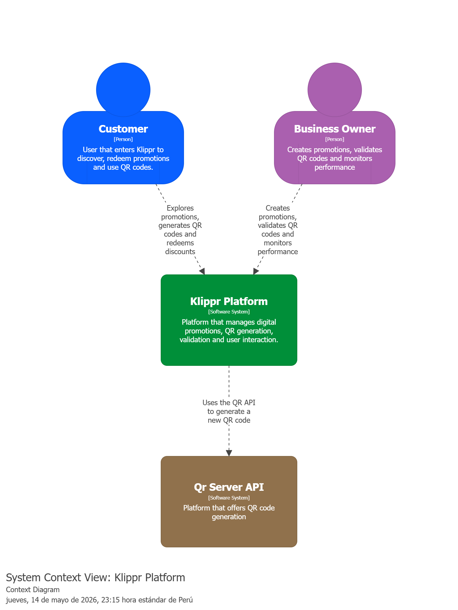

#### 2.5.3.2. Software Architecture Container Level Diagrams

    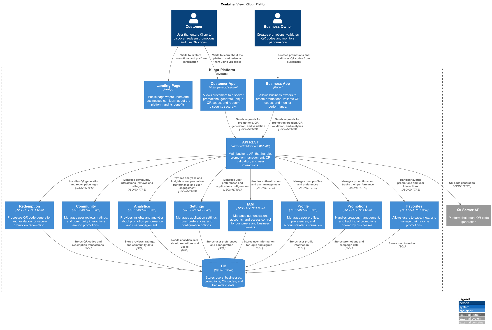

#### 2.5.3.3. Software Architecture Deployment Diagrams

## 2.6. Tactical-Level Domain-Driven Design

### 2.6.1. Bounded Context: IAM

Siguiendo el modelo de arquitectura Clean Architecture, el Bounded Context IAM de Klippr gestiona la autenticación y autorización de los tres tipos de cuenta de la plataforma: usuario consumidor, negocio afiliado y administrador. A continuación se detallan las capas del Bounded Context.

#### 2.6.1.1. Domain Layer

**Sub-capa Model - Aggregates:**

| Tipo | Nombre | Descripción | Responsabilidad Principal | Relación con otros elementos |
|---|---|---|---|---|
| Aggregate | CampaignMetrics | Representa las métricas agregadas de una campaña. | Consolidar datos como vistas, canjes y calificaciones, asegurando su consistencia. | Relacionado con Promotions y Redemption para obtener eventos de interacción. |
| Aggregate | AbuseReport | Representa un reporte de abuso dentro de la plataforma. | Registrar y mantener información sobre comportamientos indebidos reportados. | Relacionado con Community y Profile para identificar usuarios involucrados. |

---

**Sub-capa Model - Commands:**

| Tipo | Nombre | Descripción | Responsabilidad Principal | Relación con otros elementos |
|---|---|---|---|---|
| Command | UpdateMetricsCommand | Comando para actualizar métricas de una campaña. | Representar la intención de registrar nuevas vistas, canjes o ratings. | Disparado por eventos provenientes de Promotions y Redemption. |
| Command | RegisterAbuseReportCommand | Comando para registrar un reporte de abuso. | Representar la intención de reportar contenido o comportamiento inapropiado. | Usado en Community y accesible por administradores. |

---

**Sub-capa Model - Queries:**

| Tipo | Nombre | Descripción | Responsabilidad Principal | Relación con otros elementos |
|---|---|---|---|---|
| Query | GetCampaignMetricsQuery | Consulta para obtener métricas de una campaña. | Recuperar estadísticas como vistas, canjes y rating promedio. | Usado en dashboards de negocios. |
| Query | GetBusinessDashboardQuery | Consulta para obtener métricas globales de un negocio. | Agrupar métricas de todas las campañas de un negocio. | Usado en el panel B2B. |
| Query | GetAbuseReportsQuery | Consulta para obtener reportes de abuso. | Listar reportes registrados para moderación. | Usado en el panel de administración. |

---

**Sub-capa Model - Events:**

| Tipo | Nombre | Descripción | Responsabilidad Principal | Relación con otros elementos |
|---|---|---|---|---|
| Domain Event | MetricaActualizada | Evento emitido al actualizar métricas. | Notificar cambios en estadísticas de campañas. | Consumido internamente para recalcular dashboards. |
| Domain Event | DashboardConsultado | Evento emitido al consultar métricas. | Registrar accesos al dashboard para auditoría o análisis. | Usado en análisis de uso. |
| Domain Event | ReporteDeAbusoRegistrado | Evento emitido al registrar un reporte. | Notificar a sistemas de moderación. | Consumido por administración. |

---

**Sub-capa Model - Value Objects:**

| Tipo | Nombre | Descripción | Responsabilidad Principal | Relación con otros elementos |
|---|---|---|---|---|
| Value Object | MetricType | Tipo de métrica. | Representar tipos como VIEWS, REDEMPTIONS, RATINGS. | Usado en CampaignMetrics. |
| Value Object | TimeRange | Rango de tiempo para métricas. | Encapsular periodos de consulta (diario, semanal, mensual). | Usado en queries de analytics. |

---

**Sub-capa Services:**

| Tipo | Nombre | Descripción | Responsabilidad Principal | Relación con otros elementos |
|---|---|---|---|---|
| Interface | IAnalyticsCommandService | Interfaz del servicio de comandos de analytics. | Definir operaciones para actualización de métricas y reportes. | Implementado en Application. |
| Interface | IAnalyticsQueryService | Interfaz del servicio de consultas de analytics. | Definir operaciones para obtención de métricas y dashboards. | Implementado en Application. |

---

**Sub-capa Repositories:**

| Tipo | Nombre | Descripción | Responsabilidad Principal | Relación con otros elementos |
|---|---|---|---|---|
| Interface | ICampaignMetricsRepository | Repositorio de métricas de campañas. | Definir operaciones de persistencia de métricas. | Implementado en Infrastructure. |
| Interface | IAbuseReportRepository | Repositorio de reportes de abuso. | Definir operaciones de persistencia de reportes. | Implementado en Infrastructure. |

---

#### 2.6.3.2. Interface Layer

**Sub-capa REST - Resources:**

| Tipo | Nombre | Descripción | Responsabilidad Principal | Relación con otros elementos |
|---|---|---|---|---|
| Resource | CampaignMetricsResource | Representación de métricas de campaña. | Exponer vistas, canjes y rating al cliente. | Usado en AnalyticsController. |
| Resource | BusinessDashboardResource | Representación del dashboard de negocio. | Exponer métricas agregadas de todas las campañas. | Usado en AnalyticsController. |
| Resource | AbuseReportResource | Representación de reporte de abuso. | Exponer información relevante para moderación. | Usado en AdminAnalyticsController. |

---

**Sub-capa REST - Transform:**

| Tipo | Nombre | Descripción | Responsabilidad Principal | Relación con otros elementos |
|---|---|---|---|---|
| Assembler | CampaignMetricsResourceFromEntityAssembler | Convierte métricas a recurso REST. | Transformar datos del dominio a formato API. | Usado en AnalyticsController. |
| Assembler | AbuseReportResourceFromEntityAssembler | Convierte reportes a recurso REST. | Transformar entidad a respuesta API. | Usado en AdminAnalyticsController. |

---

**Sub-capa REST - Controllers:**

| Tipo | Nombre | Descripción | Responsabilidad Principal | Relación con otros elementos |
|---|---|---|---|---|
| Controller | AnalyticsController | Controlador para métricas de negocio. | Manejar consultas de métricas y dashboards. | Usa query services. |
| Controller | AdminAnalyticsController | Controlador para administración. | Manejar reportes de abuso y métricas globales. | Usa query services. |

---

**Sub-capa ACL:**

| Tipo | Nombre | Descripción | Responsabilidad Principal | Relación con otros elementos |
|---|---|---|---|---|
| Service | AnalyticsContextFacade | Fachada del contexto Analytics. | Permitir a otros contextos consultar métricas sin acoplamiento directo. | Relacionado con Promotions y Profile. |

---

#### 2.6.3.3. Application Layer

**Sub-capa Internal - CommandServices:**

| Tipo | Nombre | Descripción | Responsabilidad Principal | Relación con otros elementos |
|---|---|---|---|---|
| CommandHandler | AnalyticsCommandService | Implementación de comandos de analytics. | Procesar actualización de métricas y registro de abusos. | Implementa IAnalyticsCommandService. |

---

**Sub-capa Internal - QueryServices:**

| Tipo | Nombre | Descripción | Responsabilidad Principal | Relación con otros elementos |
|---|---|---|---|---|
| QueryHandler | AnalyticsQueryService | Implementación de consultas de analytics. | Recuperar métricas y dashboards. | Implementa IAnalyticsQueryService. |

---

#### 2.6.3.4. Infrastructure Layer

**Sub-capa Persistence:**

| Tipo | Nombre | Descripción | Responsabilidad Principal | Relación con otros elementos |
|---|---|---|---|---|
| Repository | CampaignMetricsRepository | Implementación del repositorio de métricas. | Persistir y recuperar métricas. | Usado en Application. |
| Repository | AbuseReportRepository | Implementación del repositorio de reportes. | Persistir reportes de abuso. | Usado en Application. |

---

**Sub-capa Pipeline (Middleware):**

| Tipo | Nombre | Descripción | Responsabilidad Principal | Relación con otros elementos |
|---|---|---|---|---|
| Attribute | AuthorizeAttribute | Control de acceso por rol. | Restringir acceso a dashboards y reportes. | Usado en controladores. |

---

#### 2.6.3.5. Bounded Context Software Architecture Component Level Diagrams

    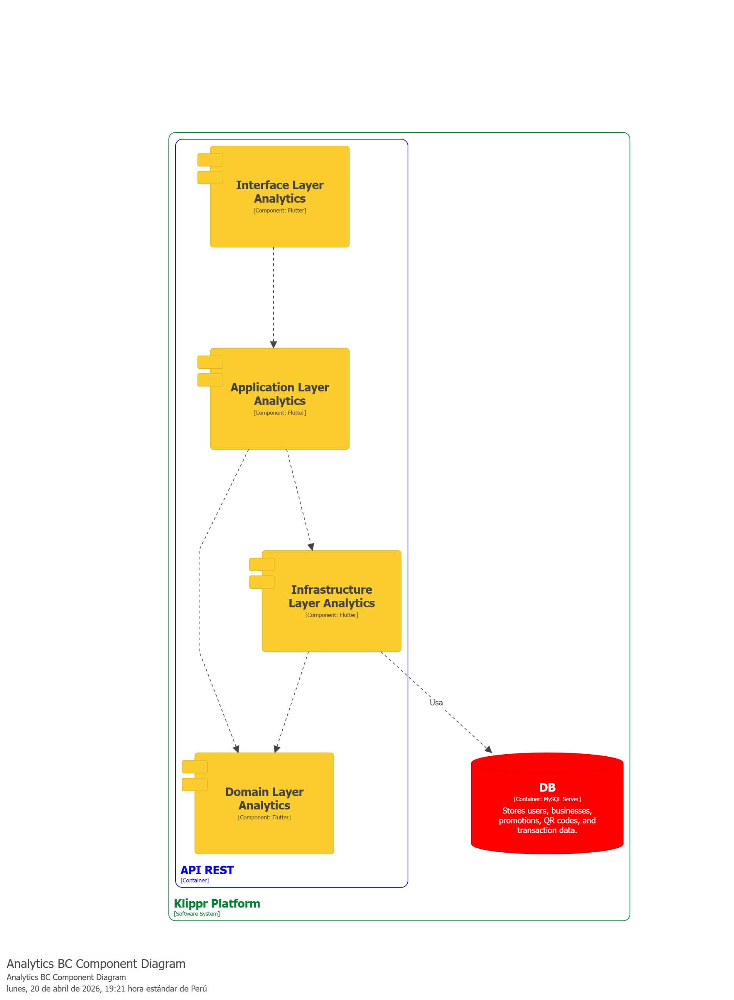

#### 2.6.3.6. Bounded Context Software Architecture Code Level Diagrams

##### 2.6.3.6.1 Bounded Context Domain Layer Class Diagrams

    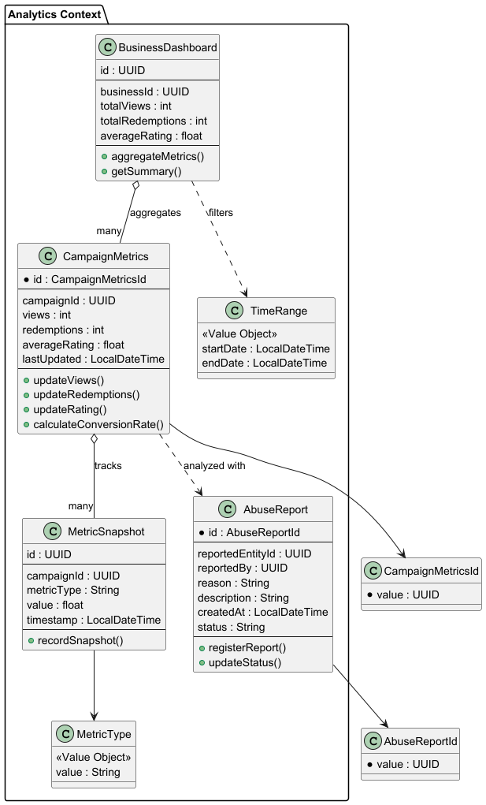

##### 2.6.3.6.2. Bounded Context Database Design Diagrams

    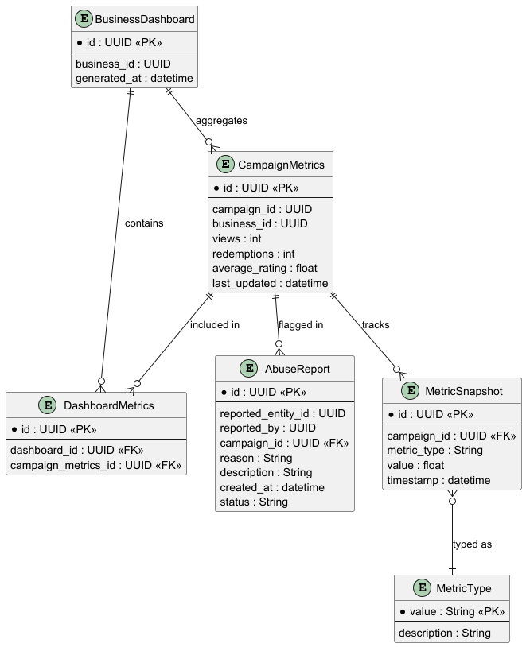

### 2.6.6. Bounded Context: Promotions

Siguiendo el modelo de arquitectura Clean Architecture, **el Bounded Context Promotions de Klippr** gestiona el **ciclo de vida de las promociones y descuentos**, permitiendo a los negocios afiliados crear, publicar y administrar ofertas, mientras que a los consumidores les permite descubrirlas y explorarlas. Este contexto interactúa con **Profile** para verificar el estado del negocio y con **Redemption** para el control de canjes. A continuación se detallan las capas del Bounded Context.

#### 2.6.6.1. Domain Layer

**Sub-capa Model - Aggregates:**

<table border="1" cellpadding="8" cellspacing="0" style="width:100%; border-collapse: collapse;">
  <tr style="background-color:#2c3e50; color:white;">
    <th>Tipo</th>
    <th>Nombre</th>
    <th>Descripción</th>
    <th>Responsabilidad Principal</th>
    <th>Relación con otros elementos</th>
  </tr>
  <tr>
    <td>Aggregate</td>
    <td>Promotion</td>
    <td>Oferta o descuento creado por un negocio afiliado.</td>
    <td>Mantener las reglas de negocio de la promoción, vigencia, stock de canjes y su estado (activa, expirada, cancelada).</td>
    <td>Relacionado con Profile (negocio creador) y Redemption (cuando un consumidor la canjea).</td>
  </tr>
</table>

**Sub-capa Model - Commands:**

<table border="1" cellpadding="8" cellspacing="0" style="width:100%; border-collapse: collapse;">
  <tr style="background-color:#2c3e50; color:white;">
    <th>Tipo</th>
    <th>Nombre</th>
    <th>Descripción</th>
    <th>Responsabilidad Principal</th>
    <th>Relación con otros elementos</th>
  </tr>
  <tr>
    <td>Command</td>
    <td>CreatePromotionCommand</td>
    <td>Comando para crear el borrador de una promoción.</td>
    <td>Representar la intención de un negocio de registrar una nueva oferta con detalles iniciales.</td>
    <td>Usado en el servicio de promociones desde Interface Layer.</td>
  </tr>
  <tr>
    <td>Command</td>
    <td>UpdatePromotionCommand</td>
    <td>Comando para actualizar información de una promoción.</td>
    <td>Representar la intención de modificar condiciones, fechas o descripción de la oferta antes de publicarla.</td>
    <td>Usado en el servicio de promociones desde Interface Layer.</td>
  </tr>
  <tr>
    <td>Command</td>
    <td>PublishPromotionCommand</td>
    <td>Comando para publicar y hacer visible la promoción.</td>
    <td>Representar la intención de cambiar el estado de la promoción a PUBLISHED, validando que el negocio esté verificado.</td>
    <td>Genera evento PromotionPublished. Valida estado usando ProfileContextFacade.</td>
  </tr>
  <tr>
    <td>Command</td>
    <td>CancelPromotionCommand</td>
    <td>Comando para cancelar una promoción en curso.</td>
    <td>Representar la intención de detener anticipadamente una promoción y evitar futuros canjes.</td>
    <td>Genera evento PromotionCancelled hacia Redemption context.</td>
  </tr>
</table>

**Sub-capa Model - Queries:**

<table border="1" cellpadding="8" cellspacing="0" style="width:100%; border-collapse: collapse;">
  <tr style="background-color:#2c3e50; color:white;">
    <th>Tipo</th>
    <th>Nombre</th>
    <th>Descripción</th>
    <th>Responsabilidad Principal</th>
    <th>Relación con otros elementos</th>
  </tr>
  <tr>
    <td>Query</td>
    <td>GetPromotionByIdQuery</td>
    <td>Consulta para obtener los detalles de una promoción específica.</td>
    <td>Representar la intención de recuperar toda la información y condiciones de una promoción.</td>
    <td>Usado por la aplicación móvil al ver detalles de la oferta.</td>
  </tr>
  <tr>
    <td>Query</td>
    <td>GetActivePromotionsQuery</td>
    <td>Consulta para obtener todas las promociones activas.</td>
    <td>Representar la intención de obtener el listado de promociones disponibles, con filtros por categoría o ubicación.</td>
    <td>Usado en el feed principal de consumidores.</td>
  </tr>
  <tr>
    <td>Query</td>
    <td>GetPromotionsByBusinessIdQuery</td>
    <td>Consulta para obtener las promociones de un negocio.</td>
    <td>Representar la intención de listar el historial de promociones creadas por un negocio específico.</td>
    <td>Usado en el dashboard B2B del negocio afiliado.</td>
  </tr>
</table>

**Sub-capa Model - Value Objects:**

<table border="1" cellpadding="8" cellspacing="0" style="width:100%; border-collapse: collapse;">
  <tr style="background-color:#2c3e50; color:white;">
    <th>Tipo</th>
    <th>Nombre</th>
    <th>Descripción</th>
    <th>Responsabilidad Principal</th>
    <th>Relación con otros elementos</th>
  </tr>
  <tr>
    <td>Value Object</td>
    <td>PromotionStatus</td>
    <td>Estado actual de la promoción.</td>
    <td>Representar los estados posibles: DRAFT, PUBLISHED, EXPIRED, CANCELLED.</td>
    <td>Usado en Promotion para control de ciclo de vida.</td>
  </tr>
  <tr>
    <td>Value Object</td>
    <td>DiscountValue</td>
    <td>Valor y tipo del descuento ofrecido.</td>
    <td>Encapsular el monto o porcentaje de descuento con reglas de validación (ej. no negativo).</td>
    <td>Usado en Promotion para definir el beneficio.</td>
  </tr>
  <tr>
    <td>Value Object</td>
    <td>TimeFrame</td>
    <td>Periodo de validez de la promoción.</td>
    <td>Encapsular fecha de inicio y fin, asegurando coherencia temporal.</td>
    <td>Usado en Promotion para determinar si está vigente.</td>
  </tr>
</table>

**Sub-capa Services:**

<table border="1" cellpadding="8" cellspacing="0" style="width:100%; border-collapse: collapse;">
  <tr style="background-color:#2c3e50; color:white;">
    <th>Tipo</th>
    <th>Nombre</th>
    <th>Descripción</th>
    <th>Responsabilidad Principal</th>
    <th>Relación con otros elementos</th>
  </tr>
  <tr>
    <td>Interface</td>
    <td>IPromotionCommandService</td>
    <td>Interfaz del servicio de comandos de promociones.</td>
    <td>Estipular contratos para crear, modificar, publicar y cancelar promociones.</td>
    <td>Implementado en capa Application; consumido desde Interface Layer.</td>
  </tr>
  <tr>
    <td>Interface</td>
    <td>IPromotionQueryService</td>
    <td>Interfaz del servicio de consultas de promociones.</td>
    <td>Estipular contratos para obtener promociones activas y por negocio.</td>
    <td>Implementado en capa Application; consumido desde Interface Layer.</td>
  </tr>
</table>

**Sub-capa Repositories:**

<table border="1" cellpadding="8" cellspacing="0" style="width:100%; border-collapse: collapse;">
  <tr style="background-color:#2c3e50; color:white;">
    <th>Tipo</th>
    <th>Nombre</th>
    <th>Descripción</th>
    <th>Responsabilidad Principal</th>
    <th>Relación con otros elementos</th>
  </tr>
  <tr>
    <td>Interface</td>
    <td>IPromotionRepository</td>
    <td>Repositorio para persistencia de Promotion.</td>
    <td>Definir contratos para operaciones CRUD y búsquedas por estado, negocio o vigencia.</td>
    <td>Implementado en capa Infrastructure.</td>
  </tr>
</table>

---

#### 2.6.6.2. Interface Layer

**Sub-capa REST - Resources:**

<table border="1" cellpadding="8" cellspacing="0" style="width:100%; border-collapse: collapse;">
  <tr style="background-color:#2c3e50; color:white;">
    <th>Tipo</th>
    <th>Nombre</th>
    <th>Descripción</th>
    <th>Responsabilidad Principal</th>
    <th>Relación con otros elementos</th>
  </tr>
  <tr>
    <td>Resource</td>
    <td>PromotionResource</td>
    <td>Estructura de respuesta con datos de la promoción.</td>
    <td>Representar visualmente la promoción: título, descuento, fechas y negocio.</td>
    <td>Usado en PromotionController para respuestas GET.</td>
  </tr>
  <tr>
    <td>Resource</td>
    <td>CreatePromotionResource</td>
    <td>Estructura de petición para crear una promoción.</td>
    <td>Representar y validar datos de entrada para nueva oferta.</td>
    <td>Usado en PromotionController para recibir peticiones POST.</td>
  </tr>
</table>

**Sub-capa REST - Transform:**

<table border="1" cellpadding="8" cellspacing="0" style="width:100%; border-collapse: collapse;">
  <tr style="background-color:#2c3e50; color:white;">
    <th>Tipo</th>
    <th>Nombre</th>
    <th>Descripción</th>
    <th>Responsabilidad Principal</th>
    <th>Relación con otros elementos</th>
  </tr>
  <tr>
    <td>Assembler</td>
    <td>PromotionResourceFromEntityAssembler</td>
    <td>Transforma entidad Promotion a PromotionResource.</td>
    <td>Convertir entidad del dominio a REST.</td>
    <td>Usado en PromotionController.</td>
  </tr>
  <tr>
    <td>Assembler</td>
    <td>CreatePromotionCommandFromResourceAssembler</td>
    <td>Transforma CreatePromotionResource a CreatePromotionCommand.</td>
    <td>Convertir petición REST al comando del dominio.</td>
    <td>Usado en PromotionController.</td>
  </tr>
</table>

**Sub-capa REST - Controllers:**

<table border="1" cellpadding="8" cellspacing="0" style="width:100%; border-collapse: collapse;">
  <tr style="background-color:#2c3e50; color:white;">
    <th>Tipo</th>
    <th>Nombre</th>
    <th>Descripción</th>
    <th>Responsabilidad Principal</th>
    <th>Relación con otros elementos</th>
  </tr>
  <tr>
    <td>Controller</td>
    <td>PromotionController</td>
    <td>Controlador para operaciones con promociones.</td>
    <td>Manejar endpoints para crear, listar, consultar y gestionar promociones.</td>
    <td>Usa command/query services de Application Layer.</td>
  </tr>
</table>

**Sub-capa ACL:**

<table border="1" cellpadding="8" cellspacing="0" style="width:100%; border-collapse: collapse;">
  <tr style="background-color:#2c3e50; color:white;">
    <th>Tipo</th>
    <th>Nombre</th>
    <th>Descripción</th>
    <th>Responsabilidad Principal</th>
    <th>Relación con otros elementos</th>
  </tr>
  <tr>
    <td>Service</td>
    <td>PromotionsContextFacade</td>
    <td>Servicio de fachada para el contexto Promotions.</td>
    <td>Proporcionar interfaz para que otros contextos validen disponibilidad de promociones.</td>
    <td>Relacionado con Redemption context (validar promoción antes de canjear).</td>
  </tr>
</table>

---

#### 2.6.6.3. Application Layer

**Sub-capa Internal - CommandServices:**

<table border="1" cellpadding="8" cellspacing="0" style="width:100%; border-collapse: collapse;">
  <tr style="background-color:#2c3e50; color:white;">
    <th>Tipo</th>
    <th>Nombre</th>
    <th>Descripción</th>
    <th>Responsabilidad Principal</th>
    <th>Relación con otros elementos</th>
  </tr>
  <tr>
    <td>CommandHandler</td>
    <td>PromotionCommandService</td>
    <td>Implementación de comandos de promociones.</td>
    <td>Ejecutar reglas de negocio para creación y publicación, validando estado de verificación con Profile.</td>
    <td>Implementa IPromotionCommandService. Consulta ProfileContextFacade.</td>
  </tr>
</table>

**Sub-capa Internal - QueryServices:**

<table border="1" cellpadding="8" cellspacing="0" style="width:100%; border-collapse: collapse;">
  <tr style="background-color:#2c3e50; color:white;">
    <th>Tipo</th>
    <th>Nombre</th>
    <th>Descripción</th>
    <th>Responsabilidad Principal</th>
    <th>Relación con otros elementos</th>
  </tr>
  <tr>
    <td>QueryHandler</td>
    <td>PromotionQueryService</td>
    <td>Implementación de consultas de promociones.</td>
    <td>Recuperar promociones activas o filtradas desde infraestructura.</td>
    <td>Implementa IPromotionQueryService.</td>
  </tr>
</table>

---

#### 2.6.6.4. Infrastructure Layer

**Sub-capa Persistence:**

<table border="1" cellpadding="8" cellspacing="0" style="width:100%; border-collapse: collapse;">
  <tr style="background-color:#2c3e50; color:white;">
    <th>Tipo</th>
    <th>Nombre</th>
    <th>Descripción</th>
    <th>Responsabilidad Principal</th>
    <th>Relación con otros elementos</th>
  </tr>
  <tr>
    <td>Repository</td>
    <td>PromotionRepository</td>
    <td>Implementación concreta para persistencia de Promotion.</td>
    <td>Manejar base de datos para operaciones CRUD y búsquedas de ofertas.</td>
    <td>Usado en Application Layer.</td>
  </tr>
</table>

**Sub-capa Event Publishing:**

<table border="1" cellpadding="8" cellspacing="0" style="width:100%; border-collapse: collapse;">
  <tr style="background-color:#2c3e50; color:white;">
    <th>Tipo</th>
    <th>Nombre</th>
    <th>Descripción</th>
    <th>Responsabilidad Principal</th>
    <th>Relación con otros elementos</th>
  </tr>
  <tr>
    <td>Service</td>
    <td>PromotionEventPublisher</td>
    <td>Servicio para publicación de eventos de promociones.</td>
    <td>Emitir eventos como PromotionPublished a través del message broker.</td>
    <td>Notifica a Analytics y Redemption context.</td>
  </tr>
</table>

#### 2.6.6.5. Bounded Context Software Architecture Component Level Diagrams

    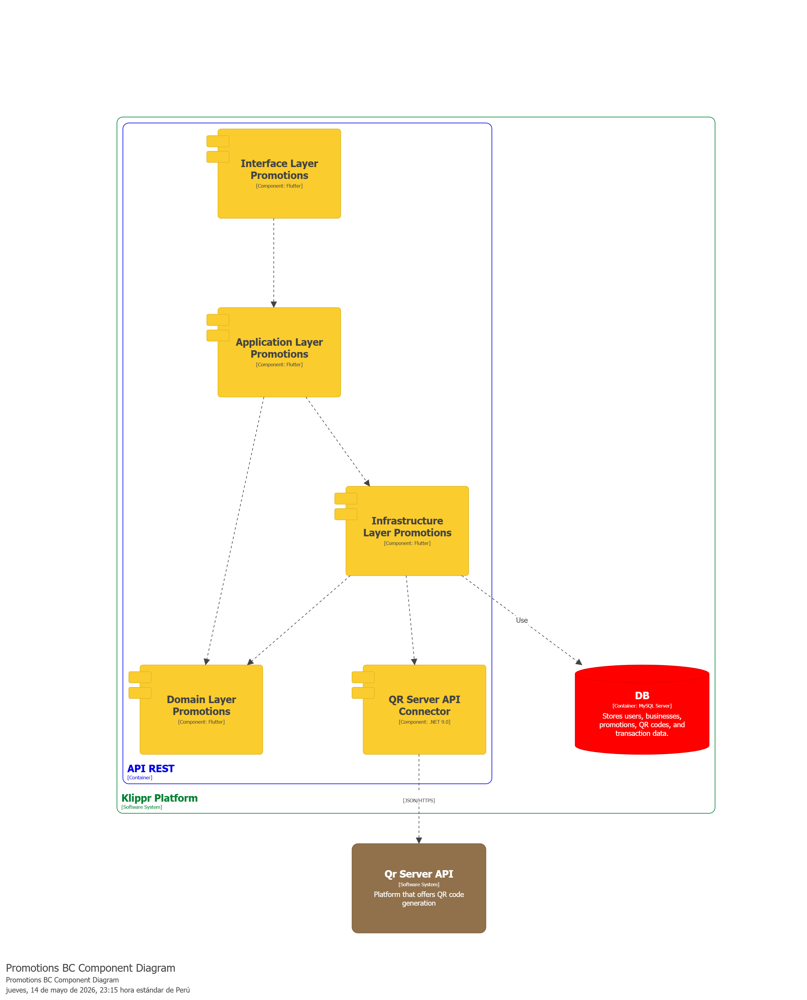

### 2.6.5. Bounded Context: Settings

---

#### 2.6.5.1. Domain Layer

**Sub-capa Model - Aggregates:**

| Tipo | Nombre | Descripción | Responsabilidad Principal | Relación con otros elementos |
|---|---|---|---|---|
| Aggregate | UserSettings | Representa la configuración personalizada de un usuario. | Gestionar preferencias como notificaciones, tema, idioma y privacidad, asegurando consistencia. | Relacionado con IAM mediante UserId. |

---

    

#### 2.6.1.6. Bounded Context Software Architecture Code Level Diagrams

    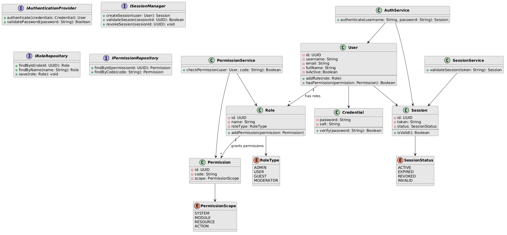

##### 2.6.1.6.2. Bounded Context Database Design Diagram

    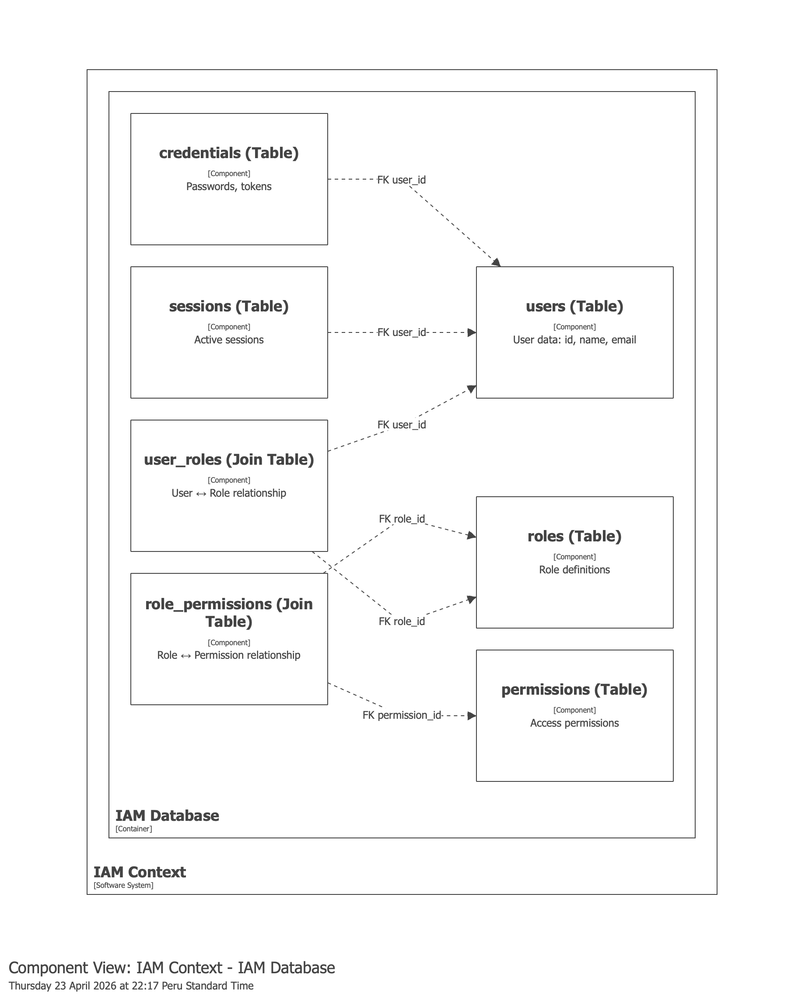

### 2.6.2. Bounded Context: Profile

Siguiendo el modelo de arquitectura Clean Architecture, **el Bounded Context Profile de Klippr** gestiona los **perfiles de usuario (consumidor y negocio afiliado)**, incluyendo **datos personales, información verificada, calificaciones y reseñas.** Este contexto interactúa directamente con **IAM** para acceder a datos de identidad y con **Community** para la gestión de reseñas. A continuación se detallan las capas del Bounded Context.

#### 2.6.2.1. Domain Layer

**Sub-capa Model - Aggregates:**

<table border="1" cellpadding="8" cellspacing="0" style="width:100%; border-collapse: collapse;">
  <tr style="background-color:#2c3e50; color:white;">
    <th>Tipo</th>
    <th>Nombre</th>
    <th>Descripción</th>
    <th>Responsabilidad Principal</th>
    <th>Relación con otros elementos</th>
  </tr>
  <tr>
    <td>Aggregate</td>
    <td>ConsumerProfile</td>
    <td>Perfil de usuario consumidor que compra/canjea descuentos en la plataforma.</td>
    <td>Mantener la integridad de datos personales, preferencias, información de ahorro y historial de canjes del usuario consumidor.</td>
    <td>Relacionado con IAM para obtener identidad del usuario; con Community para reseñas que realiza; con Analytics para estadísticas de ahorro.</td>
  </tr>
  <tr>
    <td>Aggregate</td>
    <td>BusinessProfile</td>
    <td>Perfil de negocio afiliado que publica promociones en la plataforma.</td>
    <td>Mantener la integridad de datos comerciales, estado de verificación, calificación agregada y disponibilidad del negocio.</td>
    <td>Relacionado con IAM para obtener identidad del negocio; con Community para reseñas recibidas; con Promotions para control de descuentos publicados.</td>
  </tr>
</table>

**Sub-capa Model - Commands:**

<table border="1" cellpadding="8" cellspacing="0" style="width:100%; border-collapse: collapse;">
  <tr style="background-color:#2c3e50; color:white;">
    <th>Tipo</th>
    <th>Nombre</th>
    <th>Descripción</th>
    <th>Responsabilidad Principal</th>
    <th>Relación con otros elementos</th>
  </tr>
  <tr>
    <td>Command</td>
    <td>CreateConsumerProfileCommand</td>
    <td>Comando para crear el perfil inicial de un consumidor post-registro.</td>
    <td>Representar la intención de crear un perfil de consumidor básico con datos mínimos requeridos (nombre, ubicación, preferencias).</td>
    <td>Desencadenado por el evento UserCreatedAsConsumer desde IAM.</td>
  </tr>
  <tr>
    <td>Command</td>
    <td>UpdateConsumerProfileCommand</td>
    <td>Comando para actualizar información del perfil consumidor.</td>
    <td>Representar la intención de modificar datos personales, preferencias de categoría, ubicación o foto de perfil.</td>
    <td>Usado en el servicio de gestión de perfiles desde Interface Layer.</td>
  </tr>
  <tr>
    <td>Command</td>
    <td>CreateBusinessProfileCommand</td>
    <td>Comando para crear el perfil inicial de un negocio post-registro.</td>
    <td>Representar la intención de crear un perfil de negocio con datos iniciales: nombre comercial, RUC, categoría, ubicación.</td>
    <td>Desencadenado por el evento UserCreatedAsBusiness desde IAM; inicia flujo de verificación.</td>
  </tr>
  <tr>
    <td>Command</td>
    <td>UpdateBusinessProfileCommand</td>
    <td>Comando para actualizar información del perfil de negocio.</td>
    <td>Representar la intención de modificar datos comerciales: nombre, categoría, descripción, ubicación, horarios.</td>
    <td>Usado en el servicio de gestión de negocios desde Interface Layer.</td>
  </tr>
  <tr>
    <td>Command</td>
    <td>SubmitBusinessVerificationCommand</td>
    <td>Comando para iniciar el proceso de verificación de un negocio.</td>
    <td>Representar la intención de enviar documentación verificable (RUC, credencial comercial, foto de local) para validación.</td>
    <td>Desencadena eventos VerificationDocumentSubmitted hacia servicio de verificación en Infrastructure.</td>
  </tr>
  <tr>
    <td>Command</td>
    <td>ApproveBusinessVerificationCommand</td>
    <td>Comando para aprobar la verificación de un negocio (admin).</td>
    <td>Representar la intención de validar y aprobar documentación del negocio, otorgando badge de verificado.</td>
    <td>Usado por panel administrativo; genera evento ReputationBadgeGranted hacia Community context.</td>
  </tr>
</table>

**Sub-capa Model - Queries:**

<table border="1" cellpadding="8" cellspacing="0" style="width:100%; border-collapse: collapse;">
  <tr style="background-color:#2c3e50; color:white;">
    <th>Tipo</th>
    <th>Nombre</th>
    <th>Descripción</th>
    <th>Responsabilidad Principal</th>
    <th>Relación con otros elementos</th>
  </tr>
  <tr>
    <td>Query</td>
    <td>GetConsumerProfileByUserIdQuery</td>
    <td>Consulta para obtener perfil completo de consumidor por su user ID.</td>
    <td>Representar la intención de recuperar todos los datos del perfil consumidor: nombre, ubicación, preferencias, estadísticas de ahorro.</td>
    <td>Usado por la aplicación móvil para mostrar perfil del usuario.</td>
  </tr>
  <tr>
    <td>Query</td>
    <td>GetBusinessProfileByUserIdQuery</td>
    <td>Consulta para obtener perfil completo de negocio por su user ID.</td>
    <td>Representar la intención de recuperar todos los datos del perfil de negocio: información comercial, estado verificación, calificación, badge.</td>
    <td>Usado por dashboard B2B para mostrar información del negocio.</td>
  </tr>
  <tr>
    <td>Query</td>
    <td>GetVerificationStatusQuery</td>
    <td>Consulta para obtener estado de verificación de un negocio.</td>
    <td>Representar la intención de verificar si un negocio está verificado o en proceso de verificación.</td>
    <td>Usado en Application Layer para autorización de operaciones sensibles (crear promociones).</td>
  </tr>
  <tr>
    <td>Query</td>
    <td>GetBusinessRatingQuery</td>
    <td>Consulta para obtener calificación promedio agregada de un negocio.</td>
    <td>Representar la intención de calcular el rating promedio basado en reseñas de Community context.</td>
    <td>Usado en Interface Layer para mostrar calificación en feed de descuentos.</td>
  </tr>
  <tr>
    <td>Query</td>
    <td>GetProfilesWithVerificationPendingQuery</td>
    <td>Consulta para obtener listado de perfiles pendientes de verificación (admin).</td>
    <td>Representar la intención de obtener cola de verificación para procesamiento manual.</td>
    <td>Usado en panel administrativo para gestión de verificaciones.</td>
  </tr>
</table>

**Sub-capa Model - Value Objects:**

<table border="1" cellpadding="8" cellspacing="0" style="width:100%; border-collapse: collapse;">
  <tr style="background-color:#2c3e50; color:white;">
    <th>Tipo</th>
    <th>Nombre</th>
    <th>Descripción</th>
    <th>Responsabilidad Principal</th>
    <th>Relación con otros elementos</th>
  </tr>
  <tr>
    <td>Value Object</td>
    <td>VerificationStatus</td>
    <td>Estado de verificación de un negocio en la plataforma.</td>
    <td>Representar los estados posibles: PENDING, UNDER_REVIEW, VERIFIED, REJECTED, SUSPENDED.</td>
    <td>Usado en BusinessProfile para determinar si puede operar en la plataforma.</td>
  </tr>
  <tr>
    <td>Value Object</td>
    <td>Location</td>
    <td>Ubicación geográfica del consumidor o negocio (latitud, longitud, dirección).</td>
    <td>Encapsular datos de geolocalización con validación de formato y precisión.</td>
    <td>Usado en ConsumerProfile y BusinessProfile para búsqueda por proximidad.</td>
  </tr>
  <tr>
    <td>Value Object</td>
    <td>BusinessCategory</td>
    <td>Categoría del negocio afiliado (gastronomía, retail, servicios, etc).</td>
    <td>Encapsular la categoría como taxonomía controlada para filtrado y análisis.</td>
    <td>Usado en BusinessProfile para segmentación de negocios.</td>
  </tr>
  <tr>
    <td>Value Object</td>
    <td>Rating</td>
    <td>Calificación promedio de un negocio (0-5 estrellas).</td>
    <td>Encapsular el rating calculado con número de reseñas, median, varianza.</td>
    <td>Agregado desde Community context; mostrado en móvil.</td>
  </tr>
  <tr>
    <td>Value Object</td>
    <td>SavingsStatistics</td>
    <td>Estadísticas de ahorro acumulado del consumidor.</td>
    <td>Encapsular total ahorrado, número de canjes, promedio por canje, últimas compras.</td>
    <td>Calculado desde Redemption context; mostrado en perfil B2C.</td>
  </tr>
</table>

**Sub-capa Services:**

<table border="1" cellpadding="8" cellspacing="0" style="width:100%; border-collapse: collapse;">
  <tr style="background-color:#2c3e50; color:white;">
    <th>Tipo</th>
    <th>Nombre</th>
    <th>Descripción</th>
    <th>Responsabilidad Principal</th>
    <th>Relación con otros elementos</th>
  </tr>
  <tr>
    <td>Interface</td>
    <td>IConsumerProfileCommandService</td>
    <td>Interfaz del servicio de comandos para perfiles de consumidor.</td>
    <td>Estipular contratos para crear y actualizar perfiles de consumidor.</td>
    <td>Implementado en capa Application; consumido desde Interface Layer.</td>
  </tr>
  <tr>
    <td>Interface</td>
    <td>IBusinessProfileCommandService</td>
    <td>Interfaz del servicio de comandos para perfiles de negocio.</td>
    <td>Estipular contratos para crear, actualizar y verificar perfiles de negocio.</td>
    <td>Implementado en capa Application; consumido desde Interface Layer.</td>
  </tr>
  <tr>
    <td>Interface</td>
    <td>IProfileQueryService</td>
    <td>Interfaz del servicio de consultas para perfiles.</td>
    <td>Estipular contratos para obtener perfiles, verificación, ratings.</td>
    <td>Implementado en capa Application; consumido desde Interface Layer.</td>
  </tr>
</table>

**Sub-capa Repositories:**

<table border="1" cellpadding="8" cellspacing="0" style="width:100%; border-collapse: collapse;">
  <tr style="background-color:#2c3e50; color:white;">
    <th>Tipo</th>
    <th>Nombre</th>
    <th>Descripción</th>
    <th>Responsabilidad Principal</th>
    <th>Relación con otros elementos</th>
  </tr>
  <tr>
    <td>Interface</td>
    <td>IConsumerProfileRepository</td>
    <td>Repositorio para operaciones de persistencia de ConsumerProfile.</td>
    <td>Definir contratos para operaciones CRUD y búsquedas especializadas por ubicación.</td>
    <td>Implementado en capa Infrastructure.</td>
  </tr>
  <tr>
    <td>Interface</td>
    <td>IBusinessProfileRepository</td>
    <td>Repositorio para operaciones de persistencia de BusinessProfile.</td>
    <td>Definir contratos para operaciones CRUD, búsquedas por verificación, categoría, ubicación.</td>
    <td>Implementado en capa Infrastructure.</td>
  </tr>
</table>

---

#### 2.6.2.2. Interface Layer

**Sub-capa REST - Resources:**

<table border="1" cellpadding="8" cellspacing="0" style="width:100%; border-collapse: collapse;">
  <tr style="background-color:#2c3e50; color:white;">
    <th>Tipo</th>
    <th>Nombre</th>
    <th>Descripción</th>
    <th>Responsabilidad Principal</th>
    <th>Relación con otros elementos</th>
  </tr>
  <tr>
    <td>Resource</td>
    <td>ConsumerProfileResource</td>
    <td>Estructura de respuesta con datos del perfil consumidor.</td>
    <td>Representar perfil de consumidor: nombre, avatar, ubicación, preferencias, estadísticas de ahorro.</td>
    <td>Usado en ProfileController para respuestas GET perfil.</td>
  </tr>
  <tr>
    <td>Resource</td>
    <td>UpdateConsumerProfileResource</td>
    <td>Estructura de petición para actualizar perfil consumidor.</td>
    <td>Representar y validar campos editables: nombre, ubicación, preferencias de categoría, avatar.</td>
    <td>Usado en ProfileController para recibir peticiones PUT.</td>
  </tr>
  <tr>
    <td>Resource</td>
    <td>BusinessProfileResource</td>
    <td>Estructura de respuesta con datos del perfil de negocio.</td>
    <td>Representar perfil de negocio: nombre comercial, categoría, ubicación, horarios, verificación, rating, badge.</td>
    <td>Usado en ProfileController y en feeds de descuentos para mostrar información verificada.</td>
  </tr>
  <tr>
    <td>Resource</td>
    <td>UpdateBusinessProfileResource</td>
    <td>Estructura de petición para actualizar perfil de negocio.</td>
    <td>Representar y validar campos editables: nombre, descripción, categoría, ubicación, horarios.</td>
    <td>Usado en ProfileController para recibir peticiones PUT desde dashboard B2B.</td>
  </tr>
  <tr>
    <td>Resource</td>
    <td>VerificationDocumentResource</td>
    <td>Estructura para envío de documentos de verificación.</td>
    <td>Representar documentación verificable: RUC, credencial comercial, foto de local, certificados.</td>
    <td>Usado en VerificationController para proceso de verificación B2B.</td>
  </tr>
</table>

**Sub-capa REST - Transform:**

<table border="1" cellpadding="8" cellspacing="0" style="width:100%; border-collapse: collapse;">
  <tr style="background-color:#2c3e50; color:white;">
    <th>Tipo</th>
    <th>Nombre</th>
    <th>Descripción</th>
    <th>Responsabilidad Principal</th>
    <th>Relación con otros elementos</th>
  </tr>
  <tr>
    <td>Assembler</td>
    <td>ConsumerProfileResourceFromEntityAssembler</td>
    <td>Transforma entidad ConsumerProfile a ConsumerProfileResource.</td>
    <td>Convertir entidad del dominio a REST incluyendo estadísticas de ahorro agregadas.</td>
    <td>Usado en ProfileController para respuestas GET.</td>
  </tr>
  <tr>
    <td>Assembler</td>
    <td>CreateConsumerProfileCommandFromResourceAssembler</td>
    <td>Transforma ConsumerProfileResource a CreateConsumerProfileCommand.</td>
    <td>Convertir petición REST al comando del dominio para creación.</td>
    <td>Usado en ProfileController para recibir datos de creación.</td>
  </tr>
  <tr>
    <td>Assembler</td>
    <td>BusinessProfileResourceFromEntityAssembler</td>
    <td>Transforma entidad BusinessProfile a BusinessProfileResource.</td>
    <td>Convertir entidad del dominio a REST incluyendo badge de verificación y rating agregado.</td>
    <td>Usado en ProfileController y feeds para mostrar negocio verificado.</td>
  </tr>
  <tr>
    <td>Assembler</td>
    <td>VerificationDocumentCommandFromResourceAssembler</td>
    <td>Transforma VerificationDocumentResource a SubmitBusinessVerificationCommand.</td>
    <td>Convertir petición REST con documentos al comando de verificación.</td>
    <td>Usado en VerificationController para iniciar flujo de verificación.</td>
  </tr>
</table>

**Sub-capa REST - Controllers:**

<table border="1" cellpadding="8" cellspacing="0" style="width:100%; border-collapse: collapse;">
  <tr style="background-color:#2c3e50; color:white;">
    <th>Tipo</th>
    <th>Nombre</th>
    <th>Descripción</th>
    <th>Responsabilidad Principal</th>
    <th>Relación con otros elementos</th>
  </tr>
  <tr>
    <td>Controller</td>
    <td>ProfileController</td>
    <td>Controlador para operaciones de gestión de perfiles (consumidor y negocio).</td>
    <td>Manejar peticiones HTTP GET/PUT de obtener y actualizar perfiles de usuarios.</td>
    <td>Usa command/query services de Application Layer; requiere autorización desde IAM context.</td>
  </tr>
  <tr>
    <td>Controller</td>
    <td>VerificationController</td>
    <td>Controlador para flujo de verificación de negocios.</td>
    <td>Manejar peticiones POST de envío de documentación y GET de estado de verificación.</td>
    <td>Usa business profile services; genera eventos hacia servicio de verificación en Infrastructure.</td>
  </tr>
  <tr>
    <td>Controller</td>
    <td>AdminProfileController</td>
    <td>Controlador para operaciones administrativas en perfiles.</td>
    <td>Manejar aprobación/rechazo de verificaciones, gestión de perfiles suspendidos (admin only).</td>
    <td>Requiere rol ADMIN desde IAM context; usa profile command services.</td>
  </tr>
</table>

**Sub-capa ACL:**

<table border="1" cellpadding="8" cellspacing="0" style="width:100%; border-collapse: collapse;">
  <tr style="background-color:#2c3e50; color:white;">
    <th>Tipo</th>
    <th>Nombre</th>
    <th>Descripción</th>
    <th>Responsabilidad Principal</th>
    <th>Relación con otros elementos</th>
  </tr>
  <tr>
    <td>Service</td>
    <td>ProfileContextFacade</td>
    <td>Servicio de fachada para el contexto Profile.</td>
    <td>Proporcionar interfaz simplificada para que otros bounded contexts (Promotions, Community, Redemption, Analytics) accedan a información de perfil sin acceso directo al dominio.</td>
    <td>Relacionado con Promotions (verificación antes de crear oferta), Community (reseñas), Analytics (datos para dashboard).</td>
  </tr>
</table>

---

#### 2.6.2.3. Application Layer

**Sub-capa Internal - CommandServices:**

<table border="1" cellpadding="8" cellspacing="0" style="width:100%; border-collapse: collapse;">
  <tr style="background-color:#2c3e50; color:white;">
    <th>Tipo</th>
    <th>Nombre</th>
    <th>Descripción</th>
    <th>Responsabilidad Principal</th>
    <th>Relación con otros elementos</th>
  </tr>
  <tr>
    <td>CommandHandler</td>
    <td>ConsumerProfileCommandService</td>
    <td>Implementación de comandos para perfiles de consumidor.</td>
    <td>Implementar creación y actualización de ConsumerProfile, coordinando persistencia y eventos de cambio de preferencias.</td>
    <td>Implementa IConsumerProfileCommandService del Domain;</td>
  </tr>
  <tr>
    <td>CommandHandler</td>
    <td>BusinessProfileCommandService</td>
    <td>Implementación de comandos para perfiles de negocio.</td>
    <td>Implementar creación, actualización y verificación de BusinessProfile, coordinando con servicio de verificación externo.</td>
    <td>Implementa IBusinessProfileCommandService del Domain; coordina con servicio de verificación.</td>
  </tr>
</table>

**Sub-capa Internal - OutboundServices:**

<table border="1" cellpadding="8" cellspacing="0" style="width:100%; border-collapse: collapse;">
  <tr style="background-color:#2c3e50; color:white;">
    <th>Tipo</th>
    <th>Nombre</th>
    <th>Descripción</th>
    <th>Responsabilidad Principal</th>
    <th>Relación con otros elementos</th>
  </tr>
  <tr>
    <td>Interface</td>
    <td>IVerificationService</td>
    <td>Interfaz para servicio de verificación de negocios.</td>
    <td>Definir contratos para envío de documentación, validación OCR/manual, y notificación de resultados.</td>
    <td>Implementado en Infrastructure; usuario por BusinessProfileCommandService.</td>
  </tr>
  <tr>
    <td>Interface</td>
    <td>IEventPublisher</td>
    <td>Interfaz para publicar eventos de cambios en contexto Profile.</td>
    <td>Definir contratos para eventos: VerificationDocumentSubmitted, ProfileUpdated, ReputationBadgeGranted.</td>
    <td>Implementado en Infrastructure; usado para comunicación inter-contexto (Community, Analytics).</td>
  </tr>
  <tr>
    <td>Interface</td>
    <td>IRatingAggregator</td>
    <td>Interfaz para agregar ratings desde Community context.</td>
    <td>Definir contrato para obtener rating promedio, número de reseñas, tendencia de un negocio.</td>
    <td>Consulta datos desde Community context; usado en queries de perfil de negocio.</td>
  </tr>
</table>

**Sub-capa Internal - QueryServices:**

<table border="1" cellpadding="8" cellspacing="0" style="width:100%; border-collapse: collapse;">
  <tr style="background-color:#2c3e50; color:white;">
    <th>Tipo</th>
    <th>Nombre</th>
    <th>Descripción</th>
    <th>Responsabilidad Principal</th>
    <th>Relación con otros elementos</th>
  </tr>
  <tr>
    <td>QueryHandler</td>
    <td>ProfileQueryService</td>
    <td>Implementación de queries para obtener perfiles y datos verificados.</td>
    <td>Implementar búsquedas por usuario ID, ubicación, categoría, verificación, ratings agregados desde Community.</td>
    <td>Implementa IProfileQueryService del Domain; coordina con IRatingAggregator para datos de reseñas.</td>
  </tr>
</table>

---

#### 2.6.2.4. Infrastructure Layer

**Sub-capa Persistence:**

<table border="1" cellpadding="8" cellspacing="0" style="width:100%; border-collapse: collapse;">
  <tr style="background-color:#2c3e50; color:white;">
    <th>Tipo</th>
    <th>Nombre</th>
    <th>Descripción</th>
    <th>Responsabilidad Principal</th>
    <th>Relación con otros elementos</th>
  </tr>
  <tr>
    <td>Repository</td>
    <td>ConsumerProfileRepository</td>
    <td>Repositorio concreto para ConsumerProfile persistidos en BD.</td>
    <td>Acceder y manipular datos de perfiles de consumidor, con índices en ubicación para búsquedas geoespaciales.</td>
    <td>Usado en Application Layer para crear/actualizar/consultar perfiles consumidor.</td>
  </tr>
  <tr>
    <td>Repository</td>
    <td>BusinessProfileRepository</td>
    <td>Repositorio concreto para BusinessProfile persistidos en BD.</td>
    <td>Acceder y manipular datos de perfiles de negocio, con índices en categoría, ubicación, estado de verificación.</td>
    <td>Usado en Application Layer para operaciones CRUD y búsquedas especializadas de negocios.</td>
  </tr>
</table>

**Sub-capa Verification:**

<table border="1" cellpadding="8" cellspacing="0" style="width:100%; border-collapse: collapse;">
  <tr style="background-color:#2c3e50; color:white;">
    <th>Tipo</th>
    <th>Nombre</th>
    <th>Descripción</th>
    <th>Responsabilidad Principal</th>
    <th>Relación con otros elementos</th>
  </tr>
  <tr>
    <td>Service</td>
    <td>VerificationService</td>
    <td>Servicio de verificación de documentación de negocios.</td>
    <td>Coordinar validación de RUC/credenciales, almacenamiento de documentos, notificación de resultados y cambio de VerificationStatus.</td>
    <td>Implementa IVerificationService de Application Layer; persiste en repositorio BusinessProfile.</td>
  </tr>
  <tr>
    <td>Service</td>
    <td>DocumentStorageService</td>
    <td>Servicio para almacenamiento seguro de documentos de verificación.</td>
    <td>Guardar documentos en storage distribuido (S3/Azure Blob), con encriptación y retención según políticas.</td>
    <td>Usado por VerificationService; integración con proveedor de almacenamiento en la nube.</td>
  </tr>
</table>

**Sub-capa Pipeline (Middleware):**

<table border="1" cellpadding="8" cellspacing="0" style="width:100%; border-collapse: collapse;">
  <tr style="background-color:#2c3e50; color:white;">
    <th>Tipo</th>
    <th>Nombre</th>
    <th>Descripción</th>
    <th>Responsabilidad Principal</th>
    <th>Relación con otros elementos</th>
  </tr>
  <tr>
    <td>Component</td>
    <td>ProfileEnrichmentMiddleware</td>
    <td>Middleware que enriquece contexto de peticiones con datos de perfil verificado.</td>
    <td>Inyectar información de BusinessVerificationStatus en contexto para autorización de operaciones sensibles (crear promoción).</td>
    <td>Parte del pipeline de autenticación; requerido por Promotions context.</td>
  </tr>
  <tr>
    <td>Component</td>
    <td>LocationCachingMiddleware</td>
    <td>Middleware para cachear datos de ubicación de perfiles.</td>
    <td>Mantener cache de ubicaciones para optimizar búsquedas geoespaciales frecuentes.</td>
    <td>Integración con Redis; mejora performance de búsquedas por proximidad.</td>
  </tr>
</table>

**Sub-capa Event Publishing:**

<table border="1" cellpadding="8" cellspacing="0" style="width:100%; border-collapse: collapse;">
  <tr style="background-color:#2c3e50; color:white;">
    <th>Tipo</th>
    <th>Nombre</th>
    <th>Descripción</th>
    <th>Responsabilidad Principal</th>
    <th>Relación con otros elementos</th>
  </tr>
  <tr>
    <td>Service</td>
    <td>ProfileEventPublisher</td>
    <td>Servicio para publicación de eventos de dominio en message broker.</td>
    <td>Publicar eventos: ProfileCreated, ProfileUpdated, VerificationDocumentSubmitted, ReputationBadgeGranted a través de RabbitMQ/Kafka.</td>
    <td>Implementa IEventPublisher de Application Layer; integración con message broker.</td>
  </tr>
  <tr>
    <td>Service</td>
    <td>RatingAggregatorService</td>
    <td>Servicio que agrega ratings desde Community context.</td>
    <td>Consultar reseñas de un negocio desde Community boundary, calcular rating promedio, mediana, tendencia.</td>
    <td>Implementa IRatingAggregator de Application Layer; comunicación inter-contexto con Community.</td>
  </tr>
</table>

#### 2.6.2.5. Bounded Context Software Architecture Component Level Diagrams

    

#### 2.6.2.6. Bounded Context Software Architecture Code Level Diagrams

##### 2.6.2.6.1. Bounded Context Domain Layer Class Diagrams

    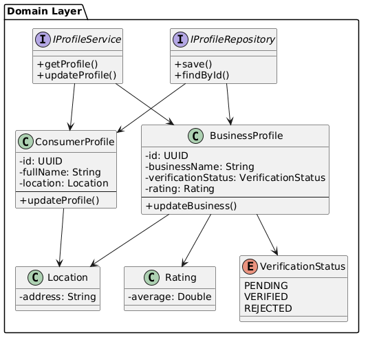

##### 2.6.2.6.2. Bounded Context Database Design Diagram

    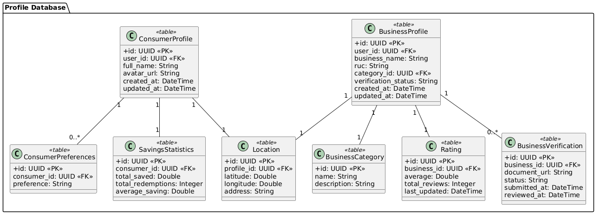

### 2.6.3. Bounded Context: Analytics

Siguiendo el modelo de arquitectura Clean Architecture, el Bounded Context **Analytics** de Klippr gestiona la **generación, procesamiento y consulta de métricas relacionadas con campañas, interacciones de usuarios y reportes de abuso.** Este contexto permite a los negocios afiliados **visualizar el rendimiento de sus promociones y al administrador monitorear el comportamiento de la plataforma.**

---

#### 2.6.3.1. Domain Layer

**Sub-capa Model - Aggregates:**

| Tipo | Nombre | Descripción | Responsabilidad Principal | Relación con otros elementos |
|---|---|---|---|---|
| Aggregate | CampaignMetrics | Representa las métricas agregadas de una campaña. | Consolidar datos como vistas, canjes y calificaciones, asegurando su consistencia. | Relacionado con Promotions y Redemption para obtener eventos de interacción. |
| Aggregate | AbuseReport | Representa un reporte de abuso dentro de la plataforma. | Registrar y mantener información sobre comportamientos indebidos reportados. | Relacionado con Community y Profile para identificar usuarios involucrados. |

---

**Sub-capa Model - Commands:**

| Tipo | Nombre | Descripción | Responsabilidad Principal | Relación con otros elementos |
|---|---|---|---|---|
| Command | UpdateMetricsCommand | Comando para actualizar métricas de una campaña. | Representar la intención de registrar nuevas vistas, canjes o ratings. | Disparado por eventos provenientes de Promotions y Redemption. |
| Command | RegisterAbuseReportCommand | Comando para registrar un reporte de abuso. | Representar la intención de reportar contenido o comportamiento inapropiado. | Usado en Community y accesible por administradores. |

---

**Sub-capa Model - Queries:**

| Tipo | Nombre | Descripción | Responsabilidad Principal | Relación con otros elementos |
|---|---|---|---|---|
| Query | GetCampaignMetricsQuery | Consulta para obtener métricas de una campaña. | Recuperar estadísticas como vistas, canjes y rating promedio. | Usado en dashboards de negocios. |
| Query | GetBusinessDashboardQuery | Consulta para obtener métricas globales de un negocio. | Agrupar métricas de todas las campañas de un negocio. | Usado en el panel B2B. |
| Query | GetAbuseReportsQuery | Consulta para obtener reportes de abuso. | Listar reportes registrados para moderación. | Usado en el panel de administración. |

---

**Sub-capa Model - Events:**

| Tipo | Nombre | Descripción | Responsabilidad Principal | Relación con otros elementos |
|---|---|---|---|---|
| Domain Event | MetricaActualizada | Evento emitido al actualizar métricas. | Notificar cambios en estadísticas de campañas. | Consumido internamente para recalcular dashboards. |
| Domain Event | DashboardConsultado | Evento emitido al consultar métricas. | Registrar accesos al dashboard para auditoría o análisis. | Usado en análisis de uso. |
| Domain Event | ReporteDeAbusoRegistrado | Evento emitido al registrar un reporte. | Notificar a sistemas de moderación. | Consumido por administración. |

---

**Sub-capa Model - Value Objects:**

| Tipo | Nombre | Descripción | Responsabilidad Principal | Relación con otros elementos |
|---|---|---|---|---|
| Value Object | MetricType | Tipo de métrica. | Representar tipos como VIEWS, REDEMPTIONS, RATINGS. | Usado en CampaignMetrics. |
| Value Object | TimeRange | Rango de tiempo para métricas. | Encapsular periodos de consulta (diario, semanal, mensual). | Usado en queries de analytics. |

---

**Sub-capa Services:**

| Tipo | Nombre | Descripción | Responsabilidad Principal | Relación con otros elementos |
|---|---|---|---|---|
| Interface | IAnalyticsCommandService | Interfaz del servicio de comandos de analytics. | Definir operaciones para actualización de métricas y reportes. | Implementado en Application. |
| Interface | IAnalyticsQueryService | Interfaz del servicio de consultas de analytics. | Definir operaciones para obtención de métricas y dashboards. | Implementado en Application. |

---

**Sub-capa Repositories:**

| Tipo | Nombre | Descripción | Responsabilidad Principal | Relación con otros elementos |
|---|---|---|---|---|
| Interface | ICampaignMetricsRepository | Repositorio de métricas de campañas. | Definir operaciones de persistencia de métricas. | Implementado en Infrastructure. |
| Interface | IAbuseReportRepository | Repositorio de reportes de abuso. | Definir operaciones de persistencia de reportes. | Implementado en Infrastructure. |

---

#### 2.6.3.2. Interface Layer

**Sub-capa REST - Resources:**

| Tipo | Nombre | Descripción | Responsabilidad Principal | Relación con otros elementos |
|---|---|---|---|---|
| Resource | CampaignMetricsResource | Representación de métricas de campaña. | Exponer vistas, canjes y rating al cliente. | Usado en AnalyticsController. |
| Resource | BusinessDashboardResource | Representación del dashboard de negocio. | Exponer métricas agregadas de todas las campañas. | Usado en AnalyticsController. |
| Resource | AbuseReportResource | Representación de reporte de abuso. | Exponer información relevante para moderación. | Usado en AdminAnalyticsController. |

---

**Sub-capa REST - Transform:**

| Tipo | Nombre | Descripción | Responsabilidad Principal | Relación con otros elementos |
|---|---|---|---|---|
| Assembler | CampaignMetricsResourceFromEntityAssembler | Convierte métricas a recurso REST. | Transformar datos del dominio a formato API. | Usado en AnalyticsController. |
| Assembler | AbuseReportResourceFromEntityAssembler | Convierte reportes a recurso REST. | Transformar entidad a respuesta API. | Usado en AdminAnalyticsController. |

---

**Sub-capa REST - Controllers:**

| Tipo | Nombre | Descripción | Responsabilidad Principal | Relación con otros elementos |
|---|---|---|---|---|
| Controller | AnalyticsController | Controlador para métricas de negocio. | Manejar consultas de métricas y dashboards. | Usa query services. |
| Controller | AdminAnalyticsController | Controlador para administración. | Manejar reportes de abuso y métricas globales. | Usa query services. |

---

**Sub-capa ACL:**

| Tipo | Nombre | Descripción | Responsabilidad Principal | Relación con otros elementos |
|---|---|---|---|---|
| Service | AnalyticsContextFacade | Fachada del contexto Analytics. | Permitir a otros contextos consultar métricas sin acoplamiento directo. | Relacionado con Promotions y Profile. |

---

#### 2.6.3.3. Application Layer

**Sub-capa Internal - CommandServices:**

| Tipo | Nombre | Descripción | Responsabilidad Principal | Relación con otros elementos |
|---|---|---|---|---|
| CommandHandler | AnalyticsCommandService | Implementación de comandos de analytics. | Procesar actualización de métricas y registro de abusos. | Implementa IAnalyticsCommandService. |

---

**Sub-capa Internal - QueryServices:**

| Tipo | Nombre | Descripción | Responsabilidad Principal | Relación con otros elementos |
|---|---|---|---|---|
| QueryHandler | AnalyticsQueryService | Implementación de consultas de analytics. | Recuperar métricas y dashboards. | Implementa IAnalyticsQueryService. |

---

#### 2.6.3.4. Infrastructure Layer

**Sub-capa Persistence:**

| Tipo | Nombre | Descripción | Responsabilidad Principal | Relación con otros elementos |
|---|---|---|---|---|
| Repository | CampaignMetricsRepository | Implementación del repositorio de métricas. | Persistir y recuperar métricas. | Usado en Application. |
| Repository | AbuseReportRepository | Implementación del repositorio de reportes. | Persistir reportes de abuso. | Usado en Application. |

---

**Sub-capa Pipeline (Middleware):**

| Tipo | Nombre | Descripción | Responsabilidad Principal | Relación con otros elementos |
|---|---|---|---|---|
| Attribute | AuthorizeAttribute | Control de acceso por rol. | Restringir acceso a dashboards y reportes. | Usado en controladores. |

#### 2.6.3.5. Bounded Context Software Architecture Component Level Diagrams

    

#### 2.6.3.6. Bounded Context Software Architecture Code Level Diagrams

##### 2.6.3.6.1 Bounded Context Domain Layer Class Diagrams

    

##### 2.6.3.6.2. Bounded Context Database Design Diagrams

    

### 2.6.4. Bounded Context: Redemption

Siguiendo el modelo de arquitectura Clean Architecture, **el Bounded Context Redemption de Klippr** gestiona el **proceso de canje de promociones** por parte de los consumidores en los negocios afiliados. Asegura que los códigos de promoción sean válidos, no estén expirados y que se respeten los límites de uso. Este contexto interactúa con **Promotions** para validar la oferta y con **Profile** para identificar al consumidor y al negocio.

#### 2.6.4.1. Domain Layer

**Sub-capa Model - Aggregates:**

<table border="1" cellpadding="8" cellspacing="0" style="width:100%; border-collapse: collapse;">
  <tr style="background-color:#2c3e50; color:white;">
    <th>Tipo</th>
    <th>Nombre</th>
    <th>Descripción</th>
    <th>Responsabilidad Principal</th>
    <th>Relación con otros elementos</th>
  </tr>
  <tr>
    <td>Aggregate</td>
    <td>Redemption</td>
    <td>Transacción de canje de una promoción por un usuario.</td>
    <td>Registrar el intento de canje, validar el código y mantener el estado final de la transacción.</td>
    <td>Relacionado con Promotion (oferta canjeada) y ConsumerProfile (usuario que canjea).</td>
  </tr>
</table>

**Sub-capa Model - Commands:**

<table border="1" cellpadding="8" cellspacing="0" style="width:100%; border-collapse: collapse;">
  <tr style="background-color:#2c3e50; color:white;">
    <th>Tipo</th>
    <th>Nombre</th>
    <th>Descripción</th>
    <th>Responsabilidad Principal</th>
    <th>Relación con otros elementos</th>
  </tr>
  <tr>
    <td>Command</td>
    <td>RedeemPromotionCommand</td>
    <td>Comando para iniciar el canje de una promoción.</td>
    <td>Representar la intención de un consumidor de utilizar un código de promoción en un negocio.</td>
    <td>Usado en Application Layer. Inicia la validación con Promotions context.</td>
  </tr>
  <tr>
    <td>Command</td>
    <td>ConfirmRedemptionCommand</td>
    <td>Comando para confirmar un canje exitoso por parte del negocio.</td>
    <td>Representar la validación física o finalización del uso del descuento en tienda.</td>
    <td>Actualiza el estado de Redemption a COMPLETED.</td>
  </tr>
</table>

**Sub-capa Model - Queries:**

<table border="1" cellpadding="8" cellspacing="0" style="width:100%; border-collapse: collapse;">
  <tr style="background-color:#2c3e50; color:white;">
    <th>Tipo</th>
    <th>Nombre</th>
    <th>Descripción</th>
    <th>Responsabilidad Principal</th>
    <th>Relación con otros elementos</th>
  </tr>
  <tr>
    <td>Query</td>
    <td>GetRedemptionByIdQuery</td>
    <td>Consulta para obtener los detalles de un canje específico.</td>
    <td>Recuperar la información del recibo o comprobante digital del canje.</td>
    <td>Usado para mostrar detalles al consumidor o negocio.</td>
  </tr>
  <tr>
    <td>Query</td>
    <td>GetRedemptionsByConsumerIdQuery</td>
    <td>Consulta el historial de canjes de un consumidor.</td>
    <td>Listar todas las promociones que ha utilizado un usuario a lo largo del tiempo.</td>
    <td>Usado en la sección de historial de la app móvil.</td>
  </tr>
  <tr>
    <td>Query</td>
    <td>GetRedemptionsByBusinessIdQuery</td>
    <td>Consulta los canjes realizados en un negocio.</td>
    <td>Proporcionar datos operativos de las promociones reclamadas en una sucursal o negocio.</td>
    <td>Usado en el dashboard operativo B2B.</td>
  </tr>
</table>

**Sub-capa Model - Value Objects:**

<table border="1" cellpadding="8" cellspacing="0" style="width:100%; border-collapse: collapse;">
  <tr style="background-color:#2c3e50; color:white;">
    <th>Tipo</th>
    <th>Nombre</th>
    <th>Descripción</th>
    <th>Responsabilidad Principal</th>
    <th>Relación con otros elementos</th>
  </tr>
  <tr>
    <td>Value Object</td>
    <td>RedemptionStatus</td>
    <td>Estado actual del canje.</td>
    <td>Representar estados: PENDING, COMPLETED, FAILED, CANCELLED.</td>
    <td>Usado en Redemption para flujo de estado.</td>
  </tr>
  <tr>
    <td>Value Object</td>
    <td>RedemptionCode</td>
    <td>Código único generado para el canje.</td>
    <td>Encapsular la lógica de generación y formato del código alfanumérico o QR.</td>
    <td>Usado para validar presencialmente o digitalmente.</td>
  </tr>
</table>

**Sub-capa Services:**

<table border="1" cellpadding="8" cellspacing="0" style="width:100%; border-collapse: collapse;">
  <tr style="background-color:#2c3e50; color:white;">
    <th>Tipo</th>
    <th>Nombre</th>
    <th>Descripción</th>
    <th>Responsabilidad Principal</th>
    <th>Relación con otros elementos</th>
  </tr>
  <tr>
    <td>Interface</td>
    <td>IRedemptionCommandService</td>
    <td>Interfaz del servicio de comandos de canjes.</td>
    <td>Definir operaciones para registrar, validar y confirmar canjes.</td>
    <td>Implementado en capa Application.</td>
  </tr>
  <tr>
    <td>Interface</td>
    <td>IRedemptionQueryService</td>
    <td>Interfaz del servicio de consultas de canjes.</td>
    <td>Definir operaciones para historiales y detalles de canjes.</td>
    <td>Implementado en capa Application.</td>
  </tr>
</table>

**Sub-capa Repositories:**

<table border="1" cellpadding="8" cellspacing="0" style="width:100%; border-collapse: collapse;">
  <tr style="background-color:#2c3e50; color:white;">
    <th>Tipo</th>
    <th>Nombre</th>
    <th>Descripción</th>
    <th>Responsabilidad Principal</th>
    <th>Relación con otros elementos</th>
  </tr>
  <tr>
    <td>Interface</td>
    <td>IRedemptionRepository</td>
    <td>Repositorio para persistencia de Redemption.</td>
    <td>Definir operaciones CRUD y búsquedas de canjes.</td>
    <td>Implementado en capa Infrastructure.</td>
  </tr>
</table>

---

#### 2.6.4.2. Interface Layer

**Sub-capa REST - Resources:**

<table border="1" cellpadding="8" cellspacing="0" style="width:100%; border-collapse: collapse;">
  <tr style="background-color:#2c3e50; color:white;">
    <th>Tipo</th>
    <th>Nombre</th>
    <th>Descripción</th>
    <th>Responsabilidad Principal</th>
    <th>Relación con otros elementos</th>
  </tr>
  <tr>
    <td>Resource</td>
    <td>RedemptionResource</td>
    <td>Representación del canje para el cliente.</td>
    <td>Exponer detalles como fecha, estado, código y descuento aplicado.</td>
    <td>Usado en RedemptionController.</td>
  </tr>
  <tr>
    <td>Resource</td>
    <td>RedeemPromotionResource</td>
    <td>Estructura de petición para canjear.</td>
    <td>Recibir datos necesarios como promotionId para iniciar proceso.</td>
    <td>Usado en RedemptionController.</td>
  </tr>
</table>

**Sub-capa REST - Transform:**

<table border="1" cellpadding="8" cellspacing="0" style="width:100%; border-collapse: collapse;">
  <tr style="background-color:#2c3e50; color:white;">
    <th>Tipo</th>
    <th>Nombre</th>
    <th>Descripción</th>
    <th>Responsabilidad Principal</th>
    <th>Relación con otros elementos</th>
  </tr>
  <tr>
    <td>Assembler</td>
    <td>RedemptionResourceFromEntityAssembler</td>
    <td>Transforma entidad Redemption a recurso.</td>
    <td>Convertir datos de dominio a formato REST.</td>
    <td>Usado en RedemptionController.</td>
  </tr>
  <tr>
    <td>Assembler</td>
    <td>RedeemPromotionCommandFromResourceAssembler</td>
    <td>Transforma petición a comando.</td>
    <td>Convertir datos REST al comando del dominio.</td>
    <td>Usado en RedemptionController.</td>
  </tr>
</table>

**Sub-capa REST - Controllers:**

<table border="1" cellpadding="8" cellspacing="0" style="width:100%; border-collapse: collapse;">
  <tr style="background-color:#2c3e50; color:white;">
    <th>Tipo</th>
    <th>Nombre</th>
    <th>Descripción</th>
    <th>Responsabilidad Principal</th>
    <th>Relación con otros elementos</th>
  </tr>
  <tr>
    <td>Controller</td>
    <td>RedemptionController</td>
    <td>Controlador de operaciones de canjes.</td>
    <td>Manejar endpoints para realizar y consultar canjes.</td>
    <td>Usa command/query services de Application Layer.</td>
  </tr>
</table>

**Sub-capa ACL:**

<table border="1" cellpadding="8" cellspacing="0" style="width:100%; border-collapse: collapse;">
  <tr style="background-color:#2c3e50; color:white;">
    <th>Tipo</th>
    <th>Nombre</th>
    <th>Descripción</th>
    <th>Responsabilidad Principal</th>
    <th>Relación con otros elementos</th>
  </tr>
  <tr>
    <td>Service</td>
    <td>RedemptionContextFacade</td>
    <td>Servicio de fachada de Redemption.</td>
    <td>Proporcionar resumen de canjes para otros contextos sin acceso directo al repositorio.</td>
    <td>Relacionado con Analytics context.</td>
  </tr>
</table>

---

#### 2.6.4.3. Application Layer

**Sub-capa Internal - CommandServices:**

<table border="1" cellpadding="8" cellspacing="0" style="width:100%; border-collapse: collapse;">
  <tr style="background-color:#2c3e50; color:white;">
    <th>Tipo</th>
    <th>Nombre</th>
    <th>Descripción</th>
    <th>Responsabilidad Principal</th>
    <th>Relación con otros elementos</th>
  </tr>
  <tr>
    <td>CommandHandler</td>
    <td>RedemptionCommandService</td>
    <td>Implementación de comandos de canjes.</td>
    <td>Ejecutar validación de disponibilidad contactando a PromotionsContextFacade, y registrar el canje.</td>
    <td>Implementa IRedemptionCommandService.</td>
  </tr>
</table>

**Sub-capa Internal - QueryServices:**

<table border="1" cellpadding="8" cellspacing="0" style="width:100%; border-collapse: collapse;">
  <tr style="background-color:#2c3e50; color:white;">
    <th>Tipo</th>
    <th>Nombre</th>
    <th>Descripción</th>
    <th>Responsabilidad Principal</th>
    <th>Relación con otros elementos</th>
  </tr>
  <tr>
    <td>QueryHandler</td>
    <td>RedemptionQueryService</td>
    <td>Implementación de consultas de canjes.</td>
    <td>Recuperar historiales de canjes por usuario o negocio desde DB.</td>
    <td>Implementa IRedemptionQueryService.</td>
  </tr>
</table>

---

#### 2.6.4.4. Infrastructure Layer

**Sub-capa Persistence:**

<table border="1" cellpadding="8" cellspacing="0" style="width:100%; border-collapse: collapse;">
  <tr style="background-color:#2c3e50; color:white;">
    <th>Tipo</th>
    <th>Nombre</th>
    <th>Descripción</th>
    <th>Responsabilidad Principal</th>
    <th>Relación con otros elementos</th>
  </tr>
  <tr>
    <td>Repository</td>
    <td>RedemptionRepository</td>
    <td>Implementación de persistencia de Redemption.</td>
    <td>Manejar operaciones en base de datos para entidades de canje.</td>
    <td>Usado en Application Layer.</td>
  </tr>
</table>

**Sub-capa Event Publishing:**

<table border="1" cellpadding="8" cellspacing="0" style="width:100%; border-collapse: collapse;">
  <tr style="background-color:#2c3e50; color:white;">
    <th>Tipo</th>
    <th>Nombre</th>
    <th>Descripción</th>
    <th>Responsabilidad Principal</th>
    <th>Relación con otros elementos</th>
  </tr>
  <tr>
    <td>Service</td>
    <td>RedemptionEventPublisher</td>
    <td>Publicador de eventos de canjes.</td>
    <td>Emitir eventos como PromotionRedeemed para que Analytics actualice métricas de campaña.</td>
    <td>Notifica a Analytics context.</td>
  </tr>
</table>

#### 2.6.4.5. Bounded Context Software Architecture Component Level Diagrams

    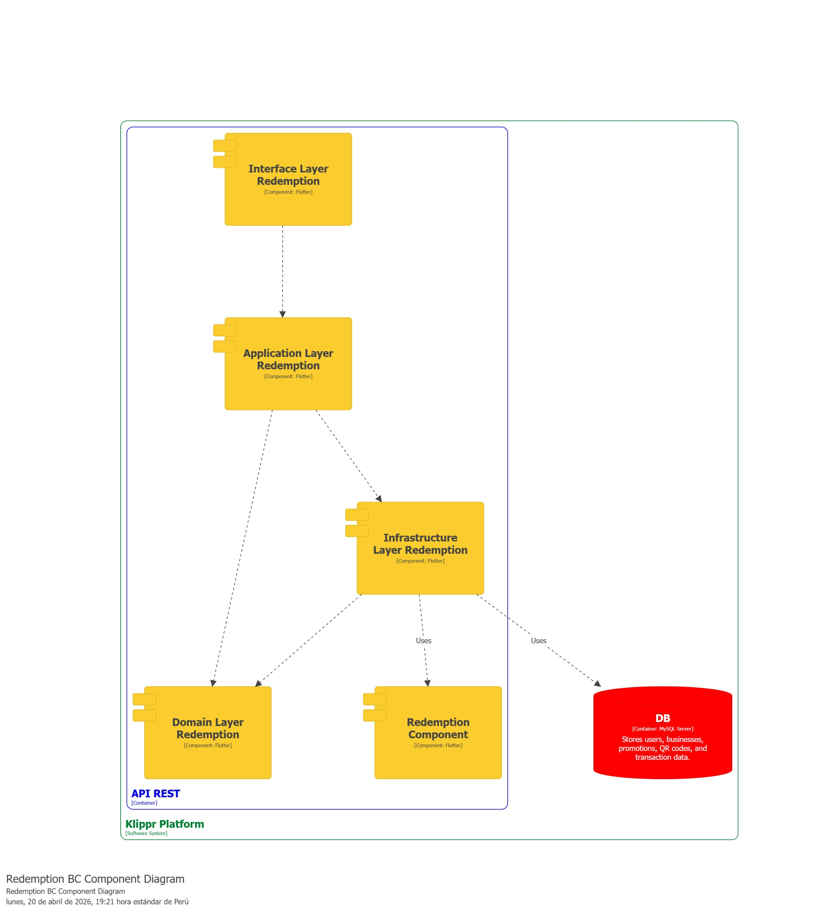

#### 2.6.4.6. Bounded Context Software Architecture Code Level Diagrams

##### 2.6.4.6.1 Bounded Context Domain Layer Class Diagrams

    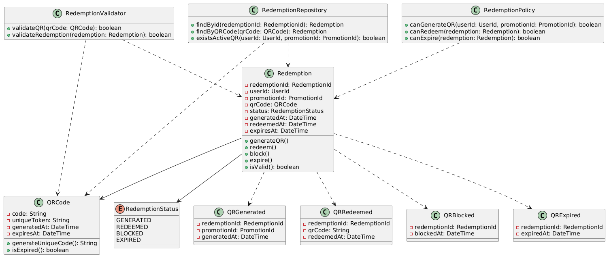

##### 2.6.4.6.2. Bounded Context Database Design Diagrams

| Tipo     | Campo             | Key    | Descripción                                 |
| -------- | ----------------- | ------ | ------------------------------------------- |
| int      | id                | PK     | Identificador único del registro del canje  |
| datetime | created_at        |        | Fecha y hora en que se creó el registro     |
| datetime | updated_at        |        | Fecha y hora de la última actualización     |
| UUID     | user_id           | FK     | Identificador del usuario consumidor        |
| string   | promotion_id      | FK     | Identificador de la promoción asociada      |
| UUID     | qr_code           | UNIQUE | Código QR generado para el canje            |
| UUID     | unique_token      | UNIQUE | Token interno irrepetible anti-fraude       |
| string   | status            |        | Estado actual del canje                     |
| datetime | generated_at      |        | Fecha y hora de generación del QR           |
| datetime | redeemed_at       |        | Fecha y hora en que fue canjeado            |
| datetime | blocked_at        |        | Fecha y hora en que fue bloqueado           |
| datetime | expires_at        |        | Fecha y hora de expiración                  |
| string   | validation_method |        | Método de validación: QR_SCAN o MANUAL_CODE |

| Nombre            | Descripción                                               |
| ----------------- | --------------------------------------------------------- |
| id                | Identificador único del registro del canje.               |
| created_at        | Fecha y hora en que se creó el registro.                  |
| updated_at        | Fecha y hora de la última actualización del registro.     |
| user_id           | Usuario que generó el código QR.                          |
| promotion_id      | Promoción vinculada al canje.                             |
| qr_code           | Código QR mostrado al usuario para validar el descuento.  |
| unique_token      | Token interno único para prevenir reutilización o fraude. |
| status            | Estado del canje: GENERATED, REDEEMED, BLOCKED, EXPIRED.  |
| generated_at      | Fecha y hora en que se generó el QR.                      |
| redeemed_at       | Fecha y hora en que se utilizó exitosamente.              |
| blocked_at        | Fecha y hora en que fue invalidado después del uso.       |
| expires_at        | Fecha límite de uso del QR.                               |
| validation_method | Método usado para validar: escaneo o código manual.       |

### 2.6.5. Bounded Context: Settings

#### 2.6.5.1. Domain Layer

**Sub-capa Model - Aggregates:**

| Tipo | Nombre | Descripción | Responsabilidad Principal | Relación con otros elementos |
|---|---|---|---|---|
| Aggregate | UserSettings | Representa la configuración personalizada de un usuario. | Gestionar preferencias como notificaciones, tema, idioma y privacidad, asegurando consistencia. | Relacionado con IAM mediante UserId. |

---

**Sub-capa Model - Value Objects:**

| Tipo | Nombre | Descripción | Responsabilidad Principal | Relación con otros elementos |
|---|---|---|---|---|
| Value Object | NotificationPreferences | Preferencias de notificaciones del usuario. | Encapsular configuraciones de notificaciones (email, push, sms). | Usado dentro de UserSettings. |
| Value Object | PrivacySettings | Configuración de privacidad del usuario. | Definir visibilidad del perfil y consentimiento de datos. | Usado dentro de UserSettings. |
| Value Object | ThemePreference | Preferencia de tema visual. | Representar si el usuario usa modo oscuro o claro. | Usado dentro de UserSettings. |
| Value Object | LanguagePreference | Preferencia de idioma. | Encapsular el idioma seleccionado por el usuario. | Usado dentro de UserSettings. |
| Value Object | TimezonePreference | Zona horaria del usuario. | Encapsular la configuración regional del usuario. | Usado dentro de UserSettings. |

---

**Sub-capa Model - Commands:**

| Tipo | Nombre | Descripción | Responsabilidad Principal | Relación con otros elementos |
|---|---|---|---|---|
| Command | UpdateNotificationSettingsCommand | Comando para actualizar preferencias de notificación. | Representar la intención de modificar configuraciones de notificaciones. | Usado en Application Layer. |
| Command | UpdatePrivacySettingsCommand | Comando para actualizar configuraciones de privacidad. | Representar la intención de modificar privacidad del usuario. | Usado en Application Layer. |
| Command | UpdateThemeCommand | Comando para cambiar el tema visual. | Representar la intención de cambiar entre modo oscuro o claro. | Usado en Application Layer. |
| Command | UpdateLanguageCommand | Comando para cambiar idioma. | Representar la intención de actualizar idioma del usuario. | Usado en Application Layer. |
| Command | UpdateTimezoneCommand | Comando para cambiar zona horaria. | Representar la intención de actualizar configuración regional. | Usado en Application Layer. |

---

**Sub-capa Model - Queries:**

| Tipo | Nombre | Descripción | Responsabilidad Principal | Relación con otros elementos |
|---|---|---|---|---|
| Query | GetUserSettingsQuery | Consulta para obtener configuración del usuario. | Recuperar todas las preferencias de un usuario. | Usado en Interface Layer. |

---

**Sub-capa Services:**

| Tipo | Nombre | Descripción | Responsabilidad Principal | Relación con otros elementos |
|---|---|---|---|---|
| Interface | IUserSettingsCommandService | Interfaz del servicio de comandos. | Definir operaciones para actualización de configuraciones. | Implementado en Application Layer. |
| Interface | IUserSettingsQueryService | Interfaz del servicio de consultas. | Definir operaciones para obtener configuraciones. | Implementado en Application Layer. |

---

**Sub-capa Repositories:**

| Tipo | Nombre | Descripción | Responsabilidad Principal | Relación con otros elementos |
|---|---|---|---|---|
| Interface | IUserSettingsRepository | Repositorio de configuraciones. | Definir operaciones de persistencia de UserSettings. | Implementado en Infrastructure Layer. |

---

#### 2.6.5.2. Interface Layer

**Sub-capa REST - Resources:**

| Tipo | Nombre | Descripción | Responsabilidad Principal | Relación con otros elementos |
|---|---|---|---|---|
| Resource | UserSettingsResource | Representación de configuración del usuario. | Exponer preferencias al cliente. | Usado en SettingsController. |
| Resource | UpdateSettingsResource | Estructura de petición para actualizar configuraciones. | Representar datos enviados por el cliente. | Usado en SettingsController. |

---

**Sub-capa REST - Transform:**

| Tipo | Nombre | Descripción | Responsabilidad Principal | Relación con otros elementos |
|---|---|---|---|---|
| Assembler | UserSettingsResourceFromEntityAssembler | Convierte UserSettings a recurso REST. | Transformar dominio a respuesta API. | Usado en SettingsController. |
| Assembler | UpdateSettingsCommandFromResourceAssembler | Convierte request a comando. | Transformar petición REST a comando de dominio. | Usado en SettingsController. |

---

**Sub-capa REST - Controllers:**

| Tipo | Nombre | Descripción | Responsabilidad Principal | Relación con otros elementos |
|---|---|---|---|---|
| Controller | SettingsController | Controlador de configuraciones. | Manejar peticiones de consulta y actualización de settings. | Usa command y query services. |

---

**Sub-capa ACL:**

| Tipo | Nombre | Descripción | Responsabilidad Principal | Relación con otros elementos |
|---|---|---|---|---|
| Service | SettingsContextFacade | Fachada del contexto Settings. | Permitir acceso a configuraciones desde otros bounded contexts. | Relacionado con IAM y Profile. |

---

#### 2.6.5.3. Application Layer

**Sub-capa Internal - CommandServices:**

| Tipo | Nombre | Descripción | Responsabilidad Principal | Relación con otros elementos |
|---|---|---|---|---|
| CommandHandler | UserSettingsCommandService | Implementación de comandos. | Procesar actualización de configuraciones. | Implementa IUserSettingsCommandService. |

---

**Sub-capa Internal - QueryServices:**

| Tipo | Nombre | Descripción | Responsabilidad Principal | Relación con otros elementos |
|---|---|---|---|---|
| QueryHandler | UserSettingsQueryService | Implementación de consultas. | Recuperar configuraciones del usuario. | Implementa IUserSettingsQueryService. |

---

#### 2.6.5.4. Infrastructure Layer

**Sub-capa Persistence:**

| Tipo | Nombre | Descripción | Responsabilidad Principal | Relación con otros elementos |
|---|---|---|---|---|
| Repository | UserSettingsRepository | Implementación del repositorio. | Persistir configuraciones del usuario. | Usado en Application Layer. |

---

**Sub-capa Pipeline (Middleware):**

| Tipo | Nombre | Descripción | Responsabilidad Principal | Relación con otros elementos |
|---|---|---|---|---|
| Attribute | AuthorizeAttribute | Control de acceso. | Restringir acceso a endpoints de settings. | Usado en SettingsController. |

#### 2.6.5.5. Bounded Context Software Architecture Component Level Diagrams

    

#### 2.6.5.6. Bounded Context Software Architecture Code Level Diagrams

##### 2.6.3.5.1 Bounded Context Domain Layer Class Diagrams

    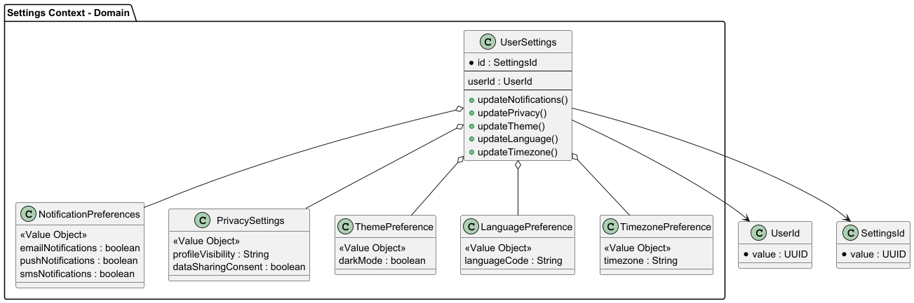

##### 2.6.3.5.2. Bounded Context Database Design Diagrams

    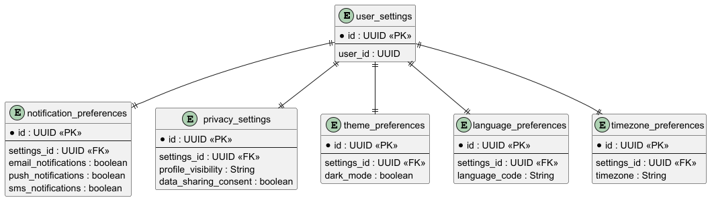

### 2.6.6. Bounded Context: Promotions

Siguiendo el modelo de arquitectura Clean Architecture, **el Bounded Context Promotions de Klippr** gestiona el **ciclo de vida de las promociones y descuentos**, permitiendo a los negocios afiliados crear, publicar y administrar ofertas, mientras que a los consumidores les permite descubrirlas y explorarlas. Este contexto interactúa con **Profile** para verificar el estado del negocio y con **Redemption** para el control de canjes. A continuación se detallan las capas del Bounded Context.

#### 2.6.6.1. Domain Layer

**Sub-capa Model - Aggregates:**

<table border="1" cellpadding="8" cellspacing="0" style="width:100%; border-collapse: collapse;">
  <tr style="background-color:#2c3e50; color:white;">
    <th>Tipo</th>
    <th>Nombre</th>
    <th>Descripción</th>
    <th>Responsabilidad Principal</th>
    <th>Relación con otros elementos</th>
  </tr>
  <tr>
    <td>Aggregate</td>
    <td>Promotion</td>
    <td>Oferta o descuento creado por un negocio afiliado.</td>
    <td>Mantener las reglas de negocio de la promoción, vigencia, stock de canjes y su estado (activa, expirada, cancelada).</td>
    <td>Relacionado con Profile (negocio creador) y Redemption (cuando un consumidor la canjea).</td>
  </tr>
</table>

**Sub-capa Model - Commands:**

<table border="1" cellpadding="8" cellspacing="0" style="width:100%; border-collapse: collapse;">
  <tr style="background-color:#2c3e50; color:white;">
    <th>Tipo</th>
    <th>Nombre</th>
    <th>Descripción</th>
    <th>Responsabilidad Principal</th>
    <th>Relación con otros elementos</th>
  </tr>
  <tr>
    <td>Command</td>
    <td>CreatePromotionCommand</td>
    <td>Comando para crear el borrador de una promoción.</td>
    <td>Representar la intención de un negocio de registrar una nueva oferta con detalles iniciales.</td>
    <td>Usado en el servicio de promociones desde Interface Layer.</td>
  </tr>
  <tr>
    <td>Command</td>
    <td>UpdatePromotionCommand</td>
    <td>Comando para actualizar información de una promoción.</td>
    <td>Representar la intención de modificar condiciones, fechas o descripción de la oferta antes de publicarla.</td>
    <td>Usado en el servicio de promociones desde Interface Layer.</td>
  </tr>
  <tr>
    <td>Command</td>
    <td>PublishPromotionCommand</td>
    <td>Comando para publicar y hacer visible la promoción.</td>
    <td>Representar la intención de cambiar el estado de la promoción a PUBLISHED, validando que el negocio esté verificado.</td>
    <td>Genera evento PromotionPublished. Valida estado usando ProfileContextFacade.</td>
  </tr>
  <tr>
    <td>Command</td>
    <td>CancelPromotionCommand</td>
    <td>Comando para cancelar una promoción en curso.</td>
    <td>Representar la intención de detener anticipadamente una promoción y evitar futuros canjes.</td>
    <td>Genera evento PromotionCancelled hacia Redemption context.</td>
  </tr>
</table>

**Sub-capa Model - Queries:**

<table border="1" cellpadding="8" cellspacing="0" style="width:100%; border-collapse: collapse;">
  <tr style="background-color:#2c3e50; color:white;">
    <th>Tipo</th>
    <th>Nombre</th>
    <th>Descripción</th>
    <th>Responsabilidad Principal</th>
    <th>Relación con otros elementos</th>
  </tr>
  <tr>
    <td>Query</td>
    <td>GetPromotionByIdQuery</td>
    <td>Consulta para obtener los detalles de una promoción específica.</td>
    <td>Representar la intención de recuperar toda la información y condiciones de una promoción.</td>
    <td>Usado por la aplicación móvil al ver detalles de la oferta.</td>
  </tr>
  <tr>
    <td>Query</td>
    <td>GetActivePromotionsQuery</td>
    <td>Consulta para obtener todas las promociones activas.</td>
    <td>Representar la intención de obtener el listado de promociones disponibles, con filtros por categoría o ubicación.</td>
    <td>Usado en el feed principal de consumidores.</td>
  </tr>
  <tr>
    <td>Query</td>
    <td>GetPromotionsByBusinessIdQuery</td>
    <td>Consulta para obtener las promociones de un negocio.</td>
    <td>Representar la intención de listar el historial de promociones creadas por un negocio específico.</td>
    <td>Usado en el dashboard B2B del negocio afiliado.</td>
  </tr>
</table>

**Sub-capa Model - Value Objects:**

<table border="1" cellpadding="8" cellspacing="0" style="width:100%; border-collapse: collapse;">
  <tr style="background-color:#2c3e50; color:white;">
    <th>Tipo</th>
    <th>Nombre</th>
    <th>Descripción</th>
    <th>Responsabilidad Principal</th>
    <th>Relación con otros elementos</th>
  </tr>
  <tr>
    <td>Value Object</td>
    <td>PromotionStatus</td>
    <td>Estado actual de la promoción.</td>
    <td>Representar los estados posibles: DRAFT, PUBLISHED, EXPIRED, CANCELLED.</td>
    <td>Usado en Promotion para control de ciclo de vida.</td>
  </tr>
  <tr>
    <td>Value Object</td>
    <td>DiscountValue</td>
    <td>Valor y tipo del descuento ofrecido.</td>
    <td>Encapsular el monto o porcentaje de descuento con reglas de validación (ej. no negativo).</td>
    <td>Usado en Promotion para definir el beneficio.</td>
  </tr>
  <tr>
    <td>Value Object</td>
    <td>TimeFrame</td>
    <td>Periodo de validez de la promoción.</td>
    <td>Encapsular fecha de inicio y fin, asegurando coherencia temporal.</td>
    <td>Usado en Promotion para determinar si está vigente.</td>
  </tr>
</table>

**Sub-capa Services:**

<table border="1" cellpadding="8" cellspacing="0" style="width:100%; border-collapse: collapse;">
  <tr style="background-color:#2c3e50; color:white;">
    <th>Tipo</th>
    <th>Nombre</th>
    <th>Descripción</th>
    <th>Responsabilidad Principal</th>
    <th>Relación con otros elementos</th>
  </tr>
  <tr>
    <td>Interface</td>
    <td>IPromotionCommandService</td>
    <td>Interfaz del servicio de comandos de promociones.</td>
    <td>Estipular contratos para crear, modificar, publicar y cancelar promociones.</td>
    <td>Implementado en capa Application; consumido desde Interface Layer.</td>
  </tr>
  <tr>
    <td>Interface</td>
    <td>IPromotionQueryService</td>
    <td>Interfaz del servicio de consultas de promociones.</td>
    <td>Estipular contratos para obtener promociones activas y por negocio.</td>
    <td>Implementado en capa Application; consumido desde Interface Layer.</td>
  </tr>
</table>

**Sub-capa Repositories:**

<table border="1" cellpadding="8" cellspacing="0" style="width:100%; border-collapse: collapse;">
  <tr style="background-color:#2c3e50; color:white;">
    <th>Tipo</th>
    <th>Nombre</th>
    <th>Descripción</th>
    <th>Responsabilidad Principal</th>
    <th>Relación con otros elementos</th>
  </tr>
  <tr>
    <td>Interface</td>
    <td>IPromotionRepository</td>
    <td>Repositorio para persistencia de Promotion.</td>
    <td>Definir contratos para operaciones CRUD y búsquedas por estado, negocio o vigencia.</td>
    <td>Implementado en capa Infrastructure.</td>
  </tr>
</table>

---

#### 2.6.6.2. Interface Layer

**Sub-capa REST - Resources:**

<table border="1" cellpadding="8" cellspacing="0" style="width:100%; border-collapse: collapse;">
  <tr style="background-color:#2c3e50; color:white;">
    <th>Tipo</th>
    <th>Nombre</th>
    <th>Descripción</th>
    <th>Responsabilidad Principal</th>
    <th>Relación con otros elementos</th>
  </tr>
  <tr>
    <td>Resource</td>
    <td>PromotionResource</td>
    <td>Estructura de respuesta con datos de la promoción.</td>
    <td>Representar visualmente la promoción: título, descuento, fechas y negocio.</td>
    <td>Usado en PromotionController para respuestas GET.</td>
  </tr>
  <tr>
    <td>Resource</td>
    <td>CreatePromotionResource</td>
    <td>Estructura de petición para crear una promoción.</td>
    <td>Representar y validar datos de entrada para nueva oferta.</td>
    <td>Usado en PromotionController para recibir peticiones POST.</td>
  </tr>
</table>

**Sub-capa REST - Transform:**

<table border="1" cellpadding="8" cellspacing="0" style="width:100%; border-collapse: collapse;">
  <tr style="background-color:#2c3e50; color:white;">
    <th>Tipo</th>
    <th>Nombre</th>
    <th>Descripción</th>
    <th>Responsabilidad Principal</th>
    <th>Relación con otros elementos</th>
  </tr>
  <tr>
    <td>Assembler</td>
    <td>PromotionResourceFromEntityAssembler</td>
    <td>Transforma entidad Promotion a PromotionResource.</td>
    <td>Convertir entidad del dominio a REST.</td>
    <td>Usado en PromotionController.</td>
  </tr>
  <tr>
    <td>Assembler</td>
    <td>CreatePromotionCommandFromResourceAssembler</td>
    <td>Transforma CreatePromotionResource a CreatePromotionCommand.</td>
    <td>Convertir petición REST al comando del dominio.</td>
    <td>Usado en PromotionController.</td>
  </tr>
</table>

**Sub-capa REST - Controllers:**

<table border="1" cellpadding="8" cellspacing="0" style="width:100%; border-collapse: collapse;">
  <tr style="background-color:#2c3e50; color:white;">
    <th>Tipo</th>
    <th>Nombre</th>
    <th>Descripción</th>
    <th>Responsabilidad Principal</th>
    <th>Relación con otros elementos</th>
  </tr>
  <tr>
    <td>Controller</td>
    <td>PromotionController</td>
    <td>Controlador para operaciones con promociones.</td>
    <td>Manejar endpoints para crear, listar, consultar y gestionar promociones.</td>
    <td>Usa command/query services de Application Layer.</td>
  </tr>
</table>

**Sub-capa ACL:**

<table border="1" cellpadding="8" cellspacing="0" style="width:100%; border-collapse: collapse;">
  <tr style="background-color:#2c3e50; color:white;">
    <th>Tipo</th>
    <th>Nombre</th>
    <th>Descripción</th>
    <th>Responsabilidad Principal</th>
    <th>Relación con otros elementos</th>
  </tr>
  <tr>
    <td>Service</td>
    <td>PromotionsContextFacade</td>
    <td>Servicio de fachada para el contexto Promotions.</td>
    <td>Proporcionar interfaz para que otros contextos validen disponibilidad de promociones.</td>
    <td>Relacionado con Redemption context (validar promoción antes de canjear).</td>
  </tr>
</table>

---

#### 2.6.6.3. Application Layer

**Sub-capa Internal - CommandServices:**

<table border="1" cellpadding="8" cellspacing="0" style="width:100%; border-collapse: collapse;">
  <tr style="background-color:#2c3e50; color:white;">
    <th>Tipo</th>
    <th>Nombre</th>
    <th>Descripción</th>
    <th>Responsabilidad Principal</th>
    <th>Relación con otros elementos</th>
  </tr>
  <tr>
    <td>CommandHandler</td>
    <td>PromotionCommandService</td>
    <td>Implementación de comandos de promociones.</td>
    <td>Ejecutar reglas de negocio para creación y publicación, validando estado de verificación con Profile.</td>
    <td>Implementa IPromotionCommandService. Consulta ProfileContextFacade.</td>
  </tr>
</table>

**Sub-capa Internal - QueryServices:**

<table border="1" cellpadding="8" cellspacing="0" style="width:100%; border-collapse: collapse;">
  <tr style="background-color:#2c3e50; color:white;">
    <th>Tipo</th>
    <th>Nombre</th>
    <th>Descripción</th>
    <th>Responsabilidad Principal</th>
    <th>Relación con otros elementos</th>
  </tr>
  <tr>
    <td>QueryHandler</td>
    <td>PromotionQueryService</td>
    <td>Implementación de consultas de promociones.</td>
    <td>Recuperar promociones activas o filtradas desde infraestructura.</td>
    <td>Implementa IPromotionQueryService.</td>
  </tr>
</table>

---

#### 2.6.6.4. Infrastructure Layer

**Sub-capa Persistence:**

<table border="1" cellpadding="8" cellspacing="0" style="width:100%; border-collapse: collapse;">
  <tr style="background-color:#2c3e50; color:white;">
    <th>Tipo</th>
    <th>Nombre</th>
    <th>Descripción</th>
    <th>Responsabilidad Principal</th>
    <th>Relación con otros elementos</th>
  </tr>
  <tr>
    <td>Repository</td>
    <td>PromotionRepository</td>
    <td>Implementación concreta para persistencia de Promotion.</td>
    <td>Manejar base de datos para operaciones CRUD y búsquedas de ofertas.</td>
    <td>Usado en Application Layer.</td>
  </tr>
</table>

**Sub-capa Event Publishing:**

<table border="1" cellpadding="8" cellspacing="0" style="width:100%; border-collapse: collapse;">
  <tr style="background-color:#2c3e50; color:white;">
    <th>Tipo</th>
    <th>Nombre</th>
    <th>Descripción</th>
    <th>Responsabilidad Principal</th>
    <th>Relación con otros elementos</th>
  </tr>
  <tr>
    <td>Service</td>
    <td>PromotionEventPublisher</td>
    <td>Servicio para publicación de eventos de promociones.</td>
    <td>Emitir eventos como PromotionPublished a través del message broker.</td>
    <td>Notifica a Analytics y Redemption context.</td>
  </tr>
</table>

#### 2.6.6.5. Bounded Context Software Architecture Component Level Diagrams

    

#### 2.6.6.6. Bounded Context Software Architecture Code Level Diagrams

##### 2.6.6.6.1 Bounded Context Domain Layer Class Diagrams

    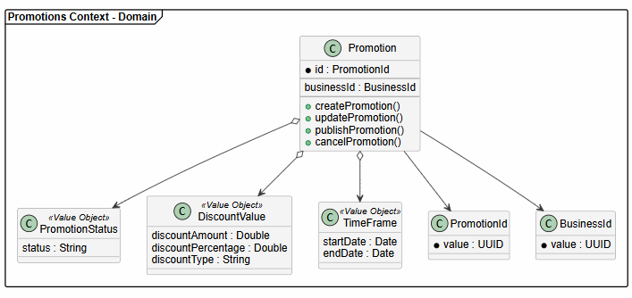

##### 2.6.6.6.2. Bounded Context Database Design Diagrams

    

### 2.6.7. Bounded Context: Community

Siguiendo el modelo de arquitectura Clean Architecture, **el Bounded Context Community de Klippr** gestiona las **interacciones sociales, reseñas y calificaciones** que los consumidores dejan sobre los negocios afiliados y sus promociones. Fomenta la confianza en la plataforma y provee retroalimentación valiosa, interactuando estrechamente con **Profile** para agregar la reputación y con **Analytics** para detectar y gestionar reportes de abuso en las opiniones.

#### 2.6.7.1. Domain Layer

**Sub-capa Model - Aggregates:**

<table border="1" cellpadding="8" cellspacing="0" style="width:100%; border-collapse: collapse;">
  <tr style="background-color:#2c3e50; color:white;">
    <th>Tipo</th>
    <th>Nombre</th>
    <th>Descripción</th>
    <th>Responsabilidad Principal</th>
    <th>Relación con otros elementos</th>
  </tr>
  <tr>
    <td>Aggregate</td>
    <td>Review</td>
    <td>Reseña y calificación dejada por un consumidor.</td>
    <td>Mantener la integridad del contenido de la opinión, la calificación otorgada y su estado de moderación.</td>
    <td>Relacionado con BusinessProfile (negocio evaluado) y ConsumerProfile (autor).</td>
  </tr>
</table>

**Sub-capa Model - Commands:**

<table border="1" cellpadding="8" cellspacing="0" style="width:100%; border-collapse: collapse;">
  <tr style="background-color:#2c3e50; color:white;">
    <th>Tipo</th>
    <th>Nombre</th>
    <th>Descripción</th>
    <th>Responsabilidad Principal</th>
    <th>Relación con otros elementos</th>
  </tr>
  <tr>
    <td>Command</td>
    <td>CreateReviewCommand</td>
    <td>Comando para publicar una nueva reseña.</td>
    <td>Representar la intención del usuario de calificar y comentar su experiencia.</td>
    <td>Usado en Application Layer. Genera evento ReviewCreated.</td>
  </tr>
  <tr>
    <td>Command</td>
    <td>ModerateReviewCommand</td>
    <td>Comando para moderar u ocultar una reseña inapropiada.</td>
    <td>Representar la decisión administrativa de cambiar la visibilidad de una opinión.</td>
    <td>Usado por administradores a partir de reportes en Analytics.</td>
  </tr>
</table>

**Sub-capa Model - Queries:**

<table border="1" cellpadding="8" cellspacing="0" style="width:100%; border-collapse: collapse;">
  <tr style="background-color:#2c3e50; color:white;">
    <th>Tipo</th>
    <th>Nombre</th>
    <th>Descripción</th>
    <th>Responsabilidad Principal</th>
    <th>Relación con otros elementos</th>
  </tr>
  <tr>
    <td>Query</td>
    <td>GetReviewsByBusinessIdQuery</td>
    <td>Consulta de reseñas para un negocio.</td>
    <td>Listar todas las opiniones visibles asociadas a un comercio específico.</td>
    <td>Usado en la pantalla de perfil del negocio.</td>
  </tr>
  <tr>
    <td>Query</td>
    <td>GetReviewsByConsumerIdQuery</td>
    <td>Consulta de reseñas de un usuario.</td>
    <td>Listar el historial de opiniones escritas por un consumidor.</td>
    <td>Usado en el perfil personal del usuario.</td>
  </tr>
</table>

**Sub-capa Model - Value Objects:**

<table border="1" cellpadding="8" cellspacing="0" style="width:100%; border-collapse: collapse;">
  <tr style="background-color:#2c3e50; color:white;">
    <th>Tipo</th>
    <th>Nombre</th>
    <th>Descripción</th>
    <th>Responsabilidad Principal</th>
    <th>Relación con otros elementos</th>
  </tr>
  <tr>
    <td>Value Object</td>
    <td>Rating</td>
    <td>Puntuación cuantitativa.</td>
    <td>Asegurar que el valor esté en el rango permitido (ej. 1 a 5 estrellas).</td>
    <td>Usado dentro de Review.</td>
  </tr>
  <tr>
    <td>Value Object</td>
    <td>ReviewContent</td>
    <td>Texto y contenido multimedia de la opinión.</td>
    <td>Almacenar el texto de retroalimentación con límites de longitud y reglas de formato.</td>
    <td>Usado dentro de Review.</td>
  </tr>
</table>

**Sub-capa Services:**

<table border="1" cellpadding="8" cellspacing="0" style="width:100%; border-collapse: collapse;">
  <tr style="background-color:#2c3e50; color:white;">
    <th>Tipo</th>
    <th>Nombre</th>
    <th>Descripción</th>
    <th>Responsabilidad Principal</th>
    <th>Relación con otros elementos</th>
  </tr>
  <tr>
    <td>Interface</td>
    <td>IReviewCommandService</td>
    <td>Interfaz del servicio de comandos de reseñas.</td>
    <td>Definir contratos para crear y moderar reseñas.</td>
    <td>Implementado en capa Application.</td>
  </tr>
  <tr>
    <td>Interface</td>
    <td>IReviewQueryService</td>
    <td>Interfaz del servicio de consultas de reseñas.</td>
    <td>Definir contratos para obtener listas de reseñas.</td>
    <td>Implementado en capa Application.</td>
  </tr>
</table>

**Sub-capa Repositories:**

<table border="1" cellpadding="8" cellspacing="0" style="width:100%; border-collapse: collapse;">
  <tr style="background-color:#2c3e50; color:white;">
    <th>Tipo</th>
    <th>Nombre</th>
    <th>Descripción</th>
    <th>Responsabilidad Principal</th>
    <th>Relación con otros elementos</th>
  </tr>
  <tr>
    <td>Interface</td>
    <td>IReviewRepository</td>
    <td>Repositorio para persistencia de Review.</td>
    <td>Definir operaciones CRUD y búsquedas de reseñas en la base de datos.</td>
    <td>Implementado en capa Infrastructure.</td>
  </tr>
</table>

---

#### 2.6.7.2. Interface Layer

**Sub-capa REST - Resources:**

<table border="1" cellpadding="8" cellspacing="0" style="width:100%; border-collapse: collapse;">
  <tr style="background-color:#2c3e50; color:white;">
    <th>Tipo</th>
    <th>Nombre</th>
    <th>Descripción</th>
    <th>Responsabilidad Principal</th>
    <th>Relación con otros elementos</th>
  </tr>
  <tr>
    <td>Resource</td>
    <td>ReviewResource</td>
    <td>Representación de la reseña para el cliente.</td>
    <td>Exponer puntuación, texto, autor y fecha.</td>
    <td>Usado en ReviewController.</td>
  </tr>
  <tr>
    <td>Resource</td>
    <td>CreateReviewResource</td>
    <td>Estructura para enviar una nueva reseña.</td>
    <td>Recibir los datos introducidos por el usuario para calificar un negocio.</td>
    <td>Usado en ReviewController.</td>
  </tr>
</table>

**Sub-capa REST - Transform:**

<table border="1" cellpadding="8" cellspacing="0" style="width:100%; border-collapse: collapse;">
  <tr style="background-color:#2c3e50; color:white;">
    <th>Tipo</th>
    <th>Nombre</th>
    <th>Descripción</th>
    <th>Responsabilidad Principal</th>
    <th>Relación con otros elementos</th>
  </tr>
  <tr>
    <td>Assembler</td>
    <td>ReviewResourceFromEntityAssembler</td>
    <td>Transforma entidad Review a recurso.</td>
    <td>Convertir datos de dominio a REST.</td>
    <td>Usado en ReviewController.</td>
  </tr>
  <tr>
    <td>Assembler</td>
    <td>CreateReviewCommandFromResourceAssembler</td>
    <td>Transforma petición a comando.</td>
    <td>Convertir JSON de creación al comando del dominio.</td>
    <td>Usado en ReviewController.</td>
  </tr>
</table>

**Sub-capa REST - Controllers:**

<table border="1" cellpadding="8" cellspacing="0" style="width:100%; border-collapse: collapse;">
  <tr style="background-color:#2c3e50; color:white;">
    <th>Tipo</th>
    <th>Nombre</th>
    <th>Descripción</th>
    <th>Responsabilidad Principal</th>
    <th>Relación con otros elementos</th>
  </tr>
  <tr>
    <td>Controller</td>
    <td>ReviewController</td>
    <td>Controlador de reseñas.</td>
    <td>Manejar endpoints para publicar y visualizar opiniones.</td>
    <td>Usa servicios de Application Layer.</td>
  </tr>
</table>

**Sub-capa ACL:**

<table border="1" cellpadding="8" cellspacing="0" style="width:100%; border-collapse: collapse;">
  <tr style="background-color:#2c3e50; color:white;">
    <th>Tipo</th>
    <th>Nombre</th>
    <th>Descripción</th>
    <th>Responsabilidad Principal</th>
    <th>Relación con otros elementos</th>
  </tr>
  <tr>
    <td>Service</td>
    <td>CommunityContextFacade</td>
    <td>Fachada del contexto Community.</td>
    <td>Proveer acceso controlado a datos agregados de reseñas para otros módulos.</td>
    <td>Usado por Profile para calcular promedio de calificaciones.</td>
  </tr>
</table>

---

#### 2.6.7.3. Application Layer

**Sub-capa Internal - CommandServices:**

<table border="1" cellpadding="8" cellspacing="0" style="width:100%; border-collapse: collapse;">
  <tr style="background-color:#2c3e50; color:white;">
    <th>Tipo</th>
    <th>Nombre</th>
    <th>Descripción</th>
    <th>Responsabilidad Principal</th>
    <th>Relación con otros elementos</th>
  </tr>
  <tr>
    <td>CommandHandler</td>
    <td>ReviewCommandService</td>
    <td>Implementación de comandos de reseñas.</td>
    <td>Procesar la creación de opiniones y asegurar su validación inicial.</td>
    <td>Implementa IReviewCommandService.</td>
  </tr>
</table>

**Sub-capa Internal - QueryServices:**

<table border="1" cellpadding="8" cellspacing="0" style="width:100%; border-collapse: collapse;">
  <tr style="background-color:#2c3e50; color:white;">
    <th>Tipo</th>
    <th>Nombre</th>
    <th>Descripción</th>
    <th>Responsabilidad Principal</th>
    <th>Relación con otros elementos</th>
  </tr>
  <tr>
    <td>QueryHandler</td>
    <td>ReviewQueryService</td>
    <td>Implementación de consultas de reseñas.</td>
    <td>Recuperar listas paginadas de opiniones.</td>
    <td>Implementa IReviewQueryService.</td>
  </tr>
</table>

---

#### 2.6.7.4. Infrastructure Layer

**Sub-capa Persistence:**

<table border="1" cellpadding="8" cellspacing="0" style="width:100%; border-collapse: collapse;">
  <tr style="background-color:#2c3e50; color:white;">
    <th>Tipo</th>
    <th>Nombre</th>
    <th>Descripción</th>
    <th>Responsabilidad Principal</th>
    <th>Relación con otros elementos</th>
  </tr>
  <tr>
    <td>Repository</td>
    <td>ReviewRepository</td>
    <td>Implementación de persistencia de Review.</td>
    <td>Interactuar con la base de datos para almacenar y leer opiniones.</td>
    <td>Usado en Application Layer.</td>
  </tr>
</table>

**Sub-capa Event Publishing:**

<table border="1" cellpadding="8" cellspacing="0" style="width:100%; border-collapse: collapse;">
  <tr style="background-color:#2c3e50; color:white;">
    <th>Tipo</th>
    <th>Nombre</th>
    <th>Descripción</th>
    <th>Responsabilidad Principal</th>
    <th>Relación con otros elementos</th>
  </tr>
  <tr>
    <td>Service</td>
    <td>CommunityEventPublisher</td>
    <td>Publicador de eventos de comunidad.</td>
    <td>Emitir eventos de ReviewCreated para actualizar estadísticas en otros módulos.</td>
    <td>Notifica al Profile context para recálculo de Rating.</td>
  </tr>
</table>

#### 2.6.7.5. Bounded Context Software Architecture Component Level Diagrams

    

#### 2.6.7.6. Bounded Context Software Architecture Code Level Diagrams

##### 2.6.7.6.1 Bounded Context Domain Layer Class Diagrams

    

##### 2.6.7.6.2. Bounded Context Database Design Diagrams

| Tipo     | Campo         | Key | Descripción                                              |
| -------- | ------------- | --- | -------------------------------------------------------- |
| int      | id            | PK  | Identificador único de la reseña.                        |
| datetime | created_at    |     | Fecha y hora en que se creó la reseña.                   |
| datetime | updated_at    |     | Fecha y hora de la última actualización.                 |
| string   | user_id       | FK  | Identificador del usuario que publicó la reseña.         |
| string   | promotion_id  | FK  | Identificador de la promoción reseñada.                  |
| string   | redemption_id | FK  | Identificador del canje completado asociado a la reseña. |
| int      | rating        |     | Calificación otorgada por el usuario, de 1 a 5.          |
| text     | comment       |     | Comentario escrito por el usuario sobre la promoción.    |
| varchar  | status        |     | Estado de la reseña: PUBLISHED, HIDDEN o REPORTED.       |
| varchar  | review_id     | FK  | Identificador de la reseña comentada.                    |
| text     | content       |     | Contenido del comentario.                                |
| varchar  | business_id   | FK  | Identificador del negocio que responde.                  |

| Nombre           | Descripción                                                                                |
| ---------------- | ------------------------------------------------------------------------------------------ |
| id               | Identificador único de la reseña registrada en el sistema.                                 |
| reviews          | Almacena las reseñas y calificaciones realizadas por usuarios después de un canje exitoso. |
| comments         | Almacena comentarios de usuarios sobre reseñas publicadas.                                 |
| business_replies | Almacena respuestas de negocios afiliados a reseñas de usuarios.                           |
| likes            | Registra los likes realizados por usuarios sobre reseñas.                                  |
| created_at       | Fecha y hora en que la reseña fue creada.                                                  |
| updated_at       | Fecha y hora de la última modificación de la reseña.                                       |
| user_id          | Usuario consumidor autor de la reseña.                                                     |
| promotion_id     | Promoción evaluada por el usuario.                                                         |
| redemption_id    | Canje exitoso que habilitó la reseña.                                                      |
| rating           | Calificación numérica otorgada entre 1 y 5 estrellas.                                      |
| status           | Estado actual de la reseña (publicada, reportada, oculta).                                 |
| content          | Texto del comentario publicado.                                                            |
| business_id      | Negocio afiliado que responde.                                                             |  

### 2.6.8. Bounded Context: Favorites

El Bounded Context <b>Favorites</b> permite a los usuarios guardar promociones de interés para consultarlas posteriormente,
facilitando el seguimiento de ofertas relevantes y mejorando la experiencia de descubrimiento.

<b>Eventos clave:</b> PromocionGuardada, PromocionEliminadaFavoritos, FavoritosConsultados

#### 2.6.8.1. Domain Layer

<h4>Sub-capa Model - Aggregates</h4>
<table border="1" cellpadding="6">
<tr>
<th>Tipo</th><th>Nombre</th><th>Descripción</th><th>Responsabilidad Principal</th><th>Relación</th>
</tr>
<tr>
<td>Aggregate</td>
<td>Favorite</td>
<td>Representa una promoción guardada por un usuario</td>
<td>Gestionar el ciclo de vida de favoritos</td>
<td>Relacionado con Promotions y Profile</td>
</tr>
</table>

<h4>Sub-capa Model - Commands</h4>
<table border="1" cellpadding="6">
<tr>
<th>Tipo</th><th>Nombre</th><th>Descripción</th><th>Responsabilidad</th>
</tr>
<tr>
<td>Command</td>
<td>SaveFavoriteCommand</td>
<td>Guardar promoción en favoritos</td>
<td>Representar intención de guardar</td>
</tr>
<tr>
<td>Command</td>
<td>RemoveFavoriteCommand</td>
<td>Eliminar promoción de favoritos</td>
<td>Representar intención de eliminar</td>
</tr>
</table>

<h4>Sub-capa Model - Queries</h4>
<table border="1" cellpadding="6">
<tr>
<th>Tipo</th><th>Nombre</th><th>Descripción</th><th>Responsabilidad</th>
</tr>
<tr>
<td>Query</td>
<td>GetUserFavoritesQuery</td>
<td>Obtener favoritos de un usuario</td>
<td>Recuperar lista de promociones guardadas</td>
</tr>
</table>

<h4>Sub-capa Model - Events</h4>
<table border="1" cellpadding="6">
<tr>
<th>Tipo</th><th>Nombre</th><th>Descripción</th><th>Responsabilidad</th>
</tr>
<tr>
<td>Domain Event</td>
<td>PromocionGuardada</td>
<td>Evento al guardar una promoción</td>
<td>Notificar almacenamiento exitoso</td>
</tr>
<tr>
<td>Domain Event</td>
<td>PromocionEliminadaFavoritos</td>
<td>Evento al eliminar favorito</td>
<td>Notificar eliminación</td>
</tr>
<tr>
<td>Domain Event</td>
<td>FavoritosConsultados</td>
<td>Evento al consultar favoritos</td>
<td>Registrar acceso</td>
</tr>
</table>

<h4>Sub-capa Model - Value Objects</h4>
<table border="1" cellpadding="6">
<tr>
<th>Tipo</th><th>Nombre</th><th>Descripción</th><th>Responsabilidad</th>
</tr>
<tr>
<td>Value Object</td>
<td>FavoriteId</td>
<td>Identificador único</td>
<td>Identificar favorito</td>
</tr>
<tr>
<td>Value Object</td>
<td>UserId</td>
<td>Identificador de usuario</td>
<td>Referencia a Profile</td>
</tr>
<tr>
<td>Value Object</td>
<td>PromotionId</td>
<td>Identificador de promoción</td>
<td>Referencia a Promotions</td>
</tr>
</table>

<h4>Sub-capa Services</h4>
<table border="1" cellpadding="6">
<tr>
<th>Tipo</th><th>Nombre</th><th>Descripción</th>
</tr>
<tr>
<td>Interface</td>
<td>IFavoriteCommandService</td>
<td>Define operaciones de escritura</td>
</tr>
<tr>
<td>Interface</td>
<td>IFavoriteQueryService</td>
<td>Define operaciones de consulta</td>
</tr>
</table>

<h4>Sub-capa Repositories</h4>
<table border="1" cellpadding="6">
<tr>
<th>Tipo</th><th>Nombre</th><th>Descripción</th>
</tr>
<tr>
<td>Interface</td>
<td>IFavoriteRepository</td>
<td>Persistencia de favoritos</td>
</tr>
</table>

#### 2.6.8.2. Interface Layer

<h4>Sub-capa REST - Resources</h4>
<table border="1" cellpadding="6">
<tr>
<th>Tipo</th><th>Nombre</th><th>Descripción</th>
</tr>
<tr>
<td>Resource</td>
<td>FavoriteResource</td>
<td>Representación de un favorito</td>
</tr>
<tr>
<td>Resource</td>
<td>FavoriteListResource</td>
<td>Lista de favoritos</td>
</tr>
</table>

<h4>Sub-capa REST - Transform</h4>
<table border="1" cellpadding="6">
<tr>
<th>Tipo</th><th>Nombre</th><th>Descripción</th>
</tr>
<tr>
<td>Assembler</td>
<td>FavoriteResourceFromEntityAssembler</td>
<td>Convierte entidad a recurso REST</td>
</tr>
</table>

<h4>Sub-capa REST - Controllers</h4>
<table border="1" cellpadding="6">
<tr>
<th>Tipo</th><th>Nombre</th><th>Descripción</th>
</tr>
<tr>
<td>Controller</td>
<td>FavoriteController</td>
<td>Gestiona operaciones de favoritos</td>
</tr>
</table>

<h4>Sub-capa ACL</h4>
<table border="1" cellpadding="6">
<tr>
<th>Tipo</th><th>Nombre</th><th>Descripción</th>
</tr>
<tr>
<td>Service</td>
<td>FavoritesContextFacade</td>
<td>Permite interacción con otros contextos</td>
</tr>
</table>

#### 2.6.8.3. Application Layer

<h4>Sub-capa Internal - CommandServices</h4>
<table border="1" cellpadding="6">
<tr>
<th>Tipo</th><th>Nombre</th><th>Descripción</th>
</tr>
<tr>
<td>CommandHandler</td>
<td>FavoriteCommandService</td>
<td>Procesa guardar y eliminar favoritos</td>
</tr>
</table>

<h4>Sub-capa Internal - QueryServices</h4>
<table border="1" cellpadding="6">
<tr>
<th>Tipo</th><th>Nombre</th><th>Descripción</th>
</tr>
<tr>
<td>QueryHandler</td>
<td>FavoriteQueryService</td>
<td>Recupera favoritos del usuario</td>
</tr>
</table>

#### 2.6.8.4. Infrastructure Layer

<h4>Sub-capa Persistence</h4>
<table border="1" cellpadding="6">
<tr>
<th>Tipo</th><th>Nombre</th><th>Descripción</th><th>Responsabilidad</th>
</tr>
<tr>
<td>Repository</td>
<td>FavoriteRepository</td>
<td>Implementación del repositorio</td>
<td>Persistir y recuperar favoritos</td>
</tr>
<tr>
<td>Repository</td>
<td>MySQLFavoriteRepository</td>
<td>Implementación concreta en base de datos</td>
<td>Mapear entidad a tabla</td>
</tr>
</table>

<h4>Sub-capa Pipeline (Middleware)</h4>
<table border="1" cellpadding="6">
<tr>
<th>Tipo</th><th>Nombre</th><th>Descripción</th>
</tr>
<tr>
<td>Attribute</td>
<td>AuthorizeAttribute</td>
<td>Control de acceso de usuarios</td>
</tr>
</table>

#### 2.6.8.5. Bounded Context Software Architecture Component Level Diagrams

#### 2.6.8.6. Bounded Context Software Architecture Code Level Diagrams

##### 2.6.8.6.1. Bounded Context Domain Layer Class Diagrams

##### 2.6.8.6.2. Bounded Context Database Design Diagram

 
