# Capitulo III: Solution UX/UI Design

## 3.1 Product Design

### 3.1.1 Style Guidelines

En esta sección, el equipo establece la estética y marca de identidad visual del producto (assets, fonts,
colores, iconografía) para mantener una presentación alineada con el espíritu de Klippr: dinámico, confiable y cercano a nuestros clientes.

#### 3.1.1.1 General Style Guidelines

**Branding**

* Identidad visual cercana que transmite **confianza**, **seguridad anti-fraude** y **comunidad**: La estética combina energía juvenil (paleta vibrante, mascota slime) con señales de credibilidad (validación QR, reseñas verificadas), apelando a usuarios de 18–45 años en América Latina.
* Cada elemento visual refuerza el core de la app usando iconografía intuitiva: QR's, etiquetas de descuento, estrellas de rating y burbujas de comunidad; claros, simples y reconocibles en pantallas móviles de cualquier tamaño.

**Typography**

* Tipografías Montserrat para alta legibilidad optimizada para dispositivos móviles.
* Sistema de jerarquía:
    * **Titulos Principales**: Bold, tamaño grande para encabezados.
    * **Subtitulos**: Semi-bold, para secciones y tarjetas.
    * **Texto General**: Regular, tamaño legible para contenido de lectura.
    * **Labels**: Medium, tamaño mediano para etiquetas.
    
**Colors**

* Paleta de colores basada en tonos violeta/púrpura como principales.
    * **Primario**: Violeta(#7161ef) - botones principales, elementos activos.
    * **Secundarios**: Tonos claros (#957fef) de lila para fondos.
    * **Neutros**: Blancos, negros y grises claros para tarjetas y textos.
    * **Acentos**: Verde para estados de éxito y rojo para alertas.

**Spacing**

* Sistema de espaciado para mantener ritmo visual consistente en cada pantalla:
    * **Micro (4px)**: separación entre ícono y etiqueta, gaps internos de chips y badges de descuento.
    * **Small (8px)**: padding interno de botones secundarios y separación entre líneas de metadata (vigencia, categoría).
    * **Base (16px)**: margen horizontal estándar de pantalla; padding interno de tarjetas de promoción y QR.
    * **Medium (24px)**: separación entre secciones del feed, entre tarjeta y barra de navegación inferior.
    * **Large (32–48px)**: espaciado de pantallas vacías (estados de cero resultados) y separación de bloques en dashboards de empresa.

**Communication Tone**

* **Cercano y directo**: Klippr habla como un amigo que te avisa de una buena oferta, nunca como una entidad corporativa. Se usa segunda persona informal (*"Tu QR está listo"*, *"¡Canje exitoso!"*).
* **Breve y accionable**: los microtextos (botones, toasts, notificaciones push) priorizan la acción sobre la descripción. Máximo 2 líneas en cualquier mensaje de interfaz.
* **Confiable sin ser rígido**: los mensajes de validación comunican seguridad con lenguaje positivo (*"Código verificado ✓"*) evitando términos técnicos que generen fricción.
* **Inclusivo**: redacción neutral en género donde sea posible.

**Dimension Guidelines**

* Todos los componentes siguen una grilla de **4 columnas** en móvil (360–414px de ancho) con márgenes de 16px y 8px.
* **Tarjetas de promoción**: ancho 100% del contenedor, altura mínima de 120px.
* **Botón primario (CTA)**: altura fija de **48px**, ancho mínimo de 160px.
* **Ícono QR y scanner overlay**: área de escaneo centrada de **240×240px** con esquinas guía de 24px; margen de seguridad de 32px respecto a bordes de pantalla.
* **Avatar / logo de empresa**: tamaño estándar de **40px** en feed y **72px** en perfil de negocio; forma circular con borde de 2px en color primario.
* **Bottom navigation bar**: altura de **64px** con íconos de 24px y labels de 10px, siempre visible durante el flujo de descubrimiento y canje.

### 3.1.2 Information Architecture

#### 3.1.2.1 Organization Systems

La arquitectura de información de Klippr organiza el contenido tanto en la landing page como en la aplicación móvil.

**Jerárquico (Visual Hierarchy)**

La landing page aplica jerarquía visual descendente desde la propuesta de valor general hacia los detalles específicos por segmento. 

En la aplicación móvil, la jerarquía visual organiza cada pantalla en tres zonas: encabezado de navegación, área de contenido principal y barra de navegación inferior fija.

**Secuencial (Step-by-Step)**: Implementado en:

* Proceso de registro de usuario
* Descubrir una promoción
* Generar el código QR
* Canjearlo en el punto de venta 
* Dejar una reseña.

**Por Topicos**

El contenido de la landing se organiza por tópicos temáticos agrupados por afinidad:

* Problema (Sección 2)
* Solución funcional (Sección 3) 
* Valor por segmento (Sección 4) 
* Evidencia social y métricas (Sección 5)
* Posicionamiento competitivo (Sección 6). 

**Segun Audiencia**

* **Usuarios**: acceso al feed de promociones, generación de QR, historial de canjes y módulo social (reseñas, calificaciones, notificaciones).
* **Empresas**: acceso al dashboard de campañas, panel de validación de QR en punto de venta y sección de respuesta a reseñas.

#### 3.1.2.2 Labelling Systems

El sistema de etiquetas de Klippr prioriza claridad y brevedad sobre descripción exhaustiva. Las etiquetas emplean el vocabulario cotidiano del contexto latinoamericano (canjear, promo, descuento, oferta) en lugar de términos técnicos. 

**Ejemplos de Etiquetas**

| Elemento | Etiqueta | Tipo |
|---|---|---|
| Pestaña principal de contenido | Descuentos | Navegacion |
| Pestaña de busqueda | Buscar | Navegacion |
| Pestaña de actividad personal | Mis canjes | Navegacion |
| Pestaña de cuenta | Perfil | Navegacion |
| Boton de activacion de descuento | Obtener descuento | Accion |
| Boton de confirmacion de canje | Canjear ahora | Accion |
| Boton de envio de resena | Publicar resena | Accion |
| Estado del codigo QR activo | Pendiente | Estado |
| Estado del codigo QR utilizado | Canjeado | Estado |
| Estado del codigo QR vencido | Expirado | Estado |
| Filtro de categoria en el feed | Categoria | Filtro |
| Filtro de proximidad geografica | Cerca de ti | Filtro |
| Filtro de porcentaje minimo | Descuento minimo | Filtro |
| Indicador de calificacion | Rating | Label |
| Seccion de opiniones de usuarios | Resenas | Label |
| Panel de metricas del negocio | Resultados | Label |
| Metrica de vistas de campana | Vistas | Label |
| Metrica de canjes realizados | Canjes | Label |

**Asociaciones**

Las etiquetas mantienen correspondencia con los estados y acciones del sistema para evitar ambiguedad. El estado "Pendiente" siempre indica un QR generado pero no validado. El estado "Canjeado" siempre indica un QR bloqueado tras validacion exitosa. La accion "Obtener descuento" siempre precede a la generacion del QR. La accion "Canjear ahora" siempre ocurre en el punto de venta con el QR activo en pantalla.

En el dashboard del negocio, las etiquetas de metricas guardan relacion directa con el evento que representan: "Vistas" corresponde a los accesos al detalle de la campana; "Canjes" corresponde a los QR validados exitosamente; "Rating" corresponde al promedio ponderado de calificaciones de resenas vinculadas a canje completado.

#### 3.1.2.3 SEO Tags and Meta Tags

**Landing Page**

* **Title:** "Klippr — Descuentos con QR unico, anti-fraude y comunidad"
* **Meta description:** "Conecta usuarios y negocios mediante descuentos seguros con codigo QR único."
* **Keywords:** "descuentos, cupones digitales, QR unico, anti-fraude, ofertas verificadas, resenas de descuentos, app de promociones, PYMEs, canjes seguros, descuentos LATAM, Klippr, QRust"
* **Author:** QRust

**Aplicacion Movil**

* **Title:** "Klippr — Descuentos seguros con QR"
* **Meta description:** "Descubre ofertas reales cerca de ti, genera tu QR unico y canjea en tienda en menos de 3 segundos. Resenas verificadas de tu comunidad para decidir con confianza."

#### 3.1.2.4 Searching Systems

Sistema de búsqueda implementado en:

**Busqueda por texto libre**:
* Opera sobre el nombre del negocio, la categoría y el título de la promoción.
* Devuelve resultados por relevancia combinada; el nombre del negocio tiene mayor peso que la descripción de la campaña.

**Filtrado por facetas**:
* Permite refinar por categoría de negocio, rango de descuento y estado de vigencia.
* El filtro de proximidad geográfica requiere permiso de ubicación; si no se otorga, se desactiva sin bloquear el resto de la experiencia.

**Ordenamiento**:
* Permite reordenar resultados por mayor porcentaje de descuento, rating promedio de reseñas o distancia al punto de venta.

#### 3.1.2.5 Navigation Systems

**Landing Page**:
* Navegacion de una sola pagina con barra superior fija que contiene el logotipo, enlace "Para negocios" y boton "Descarga la app".
* En resolucion movil, el enlace "Para negocios" colapsa en un menu hamburguesa; el boton de descarga redirige al store segun el sistema operativo detectado.

**Aplicacion Movil (Consumidor)**:
* Barra inferior fija de cinco elementos: feed de descuentos, busqueda, generador de QR (boton central flotante), historial de canjes y perfil.
* Acciones secundarias (filtros, detalles, contextuales) operan mediante bottom sheets; las acciones de alta consecuencia requieren confirmacion por dialogo modal.

**Aplicacion Movil (Negocio)**:
* Barra inferior de cinco elementos con la misma estructura del consumidor, reemplazando el feed por el dashboard de campanas y el historial por el panel de validacion de QR.
* La pantalla de validacion de QR ocupa el elemento central de la barra, manteniendo la misma jerarquia visual que el generador de QR del consumidor.

### 3.1.3. Landing Page UI Design

El link del diseño de **Figma** donde se desarrollaron los Mockups y Wireframes para la **Landing Page** es el siguiente: https://www.figma.com/design/qrrjkC1ZwEIkvVBVWlxXn1/Aplicaciones-Moviles-2026-1?node-id=26-4&t=BWWBciObsKb10zXn-0

#### 3.1.3.1. Landing Page Wireframe

Vista del Wireframe de **Landing Page** completo:

#### 3.1.3.2. Landing Page Mock-up

Vista del Mockup de **Landing Page** completo:

<h2> Hero Section </h2>

<h2> Problem Section </h2>

<h2> Features Section </h2>

<h2> Benefits Section </h2>

<h2> Testimonies Section </h2>

<h2> Comparison Section </h2>

<h2> Footer Section </h2>

### 3.1.4. Mobile Applications UX/UI Design

#### 3.1.4.1. Mobile Applications Wireframes

En esta sección, se presentaran los wireframes de los mobile applications de ambos segmentos objetivo:

**Segmento Objetivo 1: Consumidores**

    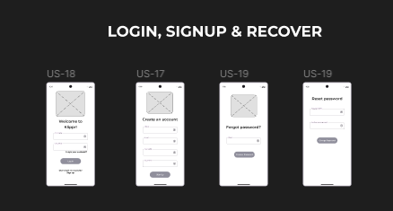

    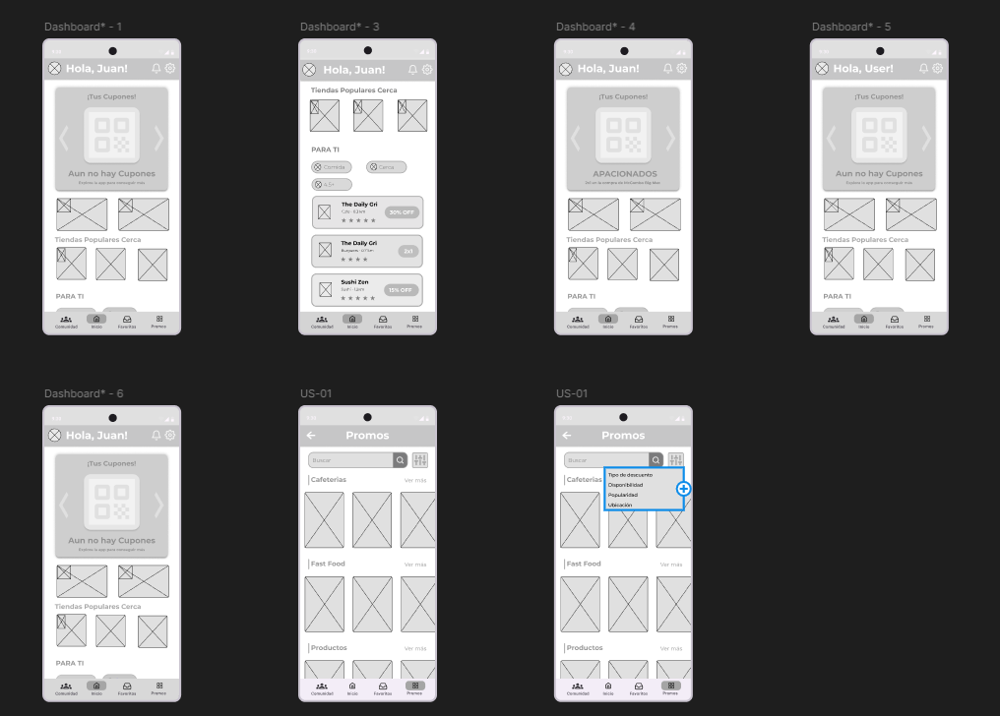

    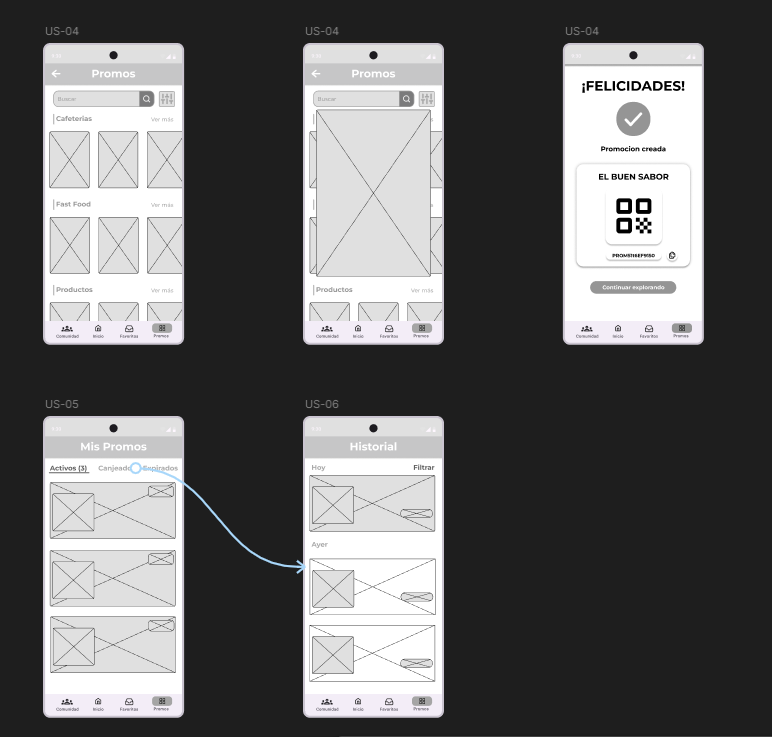

    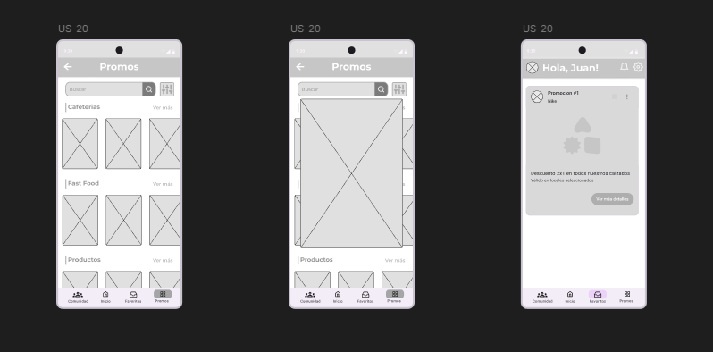

**Segmento Objetivo 2: Empresas**

    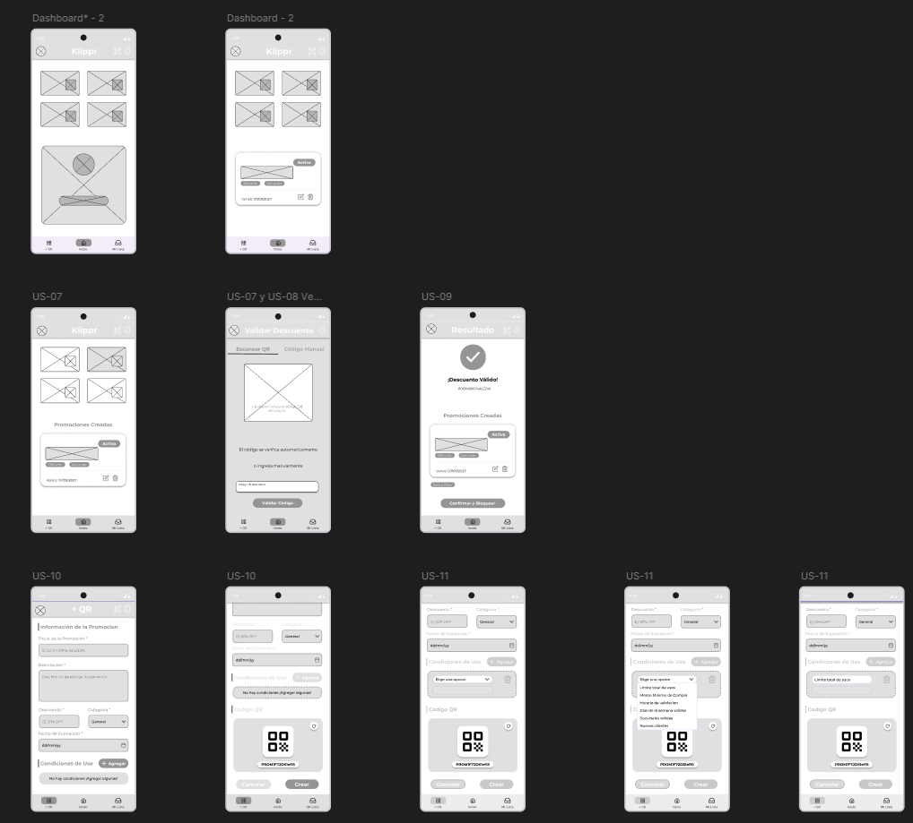

    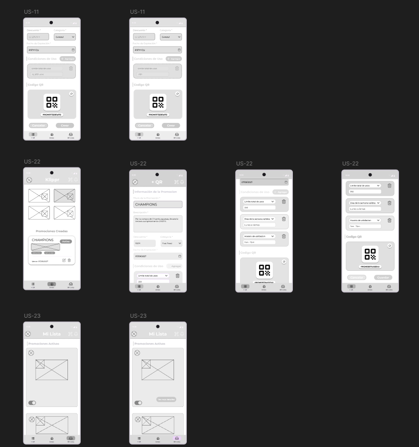

#### 3.1.4.2. Mobile Applications Wireflow Diagrams

En esta seccion presentaremos nuestro wireflow diagram que representa el flujo que siguen de nuestros wireframes:

  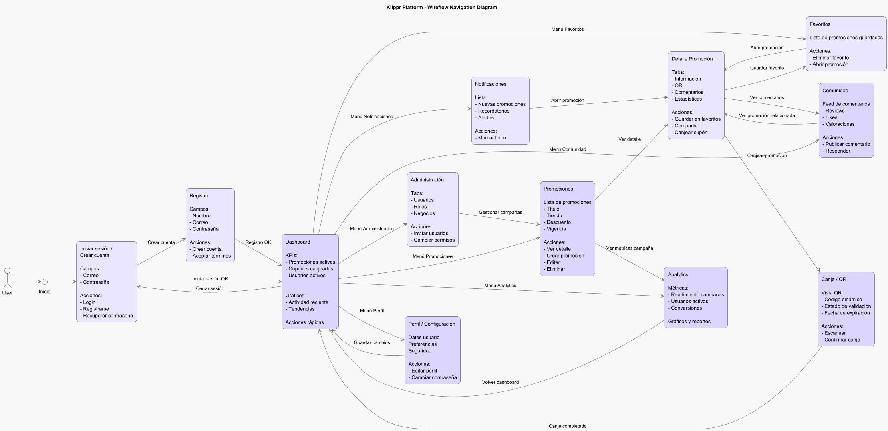

#### 3.1.4.3. Mobile Applications Mock-ups

En esta sección, se presentaran los mockups de los mobile applications de ambos segmentos objetivo:

**Segmento Objetivo 1: Consumidores**

    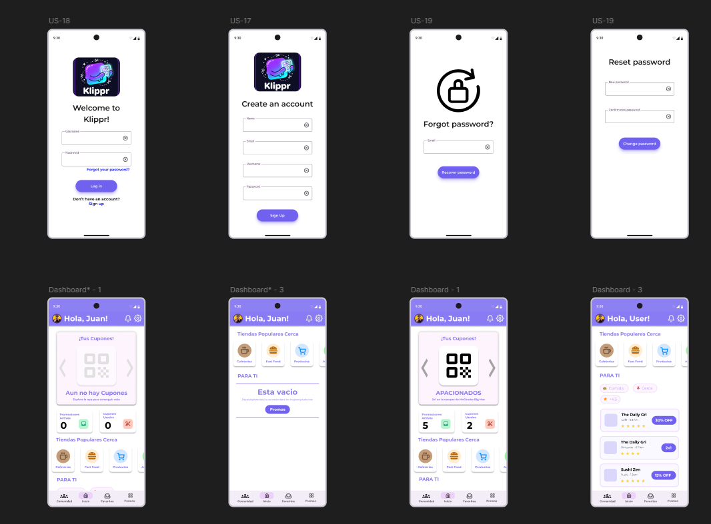

    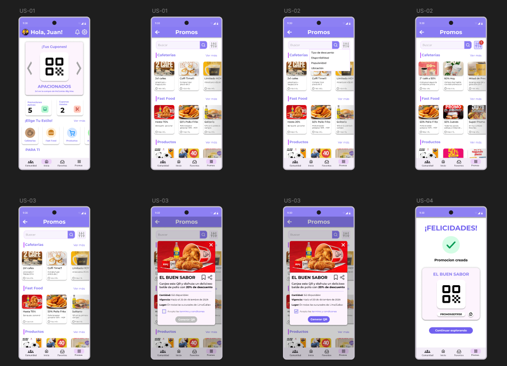

    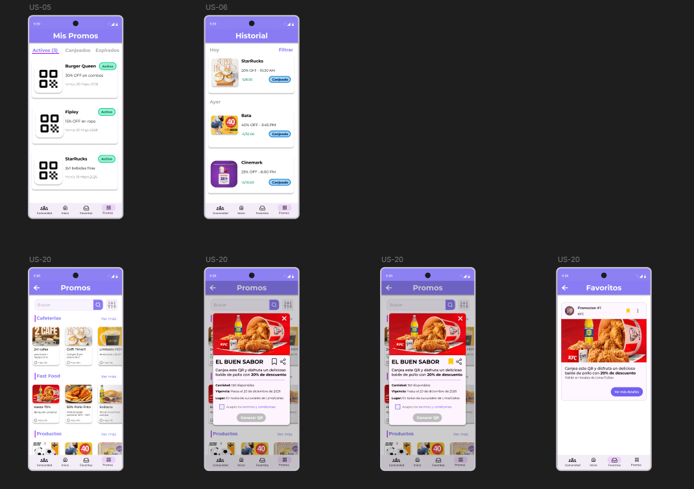

**Segmento Objetivo 2: Empresas**

    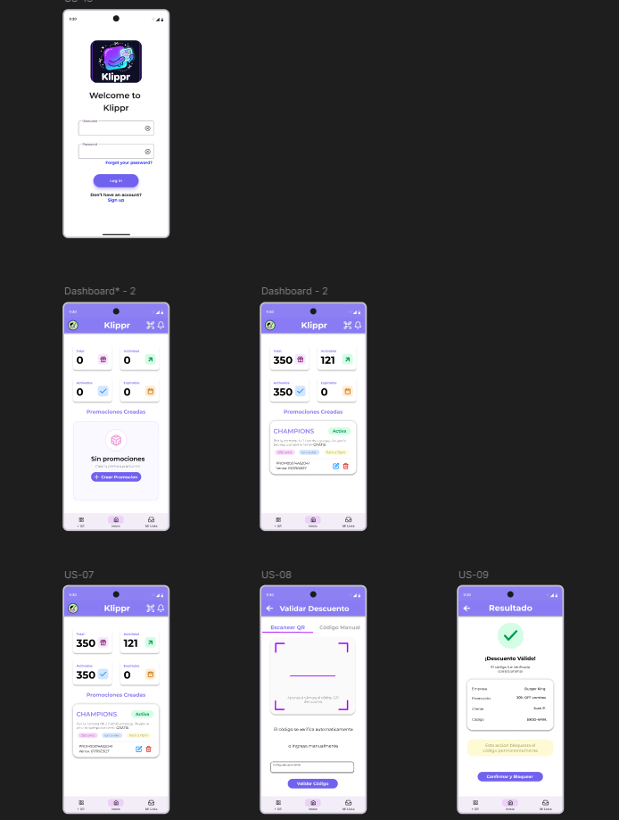

    

    

#### 3.1.4.4. Mobile Applications User Flow Diagrams

En esta seccion presentaremos nuestro User Flow Diagram que representa el flujo que siguen de nuestros mockups junto con User Goals:

    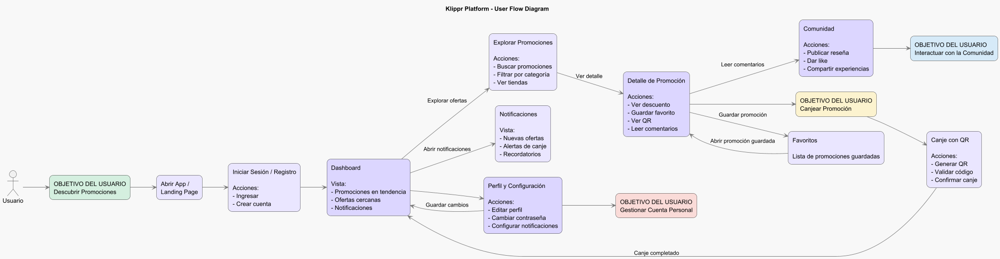

#### 3.1.4.5. Mobile Applications Prototyping

Para nuestro prototipo, lo dividimos en dos flows como se muestra a continuación:

    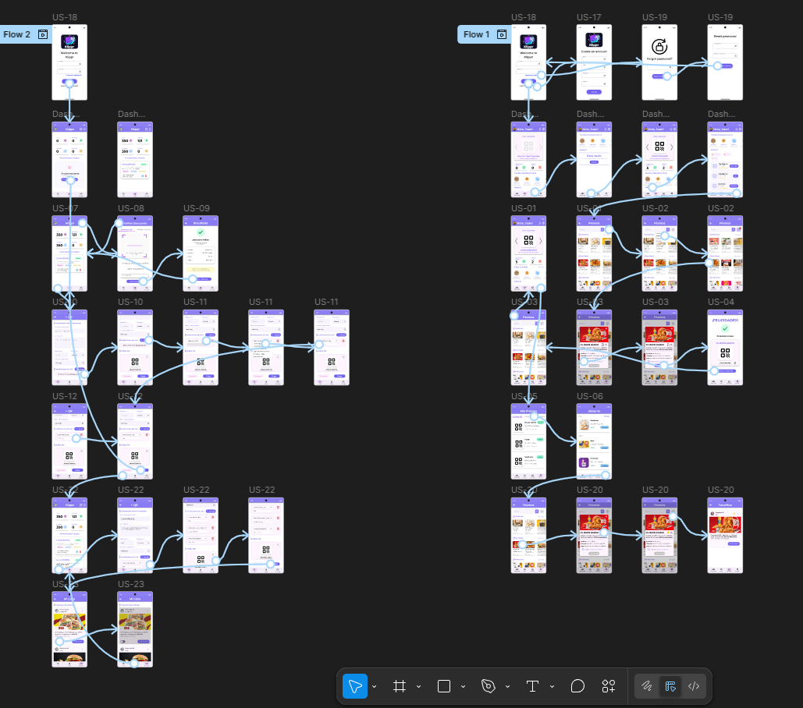

Link del prototipo: https://www.figma.com/proto/qrrjkC1ZwEIkvVBVWlxXn1/Aplicaciones-Moviles-2026-1?node-id=298-4778&p=f&viewport=423%2C98%2C0.11&t=4VHF9n7J6Ik5nvdC-1&scaling=scale-down&content-scaling=fixed&starting-point-node-id=298%3A4778&show-proto-sidebar=1&page-id=25%3A2

