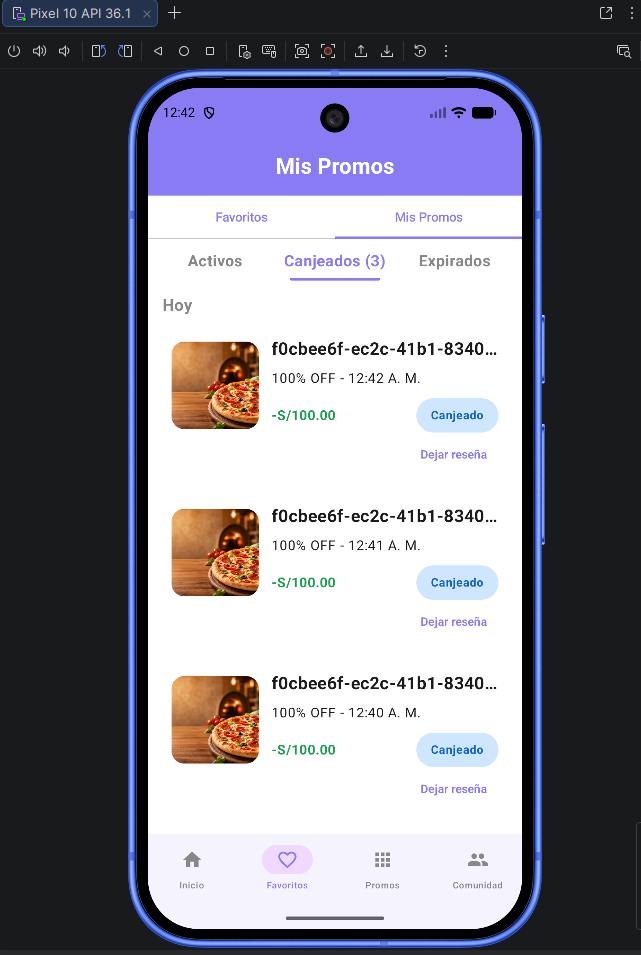
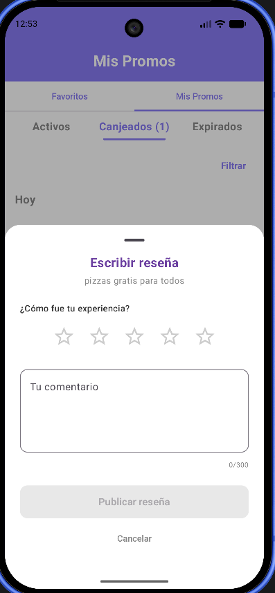
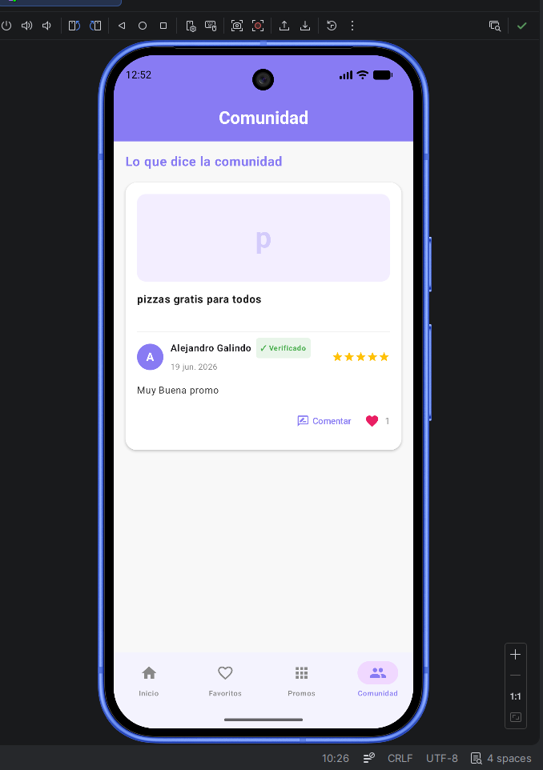
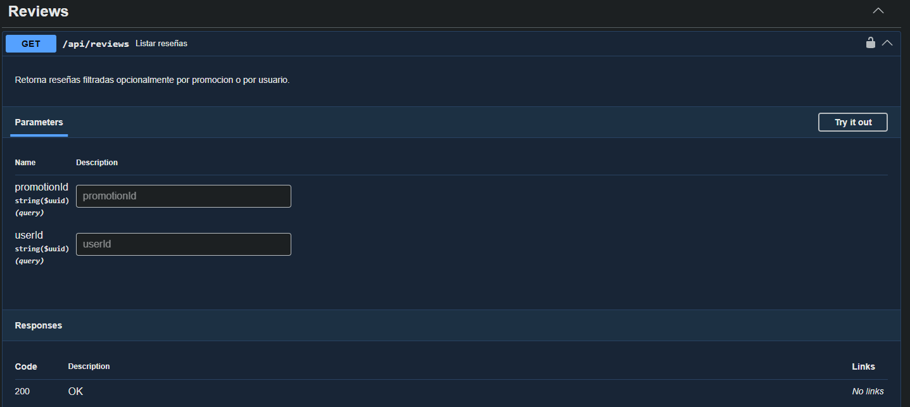
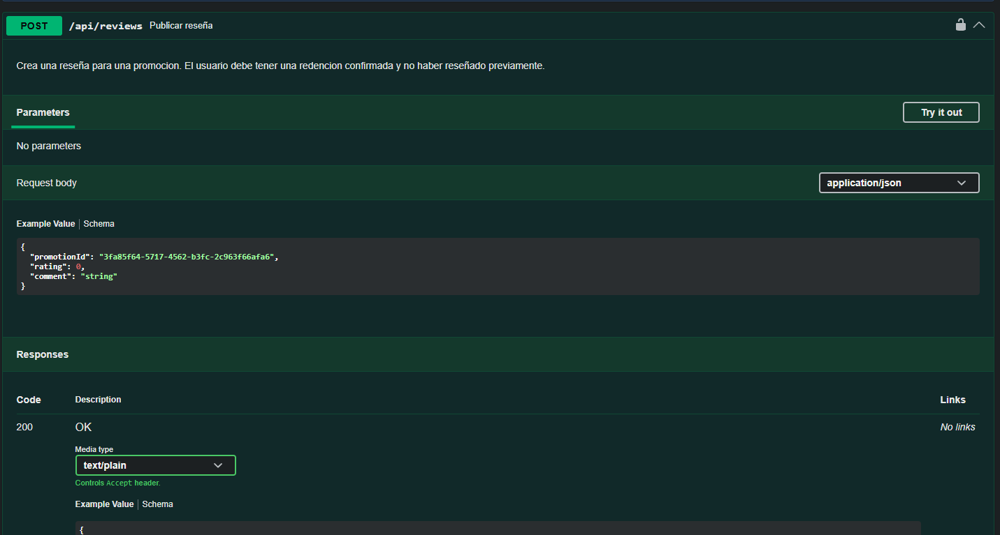
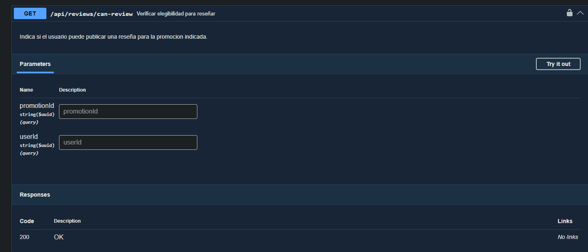
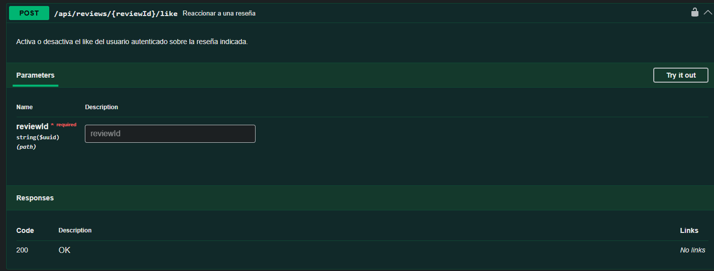
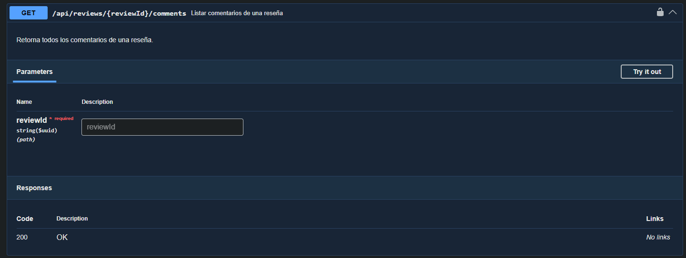
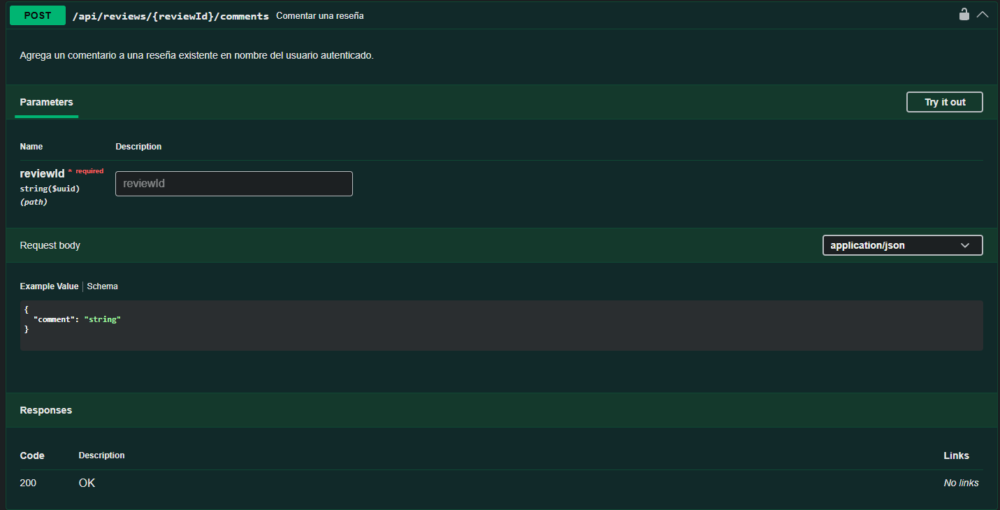

# Capítulo IV: Product Implementation & Validation

## 4.1 Software Configuration Management

### 4.1.1 Software Development Environment Configuration

### 4.2. Landing Page & Mobile Application Implementation
#### 4.2.1. Sprint n
##### 4.2.1.1. Sprint Planning n
##### 4.2.1.2. Sprint Backlog n
##### 4.2.1.3. Development Evidence for Sprint Review
##### 4.2.1.4. Testing Suite Evidence for Sprint Review
##### 4.2.1.5. Execution Evidence for Sprint Review

##### 4.2.1.6. Services Documentation Evidence for Sprint Review

## Analytics Bounded Context

Como parte del desarrollo del backend en C#, se ha consolidado el Bounded Context de **Analytics**. Este módulo es fundamental para la inteligencia de negocio de la aplicación, encargado de recopilar, procesar y exponer métricas del sistema, dashboards por negocio, estadísticas de campañas y reportes de abuso.

### Implementación Técnica de Analytics

Se ha estructurado la lógica para permitir que los negocios accedan a información clave sobre su desempeño y actividad. Los logros principales incluyen:

* **Gestión de Métricas:** Implementación de flujos para la actualización y consulta de métricas del sistema en tiempo real.
* **Dashboards por Negocio:** Capacidad para obtener un resumen consolidado del desempeño de cada negocio mediante su identificador único.
* **Métricas de Campaña:** Endpoints dedicados a la consulta de estadísticas específicas por campaña promocional.
* **Control de Abuso:** Registro y consulta de reportes de abuso, permitiendo una supervisión activa del uso de la plataforma.

---

## Evidencias de Ejecución: Módulo Analytics

A continuación se presentan los endpoints desarrollados y testeados a través de la interfaz de Swagger:

### 1. Gestión de Analytics

El controlador de **Analytics** expone las funcionalidades críticas para el monitoreo y análisis del sistema:

* **Endpoints de Analytics**: Permite a los negocios consultar su desempeño y al sistema registrar eventos relevantes.

- **Actualización de Métricas del Sistema**

    

    

- **Dashboard por Negocio**
  

    

- **Métricas de Campaña**

    

- **Registro de Reportes de Abuso**

    

    

- **Consulta de Reportes de Abuso**

    

### 4.2.2. Sprint 2

#### 4.2.2.1 Sprint Planning 2

#### 4.2.2.2 Sprint Backlog 2

#### 4.2.2.3 Development Evidence for Sprint Review

#### 4.2.2.4 Testing Suite Evidence for Sprint Review

#### 4.2.2.5. Execution Evidence for Sprint Review

#### Evidencias de Ejecución: Módulo Community (Customer Views)

A continuación se presentan las capturas de pantalla de la aplicación móvil que demuestran el funcionamiento del módulo de Community integrado con el backend:

#### Pantalla de Mis Promos — Opción para Dejar Reseña

Desde la sección **Mis Promos**, en la pestaña de promociones canjeadas, el usuario visualiza el historial de canjes realizados. Cada ítem muestra la imagen de la promoción, el identificador del cupón, el porcentaje de descuento aplicado, el horario de canje y el estado **Canjeado**. Adicionalmente, se presenta el enlace **"Dejar reseña"**, que habilita al usuario a calificar su experiencia con la promoción canjeada, siendo este el punto de entrada al flujo de publicación de reseña.

    

#### Modal de Escritura de Reseña

Al seleccionar **"Dejar reseña"**, se despliega un bottom sheet modal con el formulario **"Escribir reseña"**, que muestra el nombre de la promoción asociada. El usuario puede asignar una calificación de 1 a 5 estrellas y redactar un comentario de hasta 300 caracteres. Una vez completado el formulario, el botón **"Publicar reseña"** se habilita para enviar la reseña. El modal puede cerrarse mediante la opción **"Cancelar"**.

    

#### Pantalla de Comunidad — Listado de Reseñas

Se muestra la pantalla principal de **Comunidad**, donde se listan las reseñas publicadas por otros usuarios. Cada reseña presenta la imagen de la promoción asociada, el nombre del usuario con su badge de verificación, la fecha de publicación, la calificación en estrellas, el comentario escrito y las opciones de interacción: comentar y reaccionar con like.

    

#### 4.2.2.6. Services Documentation Evidence for Sprint Review

## Community Bounded Context

Como parte del desarrollo del backend, se ha consolidado el Bounded Context de **Community**. Este módulo es fundamental para la interacción social dentro de la plataforma, encargado de gestionar las reseñas publicadas por los usuarios, las reacciones, los comentarios asociados y las operaciones CRUD administrativas sobre reseñas.

### Implementación Técnica de Community

Se ha estructurado la lógica para permitir que los usuarios interactúen mediante reseñas y comentarios, garantizando mecanismos de control de elegibilidad y moderación. Los logros principales incluyen:

* **Gestión de Reseñas:** Implementación de flujos para listar y publicar reseñas, así como operaciones de actualización y eliminación vía API versionada.
* **Control de Elegibilidad:** Endpoint dedicado a verificar si un usuario cumple los requisitos para publicar una reseña antes de permitir la acción.
* **Reacciones a Reseñas:** Capacidad para registrar reacciones (likes) sobre reseñas específicas mediante su identificador.
* **Gestión de Comentarios:** Endpoints para listar y publicar comentarios asociados a una reseña particular.
* **Operaciones Administrativas (v1):** Conjunto de endpoints versionados para la consulta, creación, actualización y eliminación de reseñas por identificador.

---

## Evidencias de Ejecución: Módulo Community (Reviews)

A continuación se presentan los endpoints desarrollados y testeados a través de la interfaz de Swagger:

### 1. Gestión de Reseñas

El controlador de **Reviews** expone las funcionalidades esenciales para la interacción social y la moderación de contenido:

* **Endpoints de Community**: Permite a los usuarios consultar, publicar y reaccionar a reseñas, así como gestionar los comentarios relacionados.

- **Listar Reseñas**

Recupera el listado completo de reseñas registradas en la plataforma.

    

- **Publicar Reseña**

Permite a un usuario autenticado publicar una nueva reseña.

    

- **Verificar Elegibilidad para Reseñar**

Valida si el usuario actualmente autenticado cumple los criterios necesarios para poder publicar una reseña.

    

- **Reaccionar a una Reseña**

Registra una reacción (like) del usuario sobre una reseña identificada por su `reviewId`.

    

- **Listar Comentarios de una Reseña**

Obtiene todos los comentarios asociados a una reseña específica mediante su `reviewId`.

    

- **Comentar una Reseña**

Permite a un usuario autenticado publicar un comentario sobre una reseña identificada por su `reviewId`.

    

#### 4.2.2.7. Software Deployment Evidence for Sprint Review

#### 4.2.2.8. Team Collaboration Insights during Sprint 

